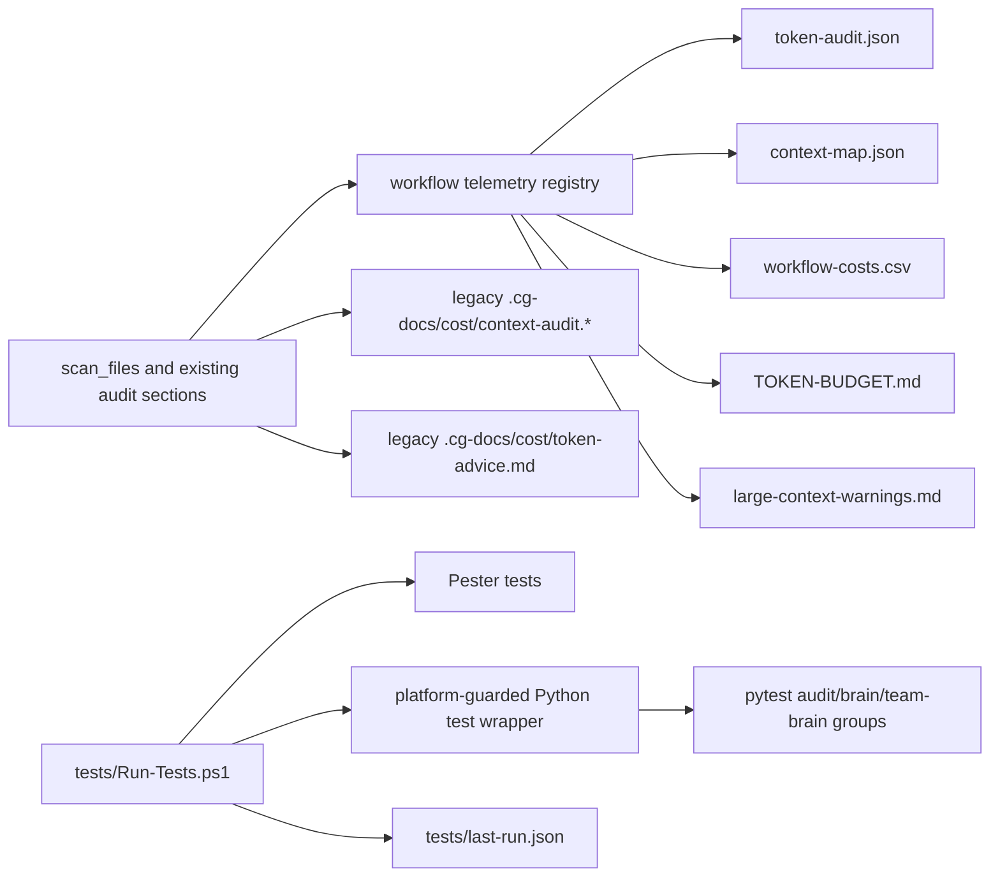

# Plan: Workflow Token Baseline and Test Integration

## Objective

Build the Phase 1.1 workflow-level token/context baseline for Compound GPID by extending the existing deterministic audit layer, adding first-class `.cg-docs/token/` artifacts, preserving `.cg-docs/cost/` and `/cg-token-audit` compatibility, and integrating Python audit/brain/team-brain validation through the canonical safe test runner.

---

## Context

The token-efficiency strategy identifies Phase 1.1 as the measurement foundation for the next token-efficiency cycle. The current audit already inventories static prompt, agent, skill, instruction, Brain, context, docs, and roadmap token pressure, but its workflow benchmark is still partial. A current local audit run to `/tmp/cg-plan-token-baseline/` reported `420,975` estimated tokens across `89` scanned files, `0` guardrail failures, and reviewed warnings `fix=0, accept=19, docs-only=3`.

Current benchmark rows cover `/cg-plan`, `/cg-work`, `/cg-review`, `/cg-compound`, `/cg-resume`, and Knowledge Brain/context lookup. Phase 1.1 expands that into a workflow-level baseline for the full requested loop without changing workflow behavior or claiming savings before comparable evidence exists.

Primary strategy source: `.cg-docs/strategy/2026-06-18-token-efficiency-workflow-strategy.md`.

---

## Requirements

| ID | Requirement | Source |
|----|-------------|--------|
| R1 | Build a workflow-level token/context baseline under `.cg-docs/token/`. | user + strategy |
| R2 | Preserve backward compatibility with existing `.cg-docs/cost/` outputs and `/cg-token-audit`. | user |
| R3 | Extend `scripts/cg_audit_context.py` rather than creating a parallel analyzer. | user + prior token-optimization pattern |
| R4 | Track budgets for `/cg-brainstorm`, `/cg-plan`, `/cg-work`, `/cg-review`, `/cg-fix-triage`, `/cg-compound`, `/cg-resume`, `/cg-diagnose`, and `/cg-token-audit`. | user |
| R5 | Track deterministically observable files read, skills loaded, agents dispatched, command-output size, summary size, Knowledge Brain usage, MCP/tool usage, repeated context blocks, large prompt/instruction/skill files, and estimated token pressure by workflow. | user |
| R6 | Treat unobservable runtime quantities as explicitly not observed, not inferred. | strategy benchmark principles |
| R7 | Integrate Python audit/brain/team-brain tests more cleanly through a platform-guarded Pester wrapper registered in `tests/Run-Tests.ps1`. | user |
| R8 | Respect all Pester safety rules and keep `tests/Run-Tests.ps1` plus `tests/last-run.json` as the canonical validation surface. | project instructions + brain findings |
| R9 | Define benchmark artifacts: `.cg-docs/token/TOKEN-BUDGET.md`, `.cg-docs/token/token-audit.json`, `.cg-docs/token/context-map.json`, `.cg-docs/token/workflow-costs.csv`, and `.cg-docs/token/large-context-warnings.md`. | user |
| R10 | Keep token-saving claims as hypotheses until measured in this repository with comparable probes. | user + strategy |
| R11 | Preserve statistical correctness, review depth, roadmap write discipline, and evidence-before-completion behavior. | charter + user |
| R12 | Do not implement `cg-index query`, command-output summary wrappers, cross-agent adapters, optional retrieval backends, skill rewrites, or snapshot tooling. | user |

---

## Scope Boundaries

- In scope: deterministic workflow baseline generation, schema/rendering work for `.cg-docs/token/`, test-runner integration, compatibility checks, and docs for how maintainers interpret the baseline.
- In scope: deterministic static detection of prompt/agent/skill/tool references and known context-loading instructions.
- In scope: generated token artifacts committed under `.cg-docs/token/` after implementation validation.
- In scope: an explicit self-scan policy for generated audit artifacts so `.cg-docs/token/` and `.cg-docs/cost/` do not inflate workflow source-token totals.
- Out of scope: `cg-index query`, any retrieval API, vector search, optional MCP/code-intelligence backends, command-output summary wrappers, and snapshot tooling.
- Out of scope: prompt slimming, skill rewrites, cross-agent packaging adapters, and broad context policy changes beyond wording needed to document this baseline.
- Out of scope: direct roadmap writes. Any roadmap link/status update must go through `@cg-roadmap`.

### Deferred to Follow-Up Work

- Phase 1.2 Knowledge Brain query and budgeted retrieval remains separate.
- Phase 1.3 command-output summarization wrappers remain separate; Phase 1.1 may represent command output and summary sizes as unobserved fields.
- Phase 1.4 progressive-disclosure skill cleanup remains separate; Phase 1.1 may identify large skills but must not rewrite them.
- Phase 1.6 dashboard/regression thresholds remain separate unless a small baseline note is needed to explain Phase 1.1 artifacts.

---

## Current Baseline Facts

These planning facts come from a local audit run to `/tmp/cg-plan-token-baseline/`; they are not saved repo artifacts.

| Signal | Current value |
|--------|---------------|
| Total scanned files | 89 |
| Total estimated tokens | 420,975 |
| Prompt estimated tokens | 61,799 |
| Brain estimated tokens | 66,483 |
| Brain index estimated tokens | 147,666 |
| Context file estimated tokens | 16,009 |
| Docs estimated tokens | 50,551 |
| Guardrail failures | 0 |
| Guardrail warnings | 22 |
| Reviewed warnings | fix=0, accept=19, docs-only=3 |

Current benchmark coverage gap: `/cg-brainstorm`, `/cg-fix-triage`, `/cg-diagnose`, and `/cg-token-audit` are not first-class workflow rows in the existing benchmark output.

---

## Context & Research

### Relevant Code and Patterns

- `scripts/cg_audit_context.py` already scans prompt, agent, skill, instruction, shared, docs, Brain, context, and roadmap files; estimates tokens; builds reference matrices; detects context-loading risks; detects repeated paragraph blocks; emits benchmark rows; emits guardrails; supports `--baseline`; and writes `.cg-docs/cost/` reports.
- `scripts/tests/test_audit_context.py` already covers token estimation, file scanning, model inventory, context-loading risks, guardrails, recommendations, output formats, CLI behavior, baseline comparison, and Phase 6 benchmark sections.
- `.github/prompts/cg-token-audit.prompt.md` currently runs `cg-token-audit --root . --output-dir .cg-docs/cost --format both --recommendations` and explicitly avoids broad model inspection of `.cg-docs/`, Brain partitions, `brain-index.json`, `compound-gpid.context.md`, and `roadmap.json`.
- `tests/Run-Tests.ps1` is the canonical safe Pester runner and writes `tests/last-run.json`.
- `tests/run-tests-runner.Tests.ps1` statically verifies `Run-Tests.ps1` registration, artifact schema, and safety-related behavior.

### Institutional Learnings

- `.cg-docs/solutions/testing-patterns/2026-06-08-token-optimization-benchmark-guardrails.md`: token optimization needs benchmark guardrails, not one-off audits; extend `scripts/cg_audit_context.py` when measurement derives from the same prompt/context inventory.
- `.cg-docs/solutions/testing-patterns/2026-06-16-reviewed-warning-classifications-close-token-work.md`: reviewed warning classifications can close token work without hiding real failures; keep `fix=0` meaningful.
- `.cg-docs/solutions/testing-patterns/2026-04-02-invoke-pester-full-suite-passthru-crashes-vscode.md`: unsafe Pester directory runs and PassThru pipelines crash VS Code.
- `.cg-docs/solutions/testing-patterns/2026-04-17-canonical-run-tests-json-artifact-decouples-test-results-from-agent-context.md`: `Run-Tests.ps1` and `last-run.json` decouple validation from context-heavy terminal output.

### External References

- None needed for Phase 1.1. The work is repository-native deterministic tooling and validation plumbing.

---

## Key Technical Decisions

- **Extend the audit report with workflow telemetry rather than a new analyzer**: `scripts/cg_audit_context.py` already owns the inventory, token estimate, reference, context-risk, duplicate, guardrail, and output contracts. A parallel analyzer would drift.
- **Represent runtime-only metrics explicitly as unobserved**: command-output size and summary size are requested, but Phase 1.1 excludes command-output wrappers. The audit should include schema fields such as `status: "not_observed"` with a reason instead of fabricating data.
- **Add `.cg-docs/token/` as a canonical benchmark artifact family while keeping `.cg-docs/cost/` stable**: `/cg-token-audit` and existing docs/tests depend on cost output names. Token artifacts should be additive.
- **Make workflow rows stable and machine-readable**: use deterministic workflow IDs and paths so future phases can compare runs without fragile Markdown parsing.
- **Use static workflow contracts for deterministic observability**: source prompt/skill text can prove declared file reads, skill loads, agent references, tool references, context-risk wording, and large local artifacts. It cannot prove actual transcript reads without future instrumentation.
- **Exclude generated audit outputs from source-token totals by default**: `.cg-docs/cost/` and `.cg-docs/token/` are outputs of the audit process. Including them in the normal scan would make each run partially measure the prior run. If their size is useful, report it in a separate artifact-output section that is not part of workflow source pressure.
- **Route Python group validation through Pester only as a safe wrapper**: the wrapper should discover Python, run bounded pytest groups, summarize counts, and write results through `last-run.json` integration without unsafe Pester idioms.
- **Keep statistical/review/evidence safeguards above token goals**: no token measurement or recommendation may reduce review depth, statistical correctness checks, Pester safety, roadmap discipline, or evidence gates.

---

## High-Level Technical Design

> *This illustrates the intended approach and is directional guidance for review, not implementation specification. The implementing agent should treat it as context, not code to reproduce.*



---

## Output Structure

The plan creates a new generated artifact family under an existing project directory:

```text
.cg-docs/
  token/
    .gitkeep
    TOKEN-BUDGET.md
    token-audit.json
    context-map.json
    workflow-costs.csv
    large-context-warnings.md
```

Future phases may add subdirectories such as benchmark runs or command-output artifacts, but Phase 1.1 should not create wrapper-output or snapshot directories unless required for compatibility notes.

---

## Implementation Steps

## Phase 1: Workflow Telemetry Model

### 1. Define stable workflow telemetry registry

- **Requirements**: R3, R4, R5, R6, R10, R12
- **Files**:
  - Modify: `scripts/cg_audit_context.py`
  - Test: `scripts/tests/test_audit_context.py`
- **Details**:
  - Replace or extend `BENCHMARK_PROMPTS` with a stable registry covering:
    - `/cg-brainstorm` -> `.github/prompts/cg-brainstorm.prompt.md`
    - `/cg-plan` -> `.github/prompts/cg-plan.prompt.md`
    - `/cg-work` -> `.github/prompts/cg-work.prompt.md`
    - `/cg-review` -> `.github/prompts/cg-review.prompt.md`
    - `/cg-fix-triage` -> `.github/prompts/cg-fix-triage.prompt.md`
    - `/cg-compound` -> `.github/prompts/cg-compound.prompt.md`
    - `/cg-resume` -> `.github/prompts/cg-resume.prompt.md`
    - `/cg-diagnose` -> `.github/prompts/cg-diagnose.prompt.md`
    - `/cg-token-audit` -> `.github/prompts/cg-token-audit.prompt.md`
  - Preserve the existing Knowledge Brain/context lookup row as a separate support surface, not one of the nine command workflows.
  - Add deterministic fields per workflow:
    - path, availability, characters, estimated tokens;
    - file references and likely file-read references;
    - skill references and likely skill-load references;
    - agent references and dispatch burden;
    - tool references and MCP/tool keyword references;
    - context-risk/justified/targeted counts;
    - repeated-block token pressure touching the workflow file;
    - large-context warning status;
    - observable/unobservable status for command-output bytes and summary bytes.
  - Keep field names stable and lowercase/snake_case in JSON.
  - Include a schema/version marker for the new telemetry payload so future phases can evolve it intentionally.
- **Patterns to follow**:
  - Existing `build_benchmark_summary()`, `build_reference_matrix()`, `build_dispatch_burden()`, `build_context_loading_risks()`, and `detect_duplicates()` in `scripts/cg_audit_context.py`.
- **Test scenarios**:
  - Happy path: all nine requested workflows appear exactly once with stable workflow IDs.
  - Edge case: a missing prompt path yields `available: false` and a warning row, not a crash.
  - Edge case: `/cg-token-audit` broad `.cg-docs/` wording remains a reviewed maintenance/audit warning, not a forced failure.
  - Error path: duplicate workflow IDs in the registry fail a unit test.
- **Verification**:
  - Python tests prove registry completeness, unique IDs, and missing-file handling.

### 2. Add deterministic observability classification

- **Requirements**: R5, R6, R10, R11
- **Files**:
  - Modify: `scripts/cg_audit_context.py`
  - Test: `scripts/tests/test_audit_context.py`
- **Details**:
  - Add an observability layer that classifies each requested metric as:
    - `observed`: derived directly from source files or generated audit data;
    - `partially_observed`: deterministic proxy exists, but not actual runtime measurement;
    - `not_observed`: Phase 1.1 lacks instrumentation;
    - `not_applicable`: metric does not apply to that workflow.
  - Use this for command-output size and summary size so the baseline is honest until Phase 1.3 wrappers exist.
  - Use `partially_observed` for files read, skills loaded, and agents dispatched when static prompt text declares references but cannot prove runtime execution.
  - Include a short `measurement_note` field per metric category.
- **Patterns to follow**:
  - Existing `DISCLAIMER` and recommendation language that labels token estimates as heuristic.
- **Test scenarios**:
  - Happy path: static prompt token counts are `observed`.
  - Edge case: command-output size is `not_observed` with a Phase 1.3 note.
  - Error path: a metric with a missing observability status fails schema validation.
- **Verification**:
  - Tests assert that token-saving claims cannot be emitted from `not_observed` fields.

## Phase 2: `.cg-docs/token/` Artifact Family

### 3. Add token artifact renderers

- **Requirements**: R1, R2, R3, R5, R9, R10
- **Files**:
  - Modify: `scripts/cg_audit_context.py`
  - Test: `scripts/tests/test_audit_context.py`
  - Test fixture output only: `tmp_path/.cg-docs/token/token-audit.json`
  - Test fixture output only: `tmp_path/.cg-docs/token/context-map.json`
  - Test fixture output only: `tmp_path/.cg-docs/token/workflow-costs.csv`
  - Test fixture output only: `tmp_path/.cg-docs/token/large-context-warnings.md`
  - Test fixture output only: `tmp_path/.cg-docs/token/TOKEN-BUDGET.md`
- **Details**:
  - Add a new output mode or flag that writes the token artifact family without changing default `.cg-docs/cost/` behavior.
  - Suggested CLI shape: keep existing `--output-dir` semantics for legacy reports and add `--token-output-dir .cg-docs/token` or `--token-artifacts`.
  - Phase 2 implements and tests the renderers against temporary output directories only. Do not commit real `.cg-docs/token/` baseline artifacts in this phase; Step 8 generates the committed baseline after validation passes.
  - `token-audit.json` should contain the full token baseline payload:
    - generated timestamp;
    - disclaimer;
    - schema version;
    - source audit summary;
    - workflow telemetry rows;
    - support surfaces such as Knowledge Brain/context lookup;
    - observability matrix;
    - guardrails and reviewed warning counts;
    - compatibility metadata pointing to `.cg-docs/cost/`.
  - `context-map.json` should be narrower:
    - workflow ID to referenced files, skill references, agent references, tool references, context-loading signals, and large artifacts touched;
    - enough structure for future phases to compare context requirements without opening Markdown.
  - `workflow-costs.csv` should be stable and spreadsheet-friendly:
    - workflow_id, path, available, estimated_tokens, characters, total_refs, file_refs, skill_refs, agent_refs, tool_refs, context_risk_count, context_justified_count, context_targeted_count, dispatch_refs, dispatch_burden, command_output_status, summary_output_status.
  - `large-context-warnings.md` should summarize large prompt/instruction/skill files and large generated/tactical artifacts; it should avoid copying large snippets.
  - `TOKEN-BUDGET.md` should be a human-facing budget note:
    - current baseline by workflow;
    - top large sources;
    - guardrail status;
    - what is measured vs unmeasured;
    - statement that token estimates are hypotheses until compared against same-probe after runs.
  - Define source-scan policy explicitly:
    - normal source-token totals exclude generated `.cg-docs/cost/` and `.cg-docs/token/` outputs;
    - if audit-output file sizes are useful, expose them in a separate `artifact_outputs` section that is not included in workflow source pressure or same-probe comparisons.
- **Patterns to follow**:
  - Existing `write_outputs()`, `render_markdown()`, `render_recommendations_markdown()`, and `write_atomic()`.
- **Test scenarios**:
  - Happy path: running the token artifact writer creates all five requested files.
  - Edge case: CSV escapes commas/pipes/newlines in workflow fields correctly.
  - Edge case: Markdown renderers do not include raw large file bodies.
  - Edge case: `.cg-docs/token/` and `.cg-docs/cost/` outputs are not counted in source-token totals by default.
  - Error path: invalid token output directory raises or returns a clear CLI error.
- **Verification**:
  - Renderer tests create valid token artifacts under `tmp_path` and JSON parses cleanly. The committed `.cg-docs/token/` baseline is generated only in Step 8.

### 4. Preserve legacy `.cg-docs/cost/` output behavior

- **Requirements**: R2, R3, R10, R11
- **Files**:
  - Modify: `scripts/cg_audit_context.py`
  - Test: `scripts/tests/test_audit_context.py`
  - Potential docs: `.cg-docs/cost/README.md`
- **Details**:
  - Existing calls must keep working:
    - `python3 scripts/cg_audit_context.py --root . --output-dir .cg-docs/cost --format both`
    - `python3 scripts/cg_audit_context.py --root . --output-dir .cg-docs/cost --format both --recommendations`
    - `python3 scripts/cg_audit_context.py --root . --output-dir .cg-docs/cost --format both --baseline <path>`
  - Do not rename `context-audit.json`, `context-audit.md`, or `token-advice.md`.
  - If the new token artifacts are opt-in, document that `.cg-docs/cost/` remains the `/cg-token-audit` compatibility surface.
  - If the new token artifacts are written by default in addition to cost outputs, ensure tests lock that behavior and the prompt docs mention both paths.
- **Patterns to follow**:
  - Existing `/cg-token-audit` compatibility from `.github/prompts/cg-token-audit.prompt.md`.
- **Test scenarios**:
  - Happy path: legacy output names are unchanged.
  - Edge case: `--recommendations` still writes `token-advice.md` only under the selected legacy output directory unless token artifacts are explicitly requested.
  - Error path: token artifact generation failure does not silently produce partial legacy output without a clear error.
- **Verification**:
  - Legacy output tests continue to pass.

## Phase 3: `/cg-token-audit` Prompt Compatibility

### 5. Update token-audit prompt and docs for dual outputs

- **Requirements**: R1, R2, R8, R9, R10, R11, R12
- **Files**:
  - Modify: `.github/prompts/cg-token-audit.prompt.md`
  - Modify: `tests/prompt-tools.Tests.ps1`
  - Modify: `docs/reference.md`
  - Modify: `docs/workflow.md`
  - Optional modify: `docs/model-guide.md`
- **Details**:
  - Update `/cg-token-audit` instructions to run the deterministic audit with any new token-artifact flag once implemented.
  - Update the prompt's File Permissions section so the deterministic audit command may write report files under both `.cg-docs/cost/` and `.cg-docs/token/`.
  - Keep `--root .` mandatory so consumer projects are analyzed, not the installed plugin clone.
  - Keep `.cg-docs/cost/token-advice.md` as the compact advisory read path unless the implementation intentionally moves advice into `.cg-docs/token/` with a compatibility copy.
  - Add a concise mention of `.cg-docs/token/` artifact purposes.
  - Preserve the existing prohibition against model-reading `.cg-docs/`, Brain partitions, `brain-index.json`, `compound-gpid.context.md`, and `roadmap.json` directly for audit analysis.
- **Patterns to follow**:
  - Existing prompt contract tests for `/cg-token-audit` command shape and broad-read fallback.
- **Test scenarios**:
  - Happy path: prompt includes the deterministic command with `--root .` and the token artifact flag/path.
  - Happy path: prompt File Permissions explicitly allow audit-generated reports under `.cg-docs/token/` as well as `.cg-docs/cost/`.
  - Edge case: CLI unavailable path still stops or reports setup issue; it does not ask the model to inspect large artifacts.
  - Error path: prompt omits `.cg-docs/cost/` compatibility or direct-read guard; Pester tests fail.
- **Verification**:
  - Prompt tests guard the command shape and direct-read prohibition.

## Phase 4: Validation Integration

### 6. Expand Python audit tests for workflow baseline schemas

- **Requirements**: R3, R4, R5, R6, R9, R10
- **Files**:
  - Modify: `scripts/tests/test_audit_context.py`
- **Details**:
  - Add focused tests for:
    - workflow registry completeness;
    - unique workflow IDs;
    - token artifact JSON schema;
    - context-map schema;
    - CSV header and row count;
    - large-context warning output;
    - legacy cost compatibility;
    - observability statuses;
    - no saving claims from unobserved fields.
  - Keep tests fixture-based and stdlib-only where possible.
  - Avoid tests that require real `.cg-docs/token/` generated state except a single integration test writing to `tmp_path`.
- **Patterns to follow**:
  - Existing `TestPhase6Benchmark`, `TestPhase6Guardrails`, `TestOutputFormats`, and CLI tests.
- **Test scenarios**:
  - Happy path: full run writes token artifacts to `tmp_path`.
  - Edge case: missing optional prompts create unavailable workflow rows.
  - Error path: malformed baseline remains a clear exit-code `1` condition.
- **Verification**:
  - `python3 -m pytest scripts/tests/test_audit_context.py` passes.

### 7. Register platform-guarded Python group validation in the safe runner

- **Requirements**: R7, R8, R11
- **Files**:
  - Modify: `tests/Run-Tests.ps1`
  - Modify: `tests/run-tests-runner.Tests.ps1`
  - Modify: `tests/pester-safety.Tests.ps1`
  - Add or modify: `tests/python-tests.Tests.ps1`
- **Details**:
  - Add a Pester test wrapper that detects Python availability using the established probe order (`python3`, `python`, `py`) and skips gracefully when unavailable.
  - After Python is found, probe `python -m pytest --version` before running groups. Missing `pytest` is a validation failure with bounded setup guidance, not a silent skip, because Python is available but the required test runner is not.
  - The wrapper should run bounded pytest groups:
    - `scripts/tests`
    - `scripts/brain/tests`
    - `scripts/team_brain/tests`
  - Avoid raw unbounded output. Capture subprocess output internally and surface a compact failure message.
  - Register the wrapper name in `tests/Run-Tests.ps1` before junction-creating tests.
  - Update runner static tests to assert the wrapper is registered.
  - Keep direct `Invoke-Pester` safety rules intact; no new pipelines from `Invoke-Pester`, no directory-form Pester runs, no `2>&1 | Select-String` on Pester output.
  - If the wrapper invokes Python subprocesses with `2>&1`, keep that separate from `Invoke-Pester` and document why it is not the forbidden Pester pattern.
- **Patterns to follow**:
  - `tests/cg-index.Tests.ps1` Python detection and skip pattern.
  - `tests/Run-Tests.ps1` last-run artifact behavior.
  - `.github/skills/cg-skill-pester-safety/SKILL.md` canonical safety rules.
- **Test scenarios**:
  - Happy path: wrapper detects Python and runs the three pytest groups.
  - Edge case: Python unavailable produces a passing skip-style placeholder, not a suite failure.
  - Error path: Python is available but `pytest` is unavailable; wrapper fails with a bounded message that names the missing dependency and does not dump raw command output.
  - Error path: one pytest group fails and the Pester wrapper fails with a bounded summary.
  - Error path: wrapper is added but not registered in `tests/Run-Tests.ps1`; runner static tests fail.
- **Verification**:
  - Safe runner artifact records the new wrapper in `files[]` when Pester runs in a PowerShell-capable environment.

## Phase 5: Documentation, Generated Baseline, and Roadmap Linkage

### 8. Generate and document the Phase 1.1 baseline artifacts

- **Requirements**: R1, R2, R9, R10, R11
- **Files**:
  - Generate: `.cg-docs/token/TOKEN-BUDGET.md`
  - Generate: `.cg-docs/token/token-audit.json`
  - Generate: `.cg-docs/token/context-map.json`
  - Generate: `.cg-docs/token/workflow-costs.csv`
  - Generate: `.cg-docs/token/large-context-warnings.md`
  - Modify: `docs/reference.md`
  - Modify: `docs/workflow.md`
  - Optional modify: `docs/model-guide.md`
- **Details**:
  - Generate the committed `.cg-docs/token/` baseline after implementation and tests are passing. This is the first step that should commit real `.cg-docs/token/` artifacts; earlier renderer tests should write to temporary directories only.
  - Make `TOKEN-BUDGET.md` human-readable and explicit about:
    - current repo baseline date/time;
    - heuristic token estimates;
    - measured vs unmeasured fields;
    - no token-saving claims yet;
    - compatibility with `.cg-docs/cost/`.
  - Document maintainer workflow:
    - run Python audit tests;
    - run safe runner in PowerShell where available;
    - run `/cg-token-audit` or `cg-token-audit --root .` with the new token artifact option;
    - inspect `fix` warning count, guardrail failures, and artifact freshness.
  - Keep docs concise and link to artifacts instead of copying large tables.
  - Confirm the generated artifact files themselves are excluded from source-token totals, or are reported only in a separate artifact-output section.
- **Patterns to follow**:
  - Existing docs around `.cg-docs/cost/context-audit.md` and token optimization release validation.
- **Test scenarios**:
  - Docs mention `.cg-docs/token/` artifact names and legacy `.cg-docs/cost/` compatibility.
  - Generated JSON artifacts are valid JSON.
  - CSV contains one row per requested workflow.
  - Generated `.cg-docs/token/` artifacts do not recursively inflate the workflow source-token baseline.
- **Verification**:
  - Generated baseline artifacts are committed only after validation evidence exists.

### 9. Link the plan to roadmap through the roadmap agent

- **Requirements**: R11, R12
- **Files**:
  - No direct file edits by implementation agent.
  - Roadmap target: `roadmap.json` feature `token-efficiency-core-system/phase-1-1-workflow-token-baseline`.
- **Details**:
  - After the plan is saved, ask whether to link the plan to the roadmap feature.
  - If approved, dispatch `@cg-roadmap` to set:
    - `plan: .cg-docs/plans/2026-06-22-workflow-token-baseline.md`
    - `status: planned`
  - Verify via targeted roadmap field read only.
  - Do not edit `roadmap.json` directly.
- **Test scenarios**:
  - Test expectation: none in code; roadmap write discipline is procedural and protected by prompt contract.
- **Verification**:
  - Targeted roadmap read shows the feature points at this plan and status is `planned`, or the user intentionally defers linkage.

---

## Testing Strategy

- `python3 -m pytest scripts/tests/test_audit_context.py`
  - Required for audit schema, renderer, compatibility, and CLI behavior.
- Python group tests through safe runner wrapper:
  - `scripts/tests`
  - `scripts/brain/tests`
  - `scripts/team_brain/tests`
- `. tests\Run-Tests.ps1`
  - Required in PowerShell/VS Code-capable environment; read `tests/last-run.json` for pass/fail evidence.
- If PowerShell/Pester is unavailable in Codex or another environment, record that limitation and require VS Code/PowerShell validation before completion.
- Do not use direct ad hoc `Invoke-Pester` commands. Do not run `Invoke-Pester tests/`. Do not pipeline `Invoke-Pester -PassThru`. Do not pipe `Invoke-Pester` output through `2>&1`.

---

## Documentation Checklist

- Update `/cg-token-audit` docs to describe both `.cg-docs/cost/` compatibility and `.cg-docs/token/` baseline artifacts.
- Add a concise artifact reference table for `TOKEN-BUDGET.md`, `token-audit.json`, `context-map.json`, `workflow-costs.csv`, and `large-context-warnings.md`.
- Document that token estimates are heuristic and token-saving claims require same-probe comparisons.
- Document that command-output and summary-size fields are placeholders until Phase 1.3 if no deterministic wrapper exists.
- Keep Pester safety guidance unchanged and link validation through `tests/Run-Tests.ps1`.

---

## Benchmark / Validation Criteria

Token-efficiency claims are valid only when all of these hold:

- Baseline and after runs use the same workflow registry and same audit version.
- `token-audit.json` records schema version, generated timestamp, and audit disclaimer.
- `workflow-costs.csv` includes all nine requested workflows.
- `context-map.json` maps each workflow to deterministic references and context-loading signals.
- `TOKEN-BUDGET.md` separates measured, partially measured, and unmeasured quantities.
- `large-context-warnings.md` identifies large sources without copying their bodies.
- Guardrail failures are `0`.
- `reviewed_warnings.counts.fix` is `0`, or every remaining fix warning is explicitly deferred with rationale.
- Python audit tests pass.
- Safe Pester runner passes where available, or unavailable PowerShell/Pester is recorded as a blocking validation gap until run in VS Code/PowerShell.
- Statistical correctness, review depth, roadmap write discipline, and evidence gates remain unchanged.

---

## System-Wide Impact

- **Interaction graph**: `scripts/cg_audit_context.py` becomes the producer for both legacy cost outputs and new token baseline artifacts; `/cg-token-audit` remains the human entrypoint; `tests/Run-Tests.ps1` becomes the validation entrypoint for Python groups.
- **Error propagation**: audit CLI errors should remain clear exit-code `1` or `2` conditions; token artifact failures should not silently produce partial evidence.
- **State lifecycle risks**: generated `.cg-docs/token/` artifacts must not be mistaken for proof of savings; they are baseline state until compared.
- **API surface parity**: CLI changes must preserve existing flags and output files; new flags must be documented and tested.
- **Integration coverage**: Python unit tests cover static schema/rendering; Pester prompt/runner tests cover prompt and validation contracts; manual VS Code/PowerShell run covers Pester availability.
- **Unchanged invariants**: no direct roadmap edits, no unsafe Pester commands, no weakening review routing, no statistical-safety tradeoffs for token goals.

---

## Risks & Mitigations

| Risk | Likelihood | Impact | Mitigation |
|------|------------|--------|------------|
| Token baseline becomes a de facto savings claim without before/after evidence. | Medium | High | Add explicit disclaimers and tests/docs that treat savings as hypotheses until same-probe comparisons exist. |
| New telemetry overstates runtime behavior from static prompt references. | Medium | High | Add observability statuses and measurement notes for every metric category. |
| `.cg-docs/token/` output breaks existing `/cg-token-audit` consumers. | Low | High | Keep `.cg-docs/cost/` names stable and test legacy output behavior. |
| Pester wrapper for Python tests accidentally violates safety rules or floods context. | Medium | High | Use `Run-Tests.ps1`, bounded wrapper output, and static Pester safety tests. |
| Audit script becomes too broad and hard to maintain. | Medium | Medium | Keep new code as small composable report builders/renderers; do not add retrieval/query behavior in Phase 1.1. |
| Generated artifacts introduce noisy diffs. | Medium | Medium | Keep deterministic ordering, compact JSON/CSV, and bounded Markdown summaries. |
| Runtime-only metrics are blocked by Phase 1.3 exclusion. | High | Medium | Represent them as `not_observed` with follow-up phase notes. |
| Roadmap linkage accidentally edits `roadmap.json` directly. | Low | High | Route linkage through `@cg-roadmap`; include as a blocked-stop condition. |

---

## Safeguards

- **Statistical correctness**: do not reduce analytical review, data-quality checks, reproducibility checks, or evidence requirements to save tokens.
- **Review depth**: preserve `/cg-review` staged routing and `/cg-work review:*` behavior; token advice may recommend matching review depth to risk but must not auto-downgrade.
- **Pester safety**: all PowerShell validation goes through `tests/Run-Tests.ps1`; direct unsafe Pester commands remain forbidden.
- **Roadmap write discipline**: all roadmap writes go through `@cg-roadmap`; implementation agents must not edit `roadmap.json` directly.
- **Evidence-before-completion**: generated artifacts are not completion evidence unless produced by an executed audit run and validated by tests/schema checks.
- **Cost-output compatibility**: `.cg-docs/cost/context-audit.json`, `.cg-docs/cost/context-audit.md`, and `.cg-docs/cost/token-advice.md` stay available.
- **Measured-claim discipline**: token-saving statements require before/after runs with identical workflow probes; otherwise they must be framed as hypotheses or baseline observations.

---

## Open Questions

### Resolved During Planning

- Should Phase 1.1 create a new analyzer? No. It should extend `scripts/cg_audit_context.py`.
- Should `.cg-docs/token/` replace `.cg-docs/cost/`? No. It is additive for Phase 1.1.
- Should command-output summaries be implemented here? No. Phase 1.1 tracks those fields as unobserved until Phase 1.3.
- Should Python tests be integrated through raw shell commands in every workflow? No. Prefer a platform-guarded Pester wrapper registered in `tests/Run-Tests.ps1`.

### Deferred to Implementation

- Exact CLI flag name for token artifacts: choose the smallest backward-compatible addition after inspecting parser ergonomics.
- Exact JSON schema field names: finalize during implementation, then lock with tests.
- Whether generated `.cg-docs/token/` artifacts should be written by default or only when a new flag is passed: decide based on compatibility and docs clarity, but preserve `.cg-docs/cost/`.
- Whether PowerShell/Pester is available in the implementation environment: if unavailable, record the gap and require VS Code/PowerShell validation.

---

## Sources & References

- Strategy: `.cg-docs/strategy/2026-06-18-token-efficiency-workflow-strategy.md`
- Prior benchmark plan: `.cg-docs/plans/2026-06-08-token-optimization-phase6-benchmarks-guardrails.md`
- Token closure plan: `.cg-docs/plans/2026-06-16-token-context-optimization-closure.md`
- Audit tooling: `scripts/cg_audit_context.py`
- Audit tests: `scripts/tests/test_audit_context.py`
- Safe runner: `tests/Run-Tests.ps1`
- Pester safety skill: `.github/skills/cg-skill-pester-safety/SKILL.md`
- Benchmark learning: `.cg-docs/solutions/testing-patterns/2026-06-08-token-optimization-benchmark-guardrails.md`
- Pester crash learning: `.cg-docs/solutions/testing-patterns/2026-04-02-invoke-pester-full-suite-passthru-crashes-vscode.md`

---

## Completion Contract

### Outcome

Phase 1.1 is complete when Compound GPID can generate deterministic workflow-level token/context baseline artifacts under `.cg-docs/token/`, while existing `.cg-docs/cost/` and `/cg-token-audit` behavior remains compatible and validation includes Python audit/brain/team-brain tests through the canonical safe runner path.

### Verification Surface

| ID | Phase | Evidence Required | Command/Artifact | Required |
|----|-------|-------------------|------------------|----------|
| V1 | 1 | All nine requested workflows appear in the audit workflow registry and context map with stable unique IDs. | `scripts/tests/test_audit_context.py` | yes |
| V2 | 2 | Token artifact renderers can generate all five requested files with valid JSON/CSV/Markdown structure in a temporary output directory. | `scripts/tests/test_audit_context.py` temp artifact assertions | yes |
| V3 | 3 | Legacy `.cg-docs/cost/` outputs and `/cg-token-audit` deterministic-command behavior remain compatible. | `.cg-docs/cost/context-audit.json`, `.cg-docs/cost/context-audit.md`, `.cg-docs/cost/token-advice.md`, `tests/prompt-tools.Tests.ps1` | yes |
| V4 | 4 | Python audit/brain/team-brain tests are integrated through the safe runner or explicitly skipped when Python is unavailable. | `tests/Run-Tests.ps1`, `tests/python-tests.Tests.ps1`, `tests/last-run.json` | yes |
| V5 | final | Committed `.cg-docs/token/` baseline artifacts are generated after validation and do not recursively inflate source-token totals. | `.cg-docs/token/token-audit.json`, `.cg-docs/token/context-map.json`, `.cg-docs/token/workflow-costs.csv`, `.cg-docs/token/large-context-warnings.md`, `.cg-docs/token/TOKEN-BUDGET.md` | yes |
| V6 | final | Audit guardrails remain zero-failure and reviewed warning `fix` count is zero or explicitly deferred with rationale. | generated audit JSON/Markdown | yes |
| V7 | final | No token-saving claim is made without same-probe before/after evidence. | `.cg-docs/token/TOKEN-BUDGET.md` and docs | yes |

### Constraints

| ID | Phase | Constraint | Check |
|----|-------|------------|-------|
| C1 | all | Extend `scripts/cg_audit_context.py`; do not create a parallel analyzer. | Diff review shows no separate analyzer for this feature. |
| C2 | all | Preserve `.cg-docs/cost/` output compatibility. | Legacy output tests and generated files still use existing names. |
| C3 | all | Do not implement excluded Phase 1.2+ features. | No `cg-index query`, command-output wrapper, adapter, retrieval backend, skill rewrite, or snapshot code added. |
| C4 | all | Preserve Pester safety. | `tests/pester-safety.Tests.ps1` and runner tests pass; no direct unsafe Pester recipes are added. |
| C5 | all | Preserve statistical correctness and review depth. | No prompt/docs change weakens analytical checks, `/cg-review` routing, or `/cg-work review:*` behavior. |
| C6 | all | Preserve roadmap write discipline. | Any roadmap linkage is performed through `@cg-roadmap`, not direct edits. |
| C7 | all | Preserve evidence-before-completion behavior. | Completion uses executed checks/artifacts, not static inspection alone. |
| C8 | all | Exclude generated `.cg-docs/cost/` and `.cg-docs/token/` outputs from workflow source-token totals by default. | Audit schema/tests show output artifact sizes are separate from source workflow pressure. |

### Boundaries

- Allowed: audit report builders, token artifact renderers, compatibility docs, Python tests, Pester wrapper tests, generated `.cg-docs/token/` baseline files.
- Allowed: small `/cg-token-audit` prompt/docs updates needed to expose deterministic token artifacts.
- Out of scope: retrieval APIs, command-output wrappers, cross-agent adapters, optional backends, skill rewrites, snapshots, and prompt slimming unrelated to documenting this feature.
- Out of scope: direct `roadmap.json` edits.

### Iteration Policy

1. If a needed metric is deterministically observable from existing source/audit data, add it with tests.
2. If a requested metric is runtime-only, represent it as `not_observed` or `partially_observed`; do not infer it.
3. If supporting a metric requires an excluded feature, stop and defer that metric to the proper phase.
4. If implementation requires changing `/cg-review`, `/cg-work`, Pester safety, or roadmap write behavior, stop unless the change is strictly documentation-compatible and covered by tests.
5. Under `deviation-policy: ask`, pause before materially changing artifact names, CLI flag shape, validation scope, or roadmap linkage.

### Blocked-Stop Conditions

- Required verification cannot be run through the safe runner or an accepted environment-specific exception.
- `.cg-docs/cost/` compatibility cannot be preserved.
- `.cg-docs/token/` or `.cg-docs/cost/` generated outputs would recursively inflate workflow source-token totals.
- Any requested metric requires nondeterministic transcript inspection or command-output wrappers in Phase 1.1.
- Completion would require implementing `cg-index query`, command-output summary wrappers, cross-agent adapters, optional retrieval backends, skill rewrites, or snapshot tooling.
- A validation path would require unsafe Pester commands, unbounded Pester output, or direct `Invoke-Pester` recipes.
- Roadmap linkage would require direct `roadmap.json` edits instead of `@cg-roadmap`.
- Any required evidence item fails and no explicit exception is accepted.
