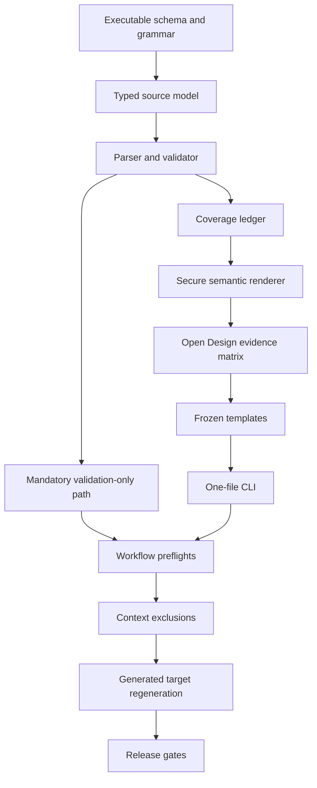

# Plan: Implement Dual-Audience Workflow Artifact Views (Revised)

## Objective

Add mandatory, deterministic validation for Brainstorm and Plan Markdown and an
optional schema-aware renderer that produces complete, self-contained HTML views
for human review. Markdown remains authoritative; validation cannot be disabled,
HTML generation can be opted out, and failures preserve the canonical artifact
with exact recovery guidance.

## Context

The decided brainstorm selected canonical Markdown plus a deterministic semantic
renderer. The first plan was reviewed by `cg-plan-critic` and is superseded by
this revision. All review findings are incorporated:

| Finding | Revision |
|---------|----------|
| P1.1 Validation bypassed by HTML opt-outs | Automatic hooks always validate; `/cg-work` validates versioned Plans before execution; opt-outs suppress only HTML writes. |
| P1.2 Output writes lacked secure containment | Destination mutation uses root-anchored no-follow traversal, handle-relative replacement where supported, reparse-point rejection, and mutation-boundary race tests. |
| P1.3 Evidence rows were subjective | Every required row now names an exact command or a machine-validated evidence artifact with objective pass criteria. |
| P2.1 Canonical target drift crossed phase boundaries | All canonical `.github/` edits occur in Phase 4 and target regeneration is the final Phase 4 implementation step. |
| P2.2 Review and commit workflows could load HTML bodies | `/cg-review` and `/cg-commit-push-pr` list/stage view paths without reading their diffs or full bodies. |
| P2.3 Markdown grammar was open-ended | Version 1 defines an exact block/inline grammar and classifies the emitted status comment as non-substantive schema metadata. |
| P2.4 Manual behavior under opt-out was undecided | `artifact-html: false` suppresses automatic writes only; explicit render and stale-check commands still operate. |
| P3.1 Hash normalization was contradictory | The normalization algorithm is explicit: remove one UTF-8 BOM, normalize CRLF/lone CR to LF, preserve Unicode and remaining whitespace, encode UTF-8, then SHA-256. |

### Existing Implementation Surfaces

- `scripts/parsing_utils.py` and `scripts/brain/utils.py` provide the existing
  dependency-free frontmatter behavior.
- `.github/prompts/cg-brainstorm.prompt.md` emits decision records;
  `.github/prompts/cg-plan.prompt.md` emits executable contracts; and
  `.github/prompts/cg-work.prompt.md` consumes Plans.
- `scripts/cg_generate_targets.py` already implements root-anchored,
  handle-relative secure mutation on supported POSIX systems and a tested
  fallback elsewhere. The shared writer must preserve that behavior.
- `.github/` remains canonical. Claude Code, Codex, and OpenCode assets are
  derived by `scripts/cg_generate_targets.py`.
- `scripts/brain/scanner.py`, `scripts/cg_audit_context.py`, `/cg-review`,
  `/cg-commit-push-pr`, and the release scanner are model-context boundaries
  that must explicitly exclude generated HTML bodies.
- Open Design is available only during implementation at
  `/Users/r.andrescastaneda/.local/bin/od`. Users must not need it at runtime.

### Dependency Graph

## Requirements

| ID | Requirement | Source |
|----|-------------|--------|
| R1 | Preserve Brainstorm and Plan Markdown as the sole authoritative decision and execution source; HTML is derived and regenerable. | Brainstorm: Audience and authority |
| R2 | Define and deterministically validate versioned Brainstorm and Plan schemas after save and, for versioned Plans, before `/cg-work` execution. Validation must run even when HTML is disabled. | Brainstorm: Source-contract audit; review P1.1 |
| R3 | For Standard and Deep Plans, prove unique IDs, valid phase/step structure, complete requirement-to-step mappings, and structurally usable required verification evidence. | Brainstorm: Source-contract audit |
| R4 | Parse sources into typed Brainstorm and Plan models with source spans and explicit strict, compatible-legacy, unsupported, and ambiguous-input behavior. | Brainstorm: Fidelity and provenance |
| R5 | Provide type-specific human information architecture while preserving every substantive source block exactly once and permitting only source-derived navigation, grouping, coverage, status, and counts. | Brainstorm: Human information architecture |
| R6 | Produce self-contained, responsive, accessible, printable HTML with usable long-document navigation, tables, code, commands, and bounded progressive disclosure. | Brainstorm: Human information architecture |
| R7 | Embed source path, normalized source SHA-256, artifact schema version, renderer version, and UTC generation timestamp in machine-readable and visible provenance. | Brainstorm: Fidelity and provenance |
| R8 | Escape or sanitize untrusted content, never execute source HTML/scripts/instructions, enforce safe URL handling and an offline content policy, and securely contain all output writes. | Brainstorm: Fidelity and provenance; review P1.2 |
| R9 | Use `/Users/r.andrescastaneda/.local/bin/od` to validate representative Brainstorm and Plan views across required viewport, offline, print, accessibility, and long-document conditions, then freeze the result into repository templates. | Brainstorm: Open Design usage |
| R10 | Map sources to `.cg-docs/views/brainstorms/<slug>.html` and `.cg-docs/views/plans/<slug>.html`; automatic success output is one concise path confirmation. | Brainstorm: Generation and storage |
| R11 | Provide one-file render, validation-only, and stale-check commands; default automatic generation; project opt-out; and one-run `--no-html`. Opt-outs suppress only automatic HTML writes. | Brainstorm: Generation and storage; review P2.4 |
| R12 | Save and verify Markdown before validation/rendering; on failure preserve Markdown and any prior valid view, emit the exact error and expected stale/missing path, and provide one-file recovery. | Brainstorm: Failure behavior |
| R13 | Exclude view bodies from Brain, context, token, review, commit/PR, release, and duplicate-content model inputs while retaining path-level staging and provenance behavior. | Brainstorm: Token safeguards; review P2.2 |
| R14 | Keep `.github/` canonical and regenerate equivalent GitHub Copilot, Claude Code, Codex, and OpenCode behavior before the phase containing canonical edits completes. | Brainstorm: Cross-platform lifecycle; review P2.1 |
| R15 | Document authority, schemas, naming, commands, opt-outs, provenance, failure recovery, context exclusions, and Open Design runtime independence. | Brainstorm: Lifecycle requirements |
| R16 | Add contract, parser, validator, coverage, renderer, security, secure-write, CLI, integration, prompt, installer, scanner, evidence, and generated-target tests. | Brainstorm: Lifecycle requirements |
| R17 | Keep version 1 limited to new Brainstorm and Plan views and one-file operations; exclude historical bulk conversion, live execution updates, editing, hosted/export formats, other artifact types, and AI summaries. | Brainstorm: Version 1 boundaries |

## Phase 1: Executable Contract and Mandatory Validation

### 1. Define the executable schema and closed Markdown grammar

- **Requirements**: R1, R2, R3, R4, R17
- **Files**:
  - `scripts/artifact_views/__init__.py` (new)
  - `scripts/artifact_views/schema.py` (new)
  - `scripts/artifact_views/tests/fixtures/` (new)
  - `scripts/artifact_views/tests/test_contract.py` (new)
- **Details**:
  - Define artifact schema version `1` in executable Python data. Defer all
    canonical `.github/` prompt and shared-contract edits to Phase 4.
  - Brainstorm version `1` requires frontmatter identity/status fields and the
    Context, Requirements, Approaches Considered, Decision, and Next Steps
    sections. Plan version `1` requires identity/scope/deviation fields,
    Objective, Context, Requirements, globally numbered steps, test metadata,
    risks, out-of-scope content, and the complete goal-execution contract.
  - Define Standard/Deep Plan invariants: unique requirement, verification, and
    constraint IDs; globally unique consecutive step numbers; unique consecutive
    phase numbers; exactly one phase owner per phased step; declared mappings;
    complete requirement coverage; and non-empty evidence/command cells for
    required verification rows.
  - Close the block grammar to ATX headings, paragraphs, blank lines, ordered,
    unordered and task lists, pipe tables, backtick/tilde fenced code,
    blockquotes, thematic breaks, and raw HTML blocks/comments.
  - Close the inline grammar to literal text, backslash escapes, emphasis,
    strong emphasis, code spans, links, autolinks, and hard/soft line breaks.
    Unsupported inline delimiters remain literal text; ambiguous block ownership
    fails validation.
  - Classify only the exact emitted `Valid status values` HTML comment as
    non-substantive schema metadata. Track it in the lexical ledger but omit it
    from the human body. Any other raw HTML is substantive inert source and must
    render visibly escaped exactly once.
  - Version `1` is strict. Missing version means legacy and renders only when it
    maps unambiguously. Unknown future versions fail with an actionable error.
- **Test Scenarios**:
  - **Happy path**: Strict Brainstorm, non-phased Plan, and phased Deep Plan
    fixtures satisfy all invariants.
  - **Edge case**: The exact status comment is metadata; similar comments and
    other raw HTML remain substantive escaped content.
  - **Error path**: Unknown versions, duplicate IDs, orphan mappings, malformed
    completion tables, ambiguous headings, and unclosed fences fail with source
    lines.
- **Tests**: `pytest -q scripts/artifact_views/tests/test_contract.py`
- **Acceptance criteria**:
  - The executable contract contains the full accepted grammar and every R2/R3
    invariant, with positive and negative fixtures.
  - Phase 1 changes no canonical `.github/` source.

### 2. Implement the typed document and source ledger

- **Requirements**: R1, R4, R5, R7
- **Files**:
  - `scripts/artifact_views/model.py` (new)
  - `scripts/artifact_views/errors.py` (new)
  - `scripts/artifact_views/tests/test_model.py` (new)
- **Details**:
  - Add immutable Python 3.8-compatible dataclasses for identity, frontmatter,
    source spans, lexical blocks, substantive blocks, requirements, alternatives,
    phases, steps, tests, risks, and completion-contract rows.
  - Give each lexical and substantive block a stable document-local ID and
    one-based line span. Non-substantive metadata remains accounted for but
    cannot satisfy substantive render coverage.
  - Mark source-backed and derived presentation elements separately. Derived
    elements cannot satisfy source coverage or introduce semantic claims.
  - Define typed read, parse, schema, coverage, security, path, and write errors
    carrying source path, span, and corrective action.
- **Test Scenarios**:
  - **Happy path**: Models preserve source order, identity, spans, and typed
    Brainstorm/Plan relationships.
  - **Edge case**: Multiline tables, empty optional sections, and metadata
    comments keep stable IDs.
  - **Error path**: Duplicate IDs, overlapping spans, or derived elements
    claiming source ownership fail construction.
- **Tests**: `pytest -q scripts/artifact_views/tests/test_model.py`
- **Acceptance criteria**:
  - Every parsed byte range is represented in the lexical ledger and every
    substantive block has exactly one source identity before rendering.

### 3. Implement fence-aware parsers, validators, and validation-only API

- **Requirements**: R2, R3, R4, R11, R16
- **Files**:
  - `scripts/parsing_utils.py`
  - `scripts/artifact_views/parser.py` (new)
  - `scripts/artifact_views/validator.py` (new)
  - `scripts/artifact_views/tests/test_parser.py` (new)
  - `scripts/artifact_views/tests/test_validator.py` (new)
- **Details**:
  - Reuse `parse_frontmatter_with_body()` and existing null/list semantics;
    extend shared helpers only when current callers also benefit.
  - Tokenize blocks without treating headings or pipes inside backtick/tilde
    fences as structure. Parse completion tables by normalized header names,
    never column positions.
  - Parse Brainstorm decision structure and Plan requirements, phases, steps,
    tests, risks, boundaries, and completion contract while preserving additional
    unambiguous sections in source order.
  - Build requirement-to-step and verification-to-phase mappings as
    source-derived data.
  - Expose a validation-only API used later by automatic hooks and `/cg-work`.
    Validation has no dependency on rendering, templates, configuration, Open
    Design, network access, or model calls.
  - Return a bounded collection of independent structural errors without
    cascading noise. Never silently drop unsupported or ambiguous input.
- **Test Scenarios**:
  - **Happy path**: Strict fixtures parse and validate with complete mappings.
  - **Edge case**: Pipes in code spans, CRLF, tilde fences, optional phase
    columns, repeated headings, and compatible legacy input behave deterministically.
  - **Error path**: Duplicate mappings, steps outside phases, malformed tables,
    unknown IDs, and ambiguity fail before any renderer call.
- **Tests**:
  - `pytest -q scripts/artifact_views/tests/test_parser.py scripts/artifact_views/tests/test_validator.py`
- **Acceptance criteria**:
  - Validation can run independently for one source and enforces every R2/R3
    invariant.

## Phase 2: Secure Deterministic Rendering

### 4. Implement normalized identity, provenance, and secure output mutation

- **Requirements**: R7, R8, R10, R12, R16
- **Files**:
  - `scripts/secure_fs.py` (new)
  - `scripts/cg_generate_targets.py`
  - `scripts/artifact_views/paths.py` (new)
  - `scripts/artifact_views/provenance.py` (new)
  - `scripts/artifact_views/writer.py` (new)
  - `scripts/artifact_views/tests/test_paths.py` (new)
  - `scripts/artifact_views/tests/test_provenance.py` (new)
  - `scripts/artifact_views/tests/test_writer.py` (new)
  - `scripts/tests/test_target_path_safety.py`
- **Details**:
  - Accept regular `.md` sources only under `.cg-docs/brainstorms/` and
    `.cg-docs/plans/`. Enforce component-level containment with
    `Path.relative_to()` and reject source symlink escapes.
  - Map only the final `.md` suffix to the mirrored `.html` destination.
  - Define normalized source bytes exactly: decode strict UTF-8; remove one
    leading U+FEFF if present; replace CRLF and lone CR with LF; preserve all
    Unicode code points, trailing whitespace, and trailing newlines; encode
    UTF-8; compute SHA-256.
  - Extract the generator's proven root-anchored secure mutation primitives into
    `scripts/secure_fs.py` without changing target-generator behavior.
  - On supported POSIX hosts, traverse from an opened root using `dir_fd`,
    `O_DIRECTORY`, and `O_NOFOLLOW`; create and fsync a temporary file in the
    pinned parent; and replace through the same handle.
  - On hosts without secure `dir_fd`, reject symlink/reparse-point ancestors and
    targets, revalidate immediately at the mutation boundary, and fail closed on
    any identity/type change. Document the platform capability in diagnostics.
  - Add `_before_secure_replace`-equivalent injection at the final mutation
    boundary. Race tests replace destination ancestors there, not before setup.
  - Preserve the mode of an existing regular view, never follow a destination
    link, and retain any previous valid view on failure.
  - Emit machine-readable JSON provenance and visible provenance. Rendering
    receives an explicit UTC timestamp; fixed complete inputs produce identical
    bytes.
- **Test Scenarios**:
  - **Happy path**: Secure write creates the expected mirrored output and
    provenance matches normalized source content.
  - **Edge case**: BOM, CRLF/lone CR, Unicode, spaces, existing modes, and fixed
    timestamps remain deterministic.
  - **Error path**: Traversal, source/destination symlinks, reparse ancestors,
    mutation-boundary swaps, read-only parents, and interrupted replacement
    fail without outside writes or loss of a valid view.
- **Tests**:
  - `pytest -q scripts/artifact_views/tests/test_paths.py scripts/artifact_views/tests/test_provenance.py scripts/artifact_views/tests/test_writer.py scripts/tests/test_target_path_safety.py`
- **Acceptance criteria**:
  - Real mutation-boundary race tests prove output cannot escape the project.
  - Existing generator secure-write tests remain green after extraction.

### 5. Build type-specific templates and source-coverage enforcement

- **Requirements**: R1, R5, R6, R7, R17
- **Files**:
  - `scripts/artifact_views/coverage.py` (new)
  - `scripts/artifact_views/templates.py` (new)
  - `scripts/artifact_views/renderer.py` (new)
  - `scripts/artifact_views/tests/test_coverage.py` (new)
  - `scripts/artifact_views/tests/test_renderer.py` (new)
- **Details**:
  - Render one HTML document with embedded CSS and no remote assets. Prefer
    native HTML/CSS and include no script unless a source-independent navigation
    behavior demonstrably requires it.
  - Brainstorm views organize context, requirements, alternatives/trade-offs,
    decision/rationale, and next steps. Plan views organize outcome, completion
    contract, phase map, steps, requirement coverage, verification, risks,
    boundaries, and next actions.
  - Mark source-backed blocks with `data-source-block` and derived maps/counts
    with `data-derived`. Derived elements may reorganize but not summarize or
    reinterpret source claims.
  - Enforce a bijection before serialization: each substantive block has exactly
    one rendered owner and no rendered owner references an unknown block.
  - Preserve unsupported but structurally bounded blocks visibly as escaped
    source with type and line information. Ambiguous blocks fail validation.
- **Test Scenarios**:
  - **Happy path**: Long Brainstorm and Plan fixtures render all substantive
    content once with distinct information architectures.
  - **Edge case**: Dense tables, nested lists, long paths, code, empty optional
    sections, and bounded unsupported blocks remain complete.
  - **Error path**: Omitted, duplicated, or invented source ownership blocks
    serialization.
- **Tests**:
  - `pytest -q scripts/artifact_views/tests/test_coverage.py scripts/artifact_views/tests/test_renderer.py`
- **Acceptance criteria**:
  - Coverage tests prove exact-once ownership for every substantive fixture
    block.

### 6. Harden content security, offline behavior, print, and accessibility

- **Requirements**: R6, R8, R16
- **Files**:
  - `scripts/artifact_views/security.py` (new)
  - `scripts/artifact_views/templates.py`
  - `scripts/artifact_views/tests/test_security.py` (new)
  - `scripts/artifact_views/tests/test_accessibility.py` (new)
- **Details**:
  - Escape text and attributes through structured helpers. Raw HTML is inert;
    source never enters CSS or script contexts.
  - Allow only documented relative URLs and explicit safe schemes. Reject
    encoded script schemes, event handlers, malformed anchors, duplicate IDs,
    and source-derived styles.
  - Apply a restrictive CSP blocking network connections, objects, frames,
    plugins, and external media. Prohibit `innerHTML`, `eval`, and dynamic code.
  - Add semantic landmarks, skip links, visible focus, keyboard navigation,
    reduced motion, non-color status cues, contrast, responsive overflow, and
    stable font sizing.
  - Print rules retain provenance, headings, table headers, links, code, and all
    substantive source while removing navigation chrome.
- **Test Scenarios**:
  - **Happy path**: Normal links, tables, code, print, and offline loading work.
  - **Edge case**: Unicode controls, long tokens, quote-heavy code, repeated
    headings, 200% zoom, and reduced motion remain usable.
  - **Error path**: Script/raw-event/URL/CSS/JSON payloads remain inert or are
    rejected before output.
- **Tests**:
  - `pytest -q scripts/artifact_views/tests/test_security.py scripts/artifact_views/tests/test_accessibility.py`
- **Acceptance criteria**:
  - Generated files contain no remote runtime dependency or executable source
    content and preserve full print content.

## Phase 3: Open Design Evidence and Frozen Presentation

### 7. Produce and validate the Open Design evidence matrix

- **Requirements**: R5, R6, R9, R16
- **Files**:
  - `scripts/validate_artifact_view_evidence.py` (new)
  - `scripts/artifact_views/evidence.py` (new)
  - `scripts/artifact_views/tests/test_evidence.py` (new)
  - `.cg-docs/work-reports/2026-07-31-dual-audience-workflow-artifact-views.design-evidence.json` (new execution evidence)
  - Representative rendered Brainstorm and Plan HTML views
- **Details**:
  - Invoke only `/Users/r.andrescastaneda/.local/bin/od`, never bare `od`.
  - Evaluate both artifact types at `1440x900`, `768x1024`, and `390x844`.
    Each artifact/viewport row records `nonblank`, `noHorizontalOverflow`,
    `noOverlap`, `navigationReachable`, `firstViewportIdentity`, and screenshot
    path.
  - Add per-artifact rows for offline load, print preview, keyboard order,
    visible focus, 200% zoom, contrast, reduced motion, long-document
    orientation, and complete provenance.
  - The JSON evidence includes schema version, source/view hashes, generated
    timestamp, Open Design executable path/version, each required boolean, and
    local screenshot/print-preview artifact paths. It contains no source body.
  - `--require-all-pass` validates schema, required matrix coverage, hashes,
    referenced evidence files, and that every required result is true. A missing
    row or artifact exits nonzero.
  - Record accepted design changes in the execution report. Do not commit Open
    Design runtime state or let it alter canonical content.
- **Test Scenarios**:
  - **Happy path**: Complete two-artifact matrix passes the validator.
  - **Edge case**: Evidence order and additional non-required observations do
    not affect validity.
  - **Error path**: Missing viewport/check/file, hash mismatch, false result, or
    bare `/usr/bin/od` identity fails.
- **Tests**:
  - `pytest -q scripts/artifact_views/tests/test_evidence.py`
  - `python3 scripts/validate_artifact_view_evidence.py --evidence .cg-docs/work-reports/2026-07-31-dual-audience-workflow-artifact-views.design-evidence.json --require-all-pass`
- **Acceptance criteria**:
  - The exact command above exits zero and the execution report records V3 as
    passed.

### 8. Freeze accepted tokens, components, responsive rules, and print rules

- **Requirements**: R6, R9, R16
- **Files**:
  - `scripts/artifact_views/templates.py`
  - `scripts/artifact_views/tests/snapshots/` (new structural snapshots)
  - `scripts/artifact_views/tests/test_design_contract.py` (new)
- **Details**:
  - Translate accepted Open Design results into CSS custom properties,
    typography, spacing, layout constraints, component rules, breakpoints,
    focus states, reduced motion, and print rules.
  - Use local platform-neutral font fallbacks with no font download. Avoid a
    one-hue palette and represent state with text/symbols as well as color.
  - Keep the reading flow unframed; cards are limited to repeated items or
    genuine framed tools. Never nest cards.
  - Snapshot stable semantics, metadata, classes, and source ownership only;
    exclude timestamps and irrelevant formatting.
- **Test Scenarios**:
  - **Happy path**: Accepted reference structures match frozen contracts.
  - **Edge case**: Narrow print margins, zoom, long words, and reduced motion do
    not hide or overlap content.
  - **Error path**: Removing provenance, print content, focus, overflow guards,
    or source ownership fails tests.
- **Tests**:
  - `pytest -q scripts/artifact_views/tests/test_design_contract.py scripts/artifact_views/tests/test_accessibility.py`
- **Acceptance criteria**:
  - Shipped templates reproduce the accepted views without Open Design or
    external resources.

## Phase 4: CLI, Workflow Integration, Isolation, and Target Parity

### 9. Implement explicit and automatic one-file CLI modes

- **Requirements**: R2, R10, R11, R12, R16
- **Files**:
  - `scripts/render_artifact.py` (new)
  - `scripts/artifact_views/cli.py` (new)
  - `scripts/artifact_views/config.py` (new)
  - `scripts/artifact_views/tests/test_cli.py` (new)
  - `scripts/artifact_views/tests/test_integration.py` (new)
- **Details**:
  - Support exactly one source per invocation:
    - `cg-render-artifact <source>` explicitly validates and renders, ignoring
      automatic-generation opt-out.
    - `cg-render-artifact --automatic <source>` always validates, reads
      `artifact-html`, and writes HTML only when enabled.
    - `cg-render-artifact --validate-only <source>` validates without writing.
    - `cg-render-artifact --check <source>` checks missing/stale/current status
      even when automatic generation is opted out.
  - Reject directories, multiple sources, bulk/watch modes, and conflicting
    modes.
  - `artifact-html` absent/true enables automatic writes; false suppresses only
    automatic writes; invalid values warn and default enabled. Explicit render,
    check, and validation-only modes always operate.
  - Render fully in memory and pass bytes to the secure writer. On success emit
    one concise relative path, or a concise validation/disabled status for modes
    that do not write.
  - On failure return nonzero with exact error, source, expected view path,
    missing/stale/current state where knowable, and explicit regeneration
    command. Preserve source and previous valid view.
  - Make no model, agent, Open Design, subprocess-agent, or network call.
- **Test Scenarios**:
  - **Happy path**: Explicit, automatic, validation-only, and check modes have
    their documented outcomes.
  - **Edge case**: Opt-out, invalid config, stale/current view, spaces, and
    existing valid output remain deterministic.
  - **Error path**: Invalid source/config/mode, validation, coverage, security,
    and write failures retain canonical and prior-view bytes.
- **Tests**:
  - `pytest -q scripts/artifact_views/tests/test_cli.py scripts/artifact_views/tests/test_integration.py`
- **Acceptance criteria**:
  - Opt-outs cannot bypass validation and explicit commands remain available.

### 10. Add cross-platform launchers and installer lifecycle support

- **Requirements**: R10, R11, R14, R16
- **Files**:
  - `bin/cg-render-artifact` (new)
  - `bin/cg-render-artifact.cmd` (new)
  - `install.ps1`
  - `scripts/install.sh`
  - `tests/install.Tests.ps1`
  - `tests/bash-scripts.Tests.ps1`
- **Details**:
  - Add a committed bash launcher resolving verified `python3`, `python`, or
    `py`, forwarding arguments, and propagating exit codes.
  - Add a committed CMD launcher with mandatory `where` guards, independent
    `for /f` version checks, Windows Store stub rejection, forwarding, and exact
    exit-code propagation for all three candidates.
  - Register idempotent install/upgrade, uninstall cleanup, command summaries,
    and help on Windows and macOS/Linux. Keep committed wrappers as source of
    truth and audit sibling Python launchers for parity without unrelated edits.
- **Test Scenarios**:
  - **Happy path**: Both launchers invoke the correct entrypoint and preserve
    arguments/exit codes.
  - **Edge case**: Missing `python3` falls through; paths contain spaces;
    install/upgrade is idempotent.
  - **Error path**: No Python, Store stubs, missing wrappers, and uninstall
    failures are actionable and do not leak absent-command stderr.
- **Tests**:
  - Safe runner `. tests/Run-Tests.ps1 -File install`
  - Safe runner `. tests/Run-Tests.ps1 -File bash-scripts`
- **Acceptance criteria**:
  - Both installers expose and remove the command, and CMD tests assert every
    required `where` guard.

### 11. Add mandatory workflow validation and model-context exclusions

- **Requirements**: R1, R2, R11, R12, R13, R14
- **Files**:
  - `.github/shared/artifact-view.contract.md` (new)
  - `.github/shared/goal-execution.contract.md`
  - `.github/shared/context-loading.contract.md`
  - `.github/prompts/cg-brainstorm.prompt.md`
  - `.github/prompts/cg-plan.prompt.md`
  - `.github/prompts/cg-work.prompt.md`
  - `.github/prompts/cg-review.prompt.md`
  - `.github/prompts/cg-commit-push-pr.prompt.md`
  - `.github/agents/cg-release-scanner.agent.md`
  - `tests/prompt-tools.Tests.ps1`
- **Details**:
  - Add `artifact-schema-version: 1` to new Brainstorm and Plan templates and
    document the executable schema/grammar without duplicating parser internals.
  - After Markdown save verification, normal emitter flow calls
    `cg-render-artifact --automatic <source>`; `--no-html` calls
    `--validate-only`. Both paths fail loudly on validation errors. Rendering
    failures preserve Markdown and produce required stale/missing guidance.
  - Add `/cg-work` preflight: strict-validate versioned Plans with
    `--validate-only` before roadmap status, execution report, or code changes.
    Preserve the existing explicit compatibility flow for legacy Plans.
  - State that HTML may orient readers but never supplies execution semantics.
  - `/cg-review` excludes `.cg-docs/views/**` from agent file bodies/diffs and
    reviews canonical Markdown, renderer code, tests, and a stale-check result.
    It may report view paths/counts only.
  - `/cg-commit-push-pr` may group/stage view files but must not read their full
    content or diff. It derives commit/PR prose from canonical sources and uses
    `--check` for generated-view consistency.
  - Context loading and release scanning classify views as generated derived
    outputs and never ingest their bodies.
  - Keep hooks compact and canonical. No platform-specific semantic fork is
    hand-authored.
- **Test Scenarios**:
  - **Happy path**: Both emitters validate; enabled automatic flow writes a view;
    `/cg-work` validates before execution; review/commit use canonical bodies.
  - **Edge case**: Project opt-out and `--no-html` still validate; review/commit
    retain path-level staging without body ingestion; legacy Plans use existing
    compatibility approval.
  - **Error path**: Invalid versioned source blocks handoff/execution; renderer
    failure preserves source; any prompt instruction to read view bodies fails
    contract assertions.
- **Tests**:
  - Safe runner `. tests/Run-Tests.ps1 -File prompt-tools`
- **Acceptance criteria**:
  - Validation is mandatory and generated HTML bodies are absent from every
    named model-facing workflow.

### 12. Exclude views from scanners, audits, and duplicate-content paths

- **Requirements**: R13, R16
- **Files**:
  - `scripts/brain/scanner.py`
  - `scripts/brain/tests/test_scanner.py`
  - `scripts/cg_audit_context.py`
  - `scripts/tests/test_audit_context.py`
  - Relevant summary/release tests discovered during implementation
- **Details**:
  - Add `views: None` to the Brain directory map so nested views skip silently
    without warnings or entities.
  - Exclude `.cg-docs/views/` from context inventory, token source totals,
    duplicate-content checks, query inputs, and release knowledge matching.
  - Audit all remaining recursive `.cg-docs/` readers. Prove extension/type
    filters already exclude HTML or add a narrow explicit exclusion.
  - Use a distinctive sentinel present only in generated HTML and prove it
    cannot appear in Brain entities/query output, context audit source records,
    duplicate findings, release references, review inputs, or commit prose.
- **Test Scenarios**:
  - **Happy path**: Canonical Markdown remains visible while its view is absent
    from all model-facing output.
  - **Edge case**: Nested and malformed HTML views skip without warnings.
  - **Error path**: Removing any exclusion exposes the sentinel and fails tests.
- **Tests**:
  - `pytest -q scripts/brain/tests/test_scanner.py scripts/tests/test_audit_context.py scripts/artifact_views/tests/test_integration.py`
- **Acceptance criteria**:
  - View content contributes zero model-context or duplicate-content records.

### 13. Regenerate all native targets and prove parity

- **Requirements**: R14, R16
- **Files**:
  - Generated `.claude/`, `.agents/`, and `.opencode/` command/shared trees and ownership manifests
  - `scripts/tests/test_cg_generate_targets.py`
  - `scripts/tests/test_target_ownership.py`
  - `scripts/tests/test_target_closure.py`
  - `scripts/tests/test_target_determinism.py`
  - `scripts/tests/test_target_drift.py`
  - `scripts/tests/test_target_path_safety.py`
- **Details**:
  - Run `python3 scripts/cg_generate_targets.py --all` only after all Phase 4
    canonical `.github/` edits are complete.
  - Never hand-edit generated targets. Verify equivalent validation, opt-out,
    authority, failure, review, and commit semantics in each native format.
  - Run ownership, closure, determinism, path-safety, and drift tests. Regenerate
    again or use drift tests to prove stable bytes.
- **Test Scenarios**:
  - **Happy path**: Every platform receives equivalent compact behavior.
  - **Edge case**: Format conversion changes only native syntax.
  - **Error path**: Missing dependencies, manual drift, unstable bytes, or
    runtime-reference leaks fail.
- **Tests**:
  - `python3 scripts/cg_generate_targets.py --all`
  - `pytest -q scripts/tests/test_cg_generate_targets.py scripts/tests/test_target_ownership.py scripts/tests/test_target_closure.py scripts/tests/test_target_determinism.py scripts/tests/test_target_drift.py scripts/tests/test_target_path_safety.py`
- **Acceptance criteria**:
  - Phase 4 ends with clean generated targets and no canonical/generated drift.

## Phase 5: Documentation and Release Evidence

### 14. Document authority, lifecycle, commands, and recovery

- **Requirements**: R10, R11, R12, R13, R15, R17
- **Files**:
  - `docs/workflow.md`
  - `docs/reference/commands.md`
  - `docs/reference/files.md`
  - `docs/configuration/index.md`
  - `docs/troubleshooting.md`
  - `docs/context-files.md`
  - `docs/navigation.json` if required
  - `README.md` only for a concise pointer if needed
  - `scripts/tests/test_target_documentation.py`
- **Details**:
  - Document canonical authority, schema versions/legacy behavior, naming,
    automatic and explicit modes, validation-only, stale check, opt-outs,
    provenance, secure failure recovery, and commit expectations.
  - Explain that `artifact-html: false` and `--no-html` never disable validation;
    explicit render/check remain available under project opt-out.
  - Explain model-context exclusions and that agents may use HTML for orientation
    only.
  - State that views are self-contained derived files committed with canonical
    sources, never edited as authority, and that users need no Open Design
    daemon, MCP, account, connector, plugin, or runtime.
  - Document all version 1 exclusions and troubleshooting for validation,
    stale/missing views, unsafe paths/content, Python launchers, and regeneration.
- **Test Scenarios**:
  - **Happy path**: A user can find every lifecycle command and recovery path.
  - **Edge case**: Documentation clearly distinguishes automatic opt-out,
    one-run skip, explicit render, and mandatory validation.
  - **Error path**: Broken links, undocumented flags, Open Design runtime
    implications, or bulk-render instructions fail review/tests.
- **Tests**:
  - `node scripts/check-docs-site.js`
  - `pytest -q scripts/tests/test_target_documentation.py`
- **Acceptance criteria**:
  - User and reference documentation cover the complete lifecycle without
    promising out-of-scope behavior.

### 15. Run end-to-end, audit, documentation, and full-suite gates

- **Requirements**: R1, R2, R5, R6, R8, R9, R12, R13, R14, R16, R17
- **Files**:
  - `.cg-docs/work-reports/2026-07-31-dual-audience-workflow-artifact-views.design-evidence.json`
  - `.cg-docs/work-reports/2026-07-31-dual-audience-workflow-artifact-views-v2.md`
  - `.cg-docs/cost/artifact-views-final/context-audit.json`
  - `tests/last-run.json`
- **Details**:
  - Render this Plan and its Brainstorm end to end; verify normalized provenance,
    exact source coverage, safe output, offline load, and stale detection.
  - Inject parser, coverage, security, destination-race, and write failures;
    compare canonical and prior-view bytes before/after.
  - Validate the complete Open Design matrix with the exact V3 command.
  - Run context audit and assert zero guardrail failures, no view source records,
    no view sentinel, and no unsupported token-saving claim. Record measured
    prompt/context deltas as heuristic evidence only.
  - Run documentation checks, all Python tests, the final generated-target drift
    gate, and the canonical full Pester suite once through an execution subagent.
  - Read `tests/last-run.json` and require `passed: true`, `failedCount: 0`, and
    `filteredFiles: null`.
  - Review the final diff for debug code, external/runtime Open Design
    dependencies, accidental HTML-body ingestion, unrelated refactors, and
    version 1 scope creep.
- **Test Scenarios**:
  - **Happy path**: Both artifact types pass every required evidence gate.
  - **Edge case**: Opt-outs, stale/legacy input, malicious content, long
    documents, and native targets retain documented behavior.
  - **Error path**: Failed evidence, filtered Pester, target drift, view
    ingestion, external resources, or unsafe mutation blocks completion.
- **Tests**:
  - Commands and objective pass criteria in the Completion Contract below.
- **Acceptance criteria**:
  - V1-V11 have executed evidence and every required constraint passes.

## Testing Strategy

1. Contract fixtures close the schema and Markdown grammar before renderer work.
2. Typed-model and parser tests account for every lexical/source span and
   validate mappings independently of HTML.
3. Secure-write tests run at the actual mutation boundary and reuse the target
   generator's proven root-anchored pattern.
4. Coverage tests enforce exact-once ownership before serialization.
5. Security tests use raw HTML, encoded URLs, scripts, event handlers, CSS/JSON
   payloads, path traversal, symlinks, reparse points, and races.
6. Design/accessibility tests combine structural checks with a machine-validated
   Open Design evidence matrix for two artifacts and three viewports.
7. CLI tests separate explicit render, automatic generation, validation-only,
   and stale-check semantics.
8. Prompt tests prove validation ordering, `/cg-work` preflight, and review,
   commit, context, and release body exclusions.
9. Sentinel tests prove generated view content never enters model-facing scans.
10. Generated-target tests prove same-phase parity, ownership, closure,
    determinism, security, and no drift.
11. Final gates use full Python, unfiltered safe Pester, documentation, audit,
    and exact design-evidence commands.

Pester must run only through the canonical `tests/Run-Tests.ps1` pattern using
an execution subagent. Never invoke Pester directly or pipeline its output.

## Documentation Checklist

- [ ] Canonical Markdown authority and mandatory validation.
- [ ] Version `1` schema, closed grammar, and compatible legacy behavior.
- [ ] Source/view naming and one-file path mapping.
- [ ] Explicit render, automatic, validation-only, and stale-check commands.
- [ ] Project opt-out versus one-run skip semantics.
- [ ] Provenance and normalized hash algorithm.
- [ ] Secure atomic write and exact recovery behavior.
- [ ] Review, commit, Brain, context, audit, and release exclusions.
- [ ] Offline, print, accessibility, and Open Design evidence behavior.
- [ ] Open Design implementation-time-only statement.
- [ ] Version 1 exclusions, especially no bulk historical conversion.
- [ ] Command, files, workflow, configuration, context, and troubleshooting navigation.

## Risks & Mitigations

| Risk | Impact | Mitigation |
|------|--------|------------|
| Schema variants exceed the closed grammar. | Content may be ambiguous or omitted. | Strict versioning, real emitter fixtures, literal inline fallback, visible bounded unsupported blocks, and hard failure on ownership ambiguity. |
| Validation is accidentally tied back to rendering. | Opt-outs or `/cg-work` could accept invalid Plans. | Independent validation API, explicit `--validate-only`, prompt ordering tests, and `/cg-work` preflight. |
| Output containment is checked before but not during mutation. | A race could overwrite outside the repository. | Root-pinned no-follow handles, handle-relative replace, reparse rejection, fail-closed fallback, and final-boundary race injection. |
| Shared secure-write extraction regresses target generation. | Existing generated targets could corrupt or drift. | Preserve public behavior, run existing path-safety/determinism tests in Phase 2, and include target checks in V2/V6. |
| Coverage is syntactic but presentation is misleading. | Humans may overlook authoritative content. | Source spans, exact-once ownership, type-specific structure, and representative long-document Open Design checks. |
| Sanitization misses an executable context. | Generated artifacts could run untrusted content. | Escape by default, allowlisted URLs, no source-derived script/style, CSP, adversarial fixtures, and abort-on-failure. |
| Manual design evidence becomes subjective prose. | `/cg-work` cannot gate Phase 3 objectively. | Versioned JSON matrix, required rows/files/hashes, exact validator command, and all-pass semantics. |
| Canonical edits leave native targets stale. | Platforms diverge. | Confine all `.github/` edits to Phase 4 and make regeneration its final step. |
| Review or commit prompts ingest large HTML. | Duplicate context violates token-efficiency goals. | Path-only handling, canonical-source prose, stale checks, sentinel tests, and final context audit. |
| Generated timestamps create noisy nondeterminism. | Tests and diffs become unstable. | Treat timestamp as explicit input and assert determinism over complete fixed inputs. |
| Open Design leaks into runtime. | Users cannot render without local design tooling. | Absolute path only in Phase 3, frozen plain templates, runtime scans, and offline tests. |
| Feature grows into a publishing platform. | Delivery slips and risk rises. | Enforce R17; deviations require approval under policy `ask`. |

## Out of Scope

- Automatic bulk conversion or migration of historical artifacts.
- Continuous Plan view updates during `/cg-work`.
- Editing canonical content or execution state from HTML.
- PDF, image, slide, hosted-site, search-site, or server export.
- Views for reviews, solutions, reports, roadmaps, strategies, or other types.
- Runtime Open Design, daemon, MCP, account, connector, plugin, or sync behavior.
- Per-artifact AI summaries, invented labels/claims, semantic compression, or
  design generation.
- A general-purpose CommonMark implementation outside the closed version `1`
  artifact grammar.
- Bulk/watch mode, preview server, or automatic browser opening.
- Using views as roadmap, execution-report, or approval authority.

## Completion Contract

### Outcome

Brainstorm and Plan Markdown are always schema-validated after save and before
versioned Plan execution, while optional self-contained HTML views provide human
review. HTML opt-outs suppress only automatic writes; failures preserve Markdown
and report exact recovery.

### Verification Surface

| ID | Phase | Evidence Required | Command/Artifact | Required |
|----|-------|-------------------|------------------|----------|
| V1 | 1 | Executable schema, typed model, parser, and validator tests pass. | `pytest -q scripts/artifact_views/tests/test_contract.py scripts/artifact_views/tests/test_model.py scripts/artifact_views/tests/test_parser.py scripts/artifact_views/tests/test_validator.py` | yes |
| V2 | 2 | Secure path mutation, normalized provenance, exact coverage, renderer, security, and accessibility tests pass without target-generator regression. | `pytest -q scripts/artifact_views/tests/test_paths.py scripts/artifact_views/tests/test_writer.py scripts/artifact_views/tests/test_provenance.py scripts/artifact_views/tests/test_renderer.py scripts/artifact_views/tests/test_coverage.py scripts/artifact_views/tests/test_security.py scripts/artifact_views/tests/test_accessibility.py scripts/tests/test_target_path_safety.py` | yes |
| V3 | 3 | Required Brainstorm/Plan viewport, offline, print, keyboard, zoom, contrast, reduced-motion, provenance, and long-document matrix is complete and all-pass. | `python3 scripts/validate_artifact_view_evidence.py --evidence .cg-docs/work-reports/2026-07-31-dual-audience-workflow-artifact-views.design-evidence.json --require-all-pass` | yes |
| V4 | 4 | CLI, mandatory validation-only, opt-out, integration, failure-preservation, and scanner/audit isolation tests pass. | `pytest -q scripts/artifact_views/tests/test_cli.py scripts/artifact_views/tests/test_integration.py scripts/brain/tests/test_scanner.py scripts/tests/test_audit_context.py` | yes |
| V5 | 4 | Installer, bash launcher, and prompt workflow contracts pass. | Through execution subagent: `. tests/Run-Tests.ps1 -File install`; `. tests/Run-Tests.ps1 -File bash-scripts`; `. tests/Run-Tests.ps1 -File prompt-tools`. Execution report requires `passed: true` and `failedCount: 0` for each. | yes |
| V6 | 4 | Native targets regenerate with ownership, closure, determinism, path safety, and zero drift. | `python3 scripts/cg_generate_targets.py --all` then `pytest -q scripts/tests/test_cg_generate_targets.py scripts/tests/test_target_ownership.py scripts/tests/test_target_closure.py scripts/tests/test_target_determinism.py scripts/tests/test_target_drift.py scripts/tests/test_target_path_safety.py` | yes |
| V7 | 4 | Review, commit/PR, release, Brain, and context consumers never load generated HTML bodies; canonical sources remain available. | `tests/prompt-tools.Tests.ps1` path-only contract assertions plus sentinel tests in `scripts/artifact_views/tests/test_integration.py` and `scripts/tests/test_audit_context.py` | yes |
| V8 | final | Context audit reports zero guardrail failures and contains no view source record, sentinel, duplicate-content finding, or unsupported savings claim. | `bin/cg-token-audit --root . --output-dir .cg-docs/cost/artifact-views-final --format json --recommendations --no-token-artifacts`; inspect `.cg-docs/cost/artifact-views-final/context-audit.json` | yes |
| V9 | final | Documentation site and target-documentation checks pass. | `node scripts/check-docs-site.js && pytest -q scripts/tests/test_target_documentation.py` | yes |
| V10 | final | Complete Python suite passes. | `pytest -q` | yes |
| V11 | final | Canonical full Pester gate passes unfiltered. | Through execution subagent: `. tests/Run-Tests.ps1`; `tests/last-run.json` requires `passed: true`, `failedCount: 0`, and `filteredFiles: null`. | yes |

### Constraints

| ID | Phase | Constraint | Check |
|----|-------|------------|-------|
| C1 | 1 | Markdown remains the sole semantic authority. | Contract, provenance, and prompt assertions |
| C2 | 1 | Validation runs despite `artifact-html: false` or `--no-html`, and `/cg-work` validates versioned Plans. | Validator API, CLI mode, and prompt-order tests |
| C3 | 2 | Every substantive source block renders exactly once. | Source-block bijection tests |
| C4 | 2 | Source HTML, scripts, styles, and instructions never execute. | Escaping, URL, CSP, and adversarial tests |
| C5 | 2 | Output is self-contained and offline. | Remote-resource and offline-load tests |
| C6 | 2 | Output mutation is root-anchored, no-follow and handle-relative where supported, rejects links/reparse points, and is race-tested at replacement. | Secure writer and target path-safety tests |
| C7 | 3 | Open Design is design-time only. | Evidence identity, runtime dependency scan, and offline tests |
| C8 | 4 | Markdown saves before validation/rendering and survives every failure. | Prompt ordering and failure-injection byte comparisons |
| C9 | 4 | `.github/` remains canonical and target regeneration completes in the same phase as edits. | Ownership, closure, parity, and drift tests |
| C10 | 4 | Generated HTML bodies add no model context. | Path-only prompt assertions, sentinel tests, and final audit |
| C11 | final | Version 1 boundaries remain intact. | Final requirements and diff review |

### Boundaries

- Allowed: artifact schema/model/parser/renderer/CLI, shared secure-write
  primitives, Open Design evidence validation, launchers/installers, canonical
  workflow contracts, generated targets, model-context exclusions,
  documentation, tests, and Brainstorm/Plan views.
- Out of scope: historical bulk conversion, live execution updates, HTML
  editing, hosted/PDF/slide exports, other artifact types, runtime Open Design,
  general Markdown publishing, and AI-generated summaries or interpretations.

### Iteration Policy

1. Validate after every save; opt-outs skip only automatic HTML writes.
2. Explicit render and stale-check commands operate under project opt-out.
3. The exact emitted status comment is non-substantive metadata; other raw HTML
   is inert substantive source.
4. Normalize hashes by removing one BOM, converting CRLF/lone CR to LF,
   preserving Unicode and remaining whitespace/newlines, then hashing UTF-8.
5. Keep canonical `.github/` edits in Phase 4 and regenerate targets before the
   phase completes.
6. Reject ambiguous structures and unsafe mutation; never emit a simplified
   fallback.
7. Ask before dependencies, schema expansion, opt-out changes, or version 1
   scope changes.

### Blocked-Stop Conditions

- Required source coverage cannot be proven.
- Validation can be bypassed by an HTML setting or execution path.
- Secure destination containment or race resistance cannot be maintained.
- Faithful rendering requires executable or trusted raw source content.
- The required Open Design evidence matrix is incomplete or failing.
- Markdown or a previous valid view changes after a failed render.
- Generated view content enters any model-facing workflow or audit source set.
- Canonical/generated targets drift at a phase boundary.
- Any required Python, Pester, documentation, audit, accessibility, security,
  or evidence gate fails after allowed recovery attempts.
- Continuing requires an unapproved dependency or version 1 scope expansion.