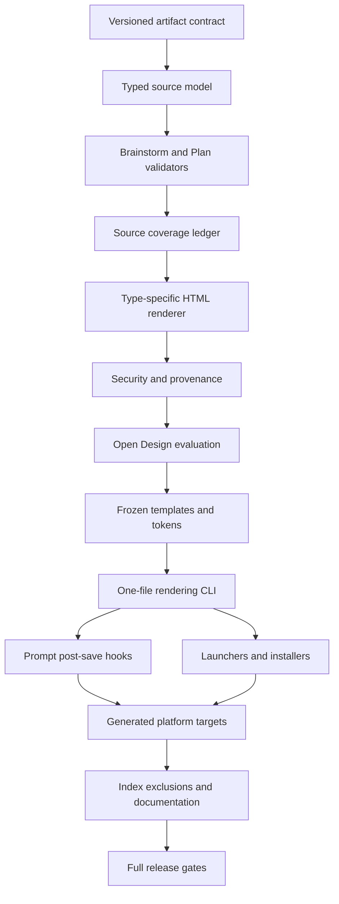

# Plan: Implement Dual-Audience Workflow Artifact Views

## Objective

Add a deterministic, schema-aware rendering system that keeps Brainstorm and
Plan Markdown authoritative while producing complete, self-contained HTML views
for human review. New artifacts should render automatically after their
canonical Markdown is saved, with explicit validation, provenance, security,
failure recovery, indexing exclusions, and equivalent behavior across supported
agent platforms.

## Context

The canonical Brainstorm and Plan prompts emit increasingly long Markdown
artifacts. Those files are effective agent inputs but are difficult for humans
to approve, monitor, and challenge. The decided brainstorm selected a typed,
deterministic semantic renderer rather than a generic Markdown skin, a second
structured authority, or per-artifact AI generation.

Current repository evidence establishes the following implementation facts:

- `.github/prompts/cg-brainstorm.prompt.md` emits a stable decision-record
  skeleton: Context, Requirements, Approaches Considered, Decision, and Next
  Steps.
- `.github/prompts/cg-plan.prompt.md` emits requirements, globally numbered
  implementation steps, optional `## Phase N:` groupings, tests, risks, and a
  completion contract governed by `.github/shared/goal-execution.contract.md`.
- `.github/prompts/cg-work.prompt.md` consumes plans through frontmatter and
  heading scans but there is no shared typed Plan parser or comprehensive
  deterministic schema validator to reuse.
- `scripts/parsing_utils.py` and `scripts/brain/utils.py` provide the existing
  dependency-free frontmatter behavior. New parsing should build on that
  behavior and remain compatible with Python 3.8+.
- `.github/` is the canonical prompt source. `scripts/cg_generate_targets.py`
  derives Claude Code, Codex, and OpenCode targets and already has determinism,
  ownership, closure, and drift tests.
- `scripts/brain/scanner.py` requires an explicit `None` mapping for generated
  `.cg-docs/` directories to avoid warnings and Knowledge Brain ingestion.
- Python launchers require bash and CMD parity. New CMD launchers must use the
  mandatory `where` pre-check and Windows Store stub rejection pattern.
- Open Design is available at `/Users/r.andrescastaneda/.local/bin/od` for
  implementation-time design work. It is not a runtime dependency and must not
  appear in the shipped rendering path.

The renderer will support the current versioned Brainstorm and Plan contracts.
Legacy artifacts may render only when their structure can be mapped without
ambiguity. A structurally bounded unsupported block may be preserved as escaped
source with a visible label; ambiguous structures fail validation and identify
the exact source location. No path may silently discard or reinterpret content.

### Dependency Graph

## Requirements

| ID | Requirement | Source |
|----|-------------|--------|
| R1 | Preserve Brainstorm and Plan Markdown as the sole authoritative decision and execution source; HTML is derived, regenerable, and never edited as authority. | Brainstorm: Audience and authority |
| R2 | Define and validate versioned current schemas for Brainstorms and Plans, including required frontmatter, required sections, unique IDs, phase and step structure, completion-contract fields, and header-driven tables. | Brainstorm: Source-contract audit |
| R3 | For Standard and Deep Plans, prove every requirement maps to one or more implementation steps and that every required verification item is structurally usable. | Brainstorm: Source-contract audit |
| R4 | Parse validated sources into typed Brainstorm and Plan models with source locations and an explicit policy for compatible legacy, unsupported, and ambiguous Markdown structures. | Brainstorm: Fidelity and provenance; Source-contract assessment |
| R5 | Provide type-specific human information architecture for Brainstorms and Plans, preserving every substantive source block exactly once and allowing only source-derived navigation, grouping, coverage, status, and counts. | Brainstorm: Human information architecture |
| R6 | Generate self-contained, responsive, accessible, printable HTML with readable long-document navigation, tables, code, commands, and progressive disclosure where semantics permit it. | Brainstorm: Human information architecture; Generation and storage |
| R7 | Embed source path, normalized source SHA-256, artifact schema version, renderer version, and UTC generation timestamp in machine-readable metadata and a visible provenance area. | Brainstorm: Fidelity and provenance |
| R8 | Treat source artifacts as untrusted content: escape raw HTML, sanitize links and identifiers, never execute embedded scripts or instructions, and enforce a restrictive offline content policy. | Brainstorm: Fidelity and provenance |
| R9 | Use `/Users/r.andrescastaneda/.local/bin/od` to iterate representative long Brainstorm and Plan views across desktop, narrow-screen, offline, print, accessibility, and long-document conditions, then freeze the accepted system into version-controlled templates. | Brainstorm: Open Design usage |
| R10 | Map sources to `.cg-docs/views/brainstorms/<slug>.html` and `.cg-docs/views/plans/<slug>.html`; support quiet automatic generation after successful saves and concise path confirmation. | Brainstorm: Generation and storage |
| R11 | Provide a one-file regeneration command, default-on behavior, a project-local `artifact-html: false` opt-out, and a one-run `--no-html` prompt override. | Brainstorm: Generation and storage |
| R12 | Save Markdown before rendering; on rendering failure preserve the source, emit the exact error, identify the expected view as missing or stale, and provide the one-file recovery command without disabling future attempts. | Brainstorm: Failure behavior |
| R13 | Exclude `.cg-docs/views/` from Knowledge Brain ingestion, context retrieval, release knowledge scans, duplicate-content analysis, and other model-facing scans; rendering itself must make no model call. | Brainstorm: Token and indexing safeguards |
| R14 | Keep `.github/` canonical and regenerate semantically equivalent GitHub Copilot, Claude Code, Codex, and OpenCode workflows through existing target generation. | Brainstorm: Cross-platform and lifecycle requirements |
| R15 | Document naming, generation, provenance, opt-out, manual regeneration, failure recovery, lifecycle, and Open Design runtime independence. | Brainstorm: Cross-platform and lifecycle requirements |
| R16 | Add parser, validator, source-coverage, renderer, security, CLI, integration, prompt-contract, installer, scanner, and generated-target parity tests. | Brainstorm: Cross-platform and lifecycle requirements |
| R17 | Keep version 1 limited to new Brainstorm and Plan views and one-file regeneration; do not add bulk historical conversion, live execution updates, editing, hosted/export formats, other artifact types, or AI summaries. | Brainstorm: Version 1 boundaries |

## Phase 1: Artifact Contract and Typed Parsing

### 1. Define the versioned artifact-view contract

- **Requirements**: R1, R2, R3, R4, R17
- **Files**:
  - `.github/shared/artifact-view.contract.md` (new)
  - `.github/prompts/cg-brainstorm.prompt.md`
  - `.github/prompts/cg-plan.prompt.md`
  - `.github/shared/goal-execution.contract.md`
  - `scripts/artifact_views/tests/fixtures/` (new fixture directory)
- **Details**:
  - Define artifact schema version `1` for newly emitted Brainstorms and Plans
    and add `artifact-schema-version: 1` to both prompt templates.
  - Keep the existing semantic distinction: Brainstorms are decision records
    consumed by `/cg-plan`; Plans are executable contracts consumed by
    `/cg-work`.
  - Specify required frontmatter types and required top-level sections for each
    artifact type. Preserve the existing header-driven completion-contract
    table behavior and optional phase columns.
  - Define Standard/Deep Plan invariants: unique requirement, verification, and
    constraint IDs; globally unique step numbers; consecutive unique phase
    numbers; each step belongs to exactly one phase when phased; each
    requirement maps to at least one step; step mappings reference declared
    requirements; required verification rows have non-empty evidence and
    command/artifact cells.
  - Define source block categories and boundaries for headings, paragraphs,
    lists, tables, fenced code, blockquotes, thematic breaks, and visibly
    preserved unsupported blocks.
  - Define compatibility behavior: schema-version `1` is strict; an absent
    schema version is legacy and may render only if the current required
    structure can be mapped unambiguously; an unknown future version fails with
    an actionable version error.
  - Define authority, source-coverage, provenance, staleness, output-path,
    configuration, and failure contracts in one shared source referenced by the
    emitters and CLI.
  - Add compact representative fixtures for valid Brainstorm, non-phased Plan,
    phased Deep Plan, compatible legacy input, and intentionally malformed
    structures.
- **Test Scenarios**:
  - **Happy path**: Version `1` Brainstorm and phased Plan fixtures satisfy every
    declared structural invariant.
  - **Edge case**: A legacy artifact without a version maps cleanly and is
    identified as legacy rather than silently relabeled version `1`.
  - **Error path**: Unknown versions, duplicate IDs, missing required sections,
    orphan requirement mappings, and ambiguous phase boundaries produce named
    validation errors with source lines.
- **Tests**:
  - `pytest -q scripts/artifact_views/tests/test_contract.py`
  - Prompt assertions in `tests/prompt-tools.Tests.ps1` through the safe runner.
- **Acceptance criteria**:
  - One normative shared contract defines all accepted schemas and lifecycle
    rules without duplicating conflicting semantics across prompts.
  - Current emitters include `artifact-schema-version: 1`.
  - Contract fixtures cover both artifact types, phased and non-phased Plans,
    legacy compatibility, and malformed input.

### 2. Implement the typed document and source-block model

- **Requirements**: R1, R4, R5, R7
- **Files**:
  - `scripts/artifact_views/__init__.py` (new)
  - `scripts/artifact_views/model.py` (new)
  - `scripts/artifact_views/errors.py` (new)
  - `scripts/artifact_views/tests/test_model.py` (new)
- **Details**:
  - Add immutable dataclasses for artifact identity, frontmatter fields,
    source spans, source blocks, requirements, phases, steps, test scenarios,
    completion-contract rows, Brainstorm alternatives, and complete typed
    documents.
  - Give every substantive parsed block a stable document-local source ID and
    one-based start/end line span. Keep original source text available only as
    inert data for fidelity and diagnostics.
  - Separate source-backed blocks from derived presentation elements. Derived
    elements must declare their derivation type and cannot satisfy source
    coverage.
  - Define typed exceptions for read, parse, schema, coverage, security, path,
    and write failures. Error messages include artifact type, source path,
    source span where known, and a concise corrective action.
  - Keep the package Python 3.8 compatible, standard-library only, and fully
    type-annotated. Use `pathlib`, `dataclasses`, and existing frontmatter
    helpers rather than adding a runtime package.
- **Test Scenarios**:
  - **Happy path**: Typed documents retain source ordering, identity, and line
    spans while exposing Brainstorm- and Plan-specific structures.
  - **Edge case**: Empty optional sections and multiline table/code content do
    not destabilize source IDs or line spans.
  - **Error path**: Invalid model construction, duplicate source IDs, and
    overlapping source spans fail before rendering.
- **Tests**:
  - `pytest -q scripts/artifact_views/tests/test_model.py`
- **Acceptance criteria**:
  - The renderer can consume only typed validated documents, not arbitrary raw
    Markdown strings.
  - Every source-backed model element has a stable source ID and line span.

### 3. Build schema-aware Brainstorm and Plan parsers and validators

- **Requirements**: R2, R3, R4, R5, R16
- **Files**:
  - `scripts/parsing_utils.py`
  - `scripts/artifact_views/parser.py` (new)
  - `scripts/artifact_views/validator.py` (new)
  - `scripts/artifact_views/tests/test_parser.py` (new)
  - `scripts/artifact_views/tests/test_validator.py` (new)
- **Details**:
  - Reuse `parse_frontmatter_with_body()` and the repository's null/list scalar
    behavior. Extend shared helpers only where both current callers and the new
    parser benefit; do not introduce a second YAML implementation.
  - Implement a fence-aware block tokenizer so headings and table delimiters
    inside backtick or tilde fences never affect document structure.
  - Parse current Brainstorm sections into context, requirements, alternatives,
    decision, rationale-bearing content, and next steps while retaining
    additional unambiguous sections in source order.
  - Parse Plans into objective, context, requirements, phases, steps, testing,
    documentation, risks, out-of-scope content, and the full completion
    contract. Parse tables by normalized header names, not column positions.
  - Validate frontmatter and body invariants from Step 1 before any rendering.
    Report all independent structural errors in one bounded diagnostic result
    where doing so does not create cascading noise.
  - Classify unsupported constructs. Preserve a structurally bounded construct
    as escaped source with a visible unsupported label; fail when block
    boundaries or ownership are ambiguous.
  - Build a requirement-to-step and verification-to-phase coverage model for
    Plan presentation and validation. The model is source-derived and adds no
    semantic claims.
- **Test Scenarios**:
  - **Happy path**: Current strict fixtures parse into complete typed documents
    and expose correct requirement, phase, step, and verification mappings.
  - **Edge case**: Pipes inside code spans, headings inside fences, optional
    phase columns, extra unambiguous sections, tilde fences, and CRLF input are
    handled without dropped blocks.
  - **Error path**: Duplicate IDs, unknown mappings, malformed tables,
    non-consecutive phases, steps outside phases, unclosed fences, and ambiguous
    legacy headings fail with exact diagnostics.
- **Tests**:
  - `pytest -q scripts/artifact_views/tests/test_parser.py scripts/artifact_views/tests/test_validator.py`
- **Acceptance criteria**:
  - Parsing and validation are deterministic and independent of rendering.
  - All R2 and R3 invariants have positive and negative automated tests.
  - No source construct is silently omitted.

## Phase 2: Deterministic and Secure Rendering

### 4. Implement source identity, path mapping, provenance, and staleness

- **Requirements**: R7, R10, R12
- **Files**:
  - `scripts/artifact_views/provenance.py` (new)
  - `scripts/artifact_views/paths.py` (new)
  - `scripts/artifact_views/tests/test_provenance.py` (new)
  - `scripts/artifact_views/tests/test_paths.py` (new)
- **Details**:
  - Accept only regular `.md` sources under `.cg-docs/brainstorms/` or
    `.cg-docs/plans/`. Resolve paths and enforce containment with
    `Path.relative_to()` so symlinks and sibling-prefix paths cannot escape the
    project boundary.
  - Map filenames deterministically to the corresponding mirrored HTML path
    while preserving the source basename and replacing only the final `.md`
    suffix with `.html`.
  - Normalize source text to UTF-8 bytes without modifying content and compute
    SHA-256 for stale-view detection.
  - Define renderer version as a package constant. Accept generation time as an
    explicit UTC input to rendering so equal source, renderer version, schema,
    and timestamp inputs produce byte-identical output; the CLI supplies the
    current UTC timestamp and tests freeze it.
  - Emit machine-readable JSON metadata and equivalent visible provenance with
    source path, source hash, schema version, renderer version, generated time,
    and derived-view status.
  - Implement stale checks against metadata without trusting visible HTML text.
- **Test Scenarios**:
  - **Happy path**: Brainstorm and Plan paths map to the expected mirrored
    output and metadata reports a matching source hash.
  - **Edge case**: Spaces, Unicode source content, CRLF, repeated `.md` tokens,
    and explicit fixed timestamps remain deterministic.
  - **Error path**: Absolute outside paths, traversal, symlink escape, wrong
    extension/type directory, and malformed existing metadata are rejected.
- **Tests**:
  - `pytest -q scripts/artifact_views/tests/test_paths.py scripts/artifact_views/tests/test_provenance.py`
- **Acceptance criteria**:
  - Path mapping exactly matches the brainstorm decision.
  - Staleness can be decided from machine-readable provenance and current
    source content.
  - Fixed-input render artifacts are byte-identical.

### 5. Build type-specific semantic HTML templates and coverage enforcement

- **Requirements**: R1, R5, R6, R7, R17
- **Files**:
  - `scripts/artifact_views/templates.py` (new)
  - `scripts/artifact_views/renderer.py` (new)
  - `scripts/artifact_views/coverage.py` (new)
  - `scripts/artifact_views/tests/test_renderer.py` (new)
  - `scripts/artifact_views/tests/test_coverage.py` (new)
- **Details**:
  - Render one complete HTML document with embedded CSS and an optional small,
    deterministic script. Do not use CDNs, remote fonts, stylesheets, images,
    or network calls.
  - Render Brainstorms around context, requirements, alternatives and
    trade-offs, decision, rationale, and next steps. Render Plans around
    outcome, completion contract, phase map, implementation steps, requirement
    coverage, verification evidence, risks, boundaries, and next actions.
  - Use semantic landmarks, heading hierarchy, skip navigation, stable anchors,
    sticky document navigation, readable tables, code/command blocks, and
    `
` only for content whose collapsed state cannot conceal required
    approval information.
  - Keep the artifact title and derived-view label prominent in the first
    viewport. Link to the canonical source with a repository-relative href.
  - Render source-backed blocks with `data-source-block` identifiers. Render
    derived navigation, counts, maps, and status elements with explicit
    `data-derived` markers.
  - Before serialization, require a bijection: every substantive source block
    is consumed once and only once, and no rendered source block references an
    unknown source ID. Coverage failure aborts the render.
  - Preserve unsupported but unambiguous blocks as escaped source in context,
    visibly labeled with the unsupported construct and source lines.
- **Test Scenarios**:
  - **Happy path**: Representative Brainstorm and Plan fixtures render all
    content once with the correct type-specific landmarks and derived maps.
  - **Edge case**: Long tables, long unbroken paths, nested lists, empty optional
    sections, and preserved unsupported blocks keep stable layout semantics and
    complete coverage.
  - **Error path**: A template omits, duplicates, or invents a source block and
    coverage enforcement prevents HTML serialization.
- **Tests**:
  - `pytest -q scripts/artifact_views/tests/test_renderer.py scripts/artifact_views/tests/test_coverage.py`
- **Acceptance criteria**:
  - Automated coverage tests prove every substantive fixture block appears
    exactly once.
  - Brainstorm and Plan outputs have distinct, task-appropriate information
    architectures rather than a shared generic Markdown skin.

### 6. Harden escaping, link handling, offline behavior, and accessibility

- **Requirements**: R6, R8, R16
- **Files**:
  - `scripts/artifact_views/security.py` (new)
  - `scripts/artifact_views/templates.py`
  - `scripts/artifact_views/renderer.py`
  - `scripts/artifact_views/tests/test_security.py` (new)
  - `scripts/artifact_views/tests/test_accessibility.py` (new)
- **Details**:
  - Escape all source text and attribute values with structured HTML APIs or
    `html.escape`; never interpolate trusted-looking Markdown directly into
    executable HTML contexts.
  - Treat raw HTML in Markdown as text. Reject unsafe URL schemes, encoded
    script schemes, event-handler attempts, malformed anchors, and identifier
    collisions. Permit only documented relative links and safe explicit
    schemes.
  - Add a restrictive Content Security Policy that blocks network access,
    plugins, frames, objects, and external media. If inline script is retained,
    keep it static, source-independent, and limited to navigation behavior.
  - Avoid `innerHTML`, `eval`, dynamic code generation, source-derived CSS, and
    source-derived script data. Prefer no script when native HTML/CSS suffices.
  - Add print rules that remove interactive chrome while retaining provenance,
    section context, table headers, readable code, links, and page-break hints.
  - Add keyboard-visible focus, skip links, landmark labels, reduced-motion
    behavior, sufficient color contrast, non-color status cues, responsive
    overflow, and text sizing that does not scale with viewport width.
  - Parse generated HTML in tests to assert valid nesting-sensitive contracts,
    one title/H1, unique IDs, valid internal anchors, semantic landmarks, and no
    remote resource URLs.
- **Test Scenarios**:
  - **Happy path**: Normal Markdown links, code, tables, and source metadata
    render safely and remain usable offline and in print.
  - **Edge case**: Unicode, bidi controls, very long tokens, quote-heavy code,
    fragment links, and repeated headings remain inert and navigable.
  - **Error path**: `<script>`, raw event attributes, `javascript:` and encoded
    variants, CSS injection, malicious JSON metadata, and duplicate IDs cannot
    produce executable output.
- **Tests**:
  - `pytest -q scripts/artifact_views/tests/test_security.py scripts/artifact_views/tests/test_accessibility.py`
- **Acceptance criteria**:
  - Adversarial fixtures remain visible as inert text and never create
    executable nodes or unsafe URLs.
  - Generated files have no runtime network dependency and retain their full
    review content in print output.

## Phase 3: Open Design Reference Views and Frozen Design System

### 7. Create representative long-form reference views in Open Design

- **Requirements**: R5, R6, R9
- **Files**:
  - The current decided brainstorm and this Plan as representative source input
  - Temporary Open Design project artifacts created through
    `/Users/r.andrescastaneda/.local/bin/od`
  - `.cg-docs/work-reports/<plan-report>.md` for durable validation evidence
- **Details**:
  - Invoke Open Design only through the absolute executable path. Never invoke
    bare `od`, which may resolve to `/usr/bin/od`.
  - Feed renderer-produced reference HTML for this long Brainstorm and Plan into
    Open Design. Iterate information hierarchy, navigation density, typography,
    table treatment, code/command treatment, phase maps, requirement coverage,
    provenance, and derived-view labeling.
  - Evaluate at representative wide desktop, laptop, tablet/narrow desktop,
    and mobile widths. Check the first viewport, long-scroll orientation,
    sticky behavior, table overflow, long paths, and heading context.
  - Exercise offline loading and print/PDF preview. Disable network access while
    confirming that no visual or functional element disappears.
  - Perform keyboard navigation, focus order, reduced motion, contrast, zoom,
    and semantic landmark checks. Record concrete observations and accepted
    changes in the execution report rather than committing Open Design runtime
    state.
  - Keep all design changes source-neutral. Open Design may improve presentation
    but must not write summaries, claims, or semantic transformations into the
    canonical artifact or renderer fixtures.
- **Test Scenarios**:
  - **Happy path**: Both long reference views remain understandable and fully
    navigable at all target widths, offline, and in print.
  - **Edge case**: Dense requirement and verification tables, long code blocks,
    and deep phase navigation remain readable without overlaps or clipped text.
  - **Error path**: Any design that hides substantive content, depends on a
    network request, or requires Open Design at runtime is rejected.
- **Tests**:
  - Open Design viewport and print evidence recorded against V3 in the execution
    report.
  - Re-run `pytest -q scripts/artifact_views/tests/test_renderer.py scripts/artifact_views/tests/test_accessibility.py` after accepted design changes.
- **Acceptance criteria**:
  - Desktop, narrow-screen, offline, print, accessibility, and long-document
    evaluations have explicit pass/fail evidence for both artifact types.
  - No accepted design behavior depends on Open Design runtime components.

### 8. Freeze accepted tokens, components, and responsive/print rules

- **Requirements**: R6, R9, R16
- **Files**:
  - `scripts/artifact_views/templates.py`
  - `scripts/artifact_views/tests/snapshots/` (new, only stable structural snapshots)
  - `scripts/artifact_views/tests/test_design_contract.py` (new)
- **Details**:
  - Translate accepted Open Design outcomes into named CSS custom properties,
    typography rules, spacing, layout constraints, components, focus states,
    responsive breakpoints, and print rules in version-controlled templates.
  - Use locally available platform-neutral font fallbacks embedded as CSS
    declarations without remote font downloads. Avoid a one-hue palette and
    ensure status indicators include text or symbols beyond color.
  - Keep cards limited to repeated artifact items or genuine framed tools; use
    unframed bands and document sections for the main reading flow.
  - Add structural snapshots for stable landmarks, classes, metadata, and
    source-block mapping. Do not snapshot timestamps or irrelevant whitespace
    in a way that makes tests brittle.
  - Add regression assertions for no overflow-inducing fixed widths, no
    viewport-scaled fonts, print visibility of source/provenance, and no hidden
    source blocks.
- **Test Scenarios**:
  - **Happy path**: Accepted Brainstorm and Plan structures match the frozen
    component and token contract.
  - **Edge case**: Large text zoom, reduced motion, narrow print margins, and
    long strings do not hide or overlap content.
  - **Error path**: A template change removes provenance, source coverage,
    keyboard focus, print content, or responsive overflow protection and tests
    fail.
- **Tests**:
  - `pytest -q scripts/artifact_views/tests/test_design_contract.py scripts/artifact_views/tests/test_accessibility.py`
- **Acceptance criteria**:
  - The shipped template fully reproduces the accepted reference views without
    Open Design, external assets, or network access.
  - Stable design contracts have focused regression tests.

## Phase 4: CLI, Workflow Hooks, Distribution, and Index Isolation

### 9. Implement the one-file rendering CLI and atomic failure semantics

- **Requirements**: R7, R10, R11, R12, R13
- **Files**:
  - `scripts/render_artifact.py` (new)
  - `scripts/artifact_views/cli.py` (new)
  - `scripts/artifact_views/config.py` (new)
  - `scripts/artifact_views/writer.py` (new)
  - `scripts/artifact_views/tests/test_cli.py` (new)
  - `scripts/artifact_views/tests/test_writer.py` (new)
- **Details**:
  - Expose one source-at-a-time invocation, for example
    `cg-render-artifact .cg-docs/plans/example.md`, plus `--check` for stale or
    missing status and `--root` for controlled integration testing.
  - Do not add a bulk-render mode in version 1. Reject directories and multiple
    source arguments with an out-of-scope error.
  - Read `artifact-html` from `compound-gpid.local.md` frontmatter. Missing or
    true means enabled; false means project-local opt-out. Invalid values warn
    and retain default-on behavior rather than silently disabling output.
  - Automatic prompt hooks check config before invoking. Explicit manual
    regeneration may override the project opt-out with a clearly named CLI flag
    only if the contract defines it; `--no-html` remains a prompt one-run skip,
    not a renderer mode that writes a placeholder.
  - Render fully in memory, validate source coverage and HTML security, then
    write to a same-directory temporary file, flush, and replace atomically.
    Never truncate or partially replace a previously valid view.
  - On failure, return nonzero and print a bounded diagnostic containing exact
    error, source, expected view path, missing/stale state, and the one-file
    regeneration command. Do not mutate the source or configuration.
  - On success, print only the concise relative output path. Ensure the CLI
    performs no model, Open Design, subprocess-agent, or network call.
- **Test Scenarios**:
  - **Happy path**: One valid source creates the expected path, then `--check`
    reports current and exits zero.
  - **Edge case**: Existing current, stale, manually edited, opted-out, read-only,
    and same-name temporary conditions have explicit deterministic behavior.
  - **Error path**: Invalid source, validation failure, coverage failure, write
    failure, and interrupted replacement preserve source and any prior valid
    view while emitting the recovery command.
- **Tests**:
  - `pytest -q scripts/artifact_views/tests/test_cli.py scripts/artifact_views/tests/test_writer.py`
- **Acceptance criteria**:
  - A one-file command generates, checks, and regenerates views with atomic
    writes and exact failure guidance.
  - Successful automatic-compatible output is one concise path line.
  - Static and mocked runtime tests prove no model, Open Design, network, or
    agent call exists in the rendering path.

### 10. Add cross-platform launchers and installer lifecycle support

- **Requirements**: R10, R11, R14, R16
- **Files**:
  - `bin/cg-render-artifact` (new)
  - `bin/cg-render-artifact.cmd` (new)
  - `install.ps1`
  - `scripts/install.sh`
  - `tests/install.Tests.ps1`
  - `tests/bash-scripts.Tests.ps1`
- **Details**:
  - Add a committed bash launcher that resolves `python3`, `python`, or `py`,
    verifies a real Python version, forwards arguments, and propagates the CLI
    exit code.
  - Add a committed CMD launcher using the exact mandatory `where` guard,
    `for /f` version verification, Store-stub rejection, argument forwarding,
    and exit-code propagation for every Python candidate.
  - Update Windows and macOS/Linux installers, idempotent upgrade behavior,
    uninstall cleanup, registered-command summaries, and help output.
  - Keep committed wrappers as the single source of truth where launcher logic
    is nontrivial. Do not duplicate a divergent inline CMD implementation in
    `install.ps1`.
  - Audit sibling Python launchers for parity without refactoring unrelated
    working code.
- **Test Scenarios**:
  - **Happy path**: Both launchers invoke the correct script, forward a source
    path, and preserve success/failure exit codes.
  - **Edge case**: `python3` absent but `python` or `py` valid; source and install
    paths contain spaces; install/upgrade is idempotent.
  - **Error path**: No valid Python, Windows Store stubs, missing committed
    wrapper, and uninstall cleanup produce actionable behavior without stderr
    leakage.
- **Tests**:
  - `. tests/Run-Tests.ps1 -File install` through the required execution subagent.
  - `. tests/Run-Tests.ps1 -File bash-scripts` through the required execution subagent.
- **Acceptance criteria**:
  - The command is available and removable through both supported installer
    paths.
  - CMD tests assert all three `where` guards and the correct Python entrypoint.

### 11. Add Markdown-first automatic generation hooks to both emitters

- **Requirements**: R1, R10, R11, R12, R14
- **Files**:
  - `.github/prompts/cg-brainstorm.prompt.md`
  - `.github/prompts/cg-plan.prompt.md`
  - `.github/shared/artifact-view.contract.md`
  - `tests/prompt-tools.Tests.ps1`
- **Details**:
  - Parse `--no-html` in both prompts as a one-run skip. Preserve all existing
    flag behavior and branch, contract-preview, save, roadmap, and handoff order.
  - After and only after canonical Markdown is successfully saved and verified,
    read the project-local `artifact-html` setting. Generate by default when the
    setting is absent or true; skip when false or `--no-html` is present.
  - Invoke `cg-render-artifact <exact-source-path>` with no model call and report
    the concise generated path on success.
  - On nonzero exit, keep the Markdown and continue no further until the user
    has seen the exact error, expected missing/stale view path, and regeneration
    command. Do not rewrite the Markdown, generate a generic fallback, alter the
    config, or disable future generation.
  - Tell agents that HTML may be inspected for orientation but all execution and
    decision semantics come from canonical Markdown.
  - Keep hooks compact and reference the shared contract instead of duplicating
    renderer internals into prompts.
- **Test Scenarios**:
  - **Happy path**: Brainstorm and Plan prompts save Markdown first, then invoke
    one-file generation and report the mirrored path.
  - **Edge case**: Project opt-out and one-run override skip generation without
    changing future defaults; HTML may orient but never authorizes execution.
  - **Error path**: Renderer failure preserves the Markdown and mandates exact
    stale/missing recovery output with no fallback.
- **Tests**:
  - New focused assertions in `tests/prompt-tools.Tests.ps1`, run through
    `. tests/Run-Tests.ps1 -File prompt-tools` using the required execution
    subagent because this is a long-session prompt-tools test.
- **Acceptance criteria**:
  - Both canonical emitters implement identical Markdown-first lifecycle
    semantics and all prompt ordering assertions pass.

### 12. Regenerate native targets and verify semantic parity

- **Requirements**: R14, R16
- **Files**:
  - Generated `.claude/commands/`, `.claude/shared/`, and ownership manifest
  - Generated `.agents/commands/`, `.agents/shared/`, and ownership manifest
  - Generated `.opencode/commands/`, `.opencode/shared/`, and ownership manifest
  - `scripts/tests/test_target_determinism.py`
  - `scripts/tests/test_target_closure.py`
  - `scripts/tests/test_target_drift.py`
- **Details**:
  - Regenerate all non-Copilot targets from the updated canonical prompts and
    shared contract with `python3 scripts/cg_generate_targets.py --all`.
  - Do not hand-edit generated command or shared-contract copies.
  - Verify each platform receives equivalent `--no-html`, config, generation,
    authority, and failure semantics within its native command format.
  - Run ownership, closure, determinism, path-safety, and drift tests. Regenerate
    a second time or use the repository's drift test to prove no unstable bytes
    are introduced by the canonical changes.
  - Confirm the renderer CLI is platform-neutral and not embedded separately in
    generated targets.
- **Test Scenarios**:
  - **Happy path**: All generated commands contain equivalent compact hooks and
    reference their generated shared contract.
  - **Edge case**: Platform format conversion changes frontmatter but preserves
    hook ordering and failure semantics.
  - **Error path**: Manual target drift, missing shared dependency, unstable
    generation, or a canonical runtime-reference leak fails tests.
- **Tests**:
  - `pytest -q scripts/tests/test_cg_generate_targets.py scripts/tests/test_target_determinism.py scripts/tests/test_target_closure.py scripts/tests/test_target_drift.py scripts/tests/test_target_path_safety.py`
- **Acceptance criteria**:
  - Generated targets are clean after regeneration and equivalent across all
    supported platforms.
  - No generated target is manually patched.

### 13. Isolate generated views from model-facing and release scans

- **Requirements**: R13, R16
- **Files**:
  - `scripts/brain/scanner.py`
  - `scripts/brain/tests/test_scanner.py`
  - `scripts/cg_audit_context.py`
  - `scripts/tests/test_audit_context.py`
  - `.github/shared/context-loading.contract.md`
  - `.github/agents/cg-release-scanner.agent.md`
  - Relevant prompt/scanner contract tests in `tests/prompt-tools.Tests.ps1`
- **Details**:
  - Add `views: None` to the Brain scanner directory map so HTML views are
    skipped silently without unknown-directory warnings or entity creation.
  - Add `.cg-docs/views/` to context-audit generated-output and duplicate-content
    exclusions. Confirm token reports do not classify view content as canonical
    project knowledge.
  - State in the context-loading contract that views are derived orientation
    surfaces and are not loaded for execution, Brain query, or ordinary context
    expansion when canonical Markdown is available.
  - Add explicit release-scanner exclusion so generated views are not counted,
    summarized, or matched as knowledge entries.
  - Search remaining `.cg-docs/` recursive readers and either prove their
    extension/type filters already exclude HTML or add a narrow explicit view
    exclusion. Do not broaden changes to unrelated generated directories.
  - Add tests that place distinctive duplicate text only in a generated HTML
    view and prove it cannot enter Brain entities, query output, audit findings,
    release references, or prompt context.
- **Test Scenarios**:
  - **Happy path**: Canonical Markdown remains indexed while the matching HTML
    view is absent from every model-facing result.
  - **Edge case**: Nested view directories and malformed/generated HTML remain
    silently excluded rather than generating scanner warnings.
  - **Error path**: Removing an exclusion causes a distinctive sentinel from a
    view to appear in a scan and the regression test fails.
- **Tests**:
  - `pytest -q scripts/brain/tests/test_scanner.py scripts/tests/test_audit_context.py`
  - Focused prompt/release assertions through the safe Pester runner.
- **Acceptance criteria**:
  - Generated HTML contributes zero duplicate artifacts or content to Brain,
    context, audit, and release knowledge surfaces.
  - Rendering and scanning tests demonstrate no model call in generation.

## Phase 5: Documentation, Integration Evidence, and Release Closure

### 14. Document and verify the complete lifecycle

- **Requirements**: R10, R11, R12, R15, R16, R17
- **Files**:
  - `docs/workflow.md`
  - `docs/reference/commands.md`
  - `docs/reference/files.md`
  - `docs/configuration/index.md`
  - `docs/troubleshooting.md`
  - `docs/context-files.md`
  - `docs/navigation.json` if required by the existing site structure
  - `README.md` only for a concise feature pointer if needed
  - `scripts/tests/test_target_documentation.py`
  - `scripts/check-docs-site.js`
- **Details**:
  - Document source/view naming, canonical authority, automatic post-save
    generation, concise success output, one-file regeneration and stale check,
    project opt-out, one-run override, failure recovery, and commit expectations.
  - Document that views are self-contained derived files under
    `.cg-docs/views/`, should be committed with their canonical sources, and
    must never be edited as authority.
  - Explain supported schema versions and visible unsupported/legacy behavior
    without promising bulk historical conversion.
  - State explicitly that users do not need Open Design, its daemon, MCP server,
    account, artifacts, connectors, or plugins.
  - Document why views are excluded from Brain/context/release ingestion and how
    agents may use them for orientation only.
  - Add troubleshooting entries for missing/stale views, invalid source
    contracts, unsafe content diagnostics, project opt-out confusion, missing
    Python/launcher setup, and regeneration failures.
  - Run documentation link/navigation checks and ensure generated platform docs
    remain consistent with canonical behavior.
- **Test Scenarios**:
  - **Happy path**: A new user can locate the source, generated view, config,
    command, provenance, and recovery procedure from the documentation.
  - **Edge case**: Documentation distinguishes project opt-out from one-run skip
    and generated orientation from canonical execution authority.
  - **Error path**: Broken links, undocumented command flags, Open Design runtime
    implication, or unsupported bulk-render instructions fail review/tests.
- **Tests**:
  - `pytest -q scripts/tests/test_target_documentation.py`
  - `node scripts/check-docs-site.js`
- **Acceptance criteria**:
  - All lifecycle requirements are documented once in the appropriate user and
    reference surfaces with no Open Design runtime implication.
  - Documentation checks pass.

### 15. Run integration, security, parity, token, and full-suite gates

- **Requirements**: R1, R5, R6, R8, R9, R12, R13, R14, R16, R17
- **Files**:
  - `scripts/artifact_views/tests/test_integration.py` (new)
  - `.cg-docs/work-reports/<plan-report>.md`
  - `tests/last-run.json`
- **Details**:
  - Add end-to-end tests that start with valid canonical Markdown, invoke the
    one-file CLI, inspect metadata and complete source coverage, load the result
    offline, and detect source staleness after a controlled change.
  - Add failure-injection tests proving canonical Markdown survives parse,
    render, coverage, security, and write failures and that any previous valid
    view is retained.
  - Render the current representative Brainstorm and Plan and inspect both
    generated files for content completeness, provenance, safe escaping,
    responsive/print contracts, and absence of external resources.
  - Measure prompt/context impact from the compact hooks and prove generated
    HTML does not enter token baselines or Knowledge Brain retrieval. Record the
    observed delta in the execution report without claiming model-token savings
    from heuristic estimates.
  - Run all Python tests. Run the canonical full Pester suite exactly once at
    the final gate through the required execution subagent, then inspect
    `tests/last-run.json` for `passed`, `failedCount`, `failures`, and
    `filteredFiles`.
  - Re-run generated-target drift checks after every canonical prompt or shared
    contract adjustment made during final fixes.
  - Review the final diff for debug code, accidental generated-view ingestion,
    remote dependencies, runtime Open Design references, unrelated refactors,
    and version 1 scope creep.
- **Test Scenarios**:
  - **Happy path**: Both artifact types complete end-to-end generation and all
    focused/full gates pass.
  - **Edge case**: Opt-out, one-run skip, stale source, legacy-compatible input,
    malicious content, long documents, and cross-platform generated prompts
    preserve their documented behavior.
  - **Error path**: Any failed required evidence, partial Pester run, source
    coverage gap, external resource, view-ingestion sentinel, or target drift
    blocks completion.
- **Tests**:
  - `pytest -q scripts/artifact_views/tests scripts/brain/tests scripts/tests`
  - `. tests/Run-Tests.ps1` through the required execution subagent, followed by
    targeted reading of `tests/last-run.json`.
  - `python3 scripts/cg_generate_targets.py --all` followed by target drift and
    determinism tests.
  - `node scripts/check-docs-site.js`
- **Acceptance criteria**:
  - V1 through V8 have executed evidence in the work report.
  - Python, Pester, documentation, security, Open Design, and target parity
    gates all pass; `filteredFiles` is null for the final Pester run.
  - Final output remains within the version 1 boundaries.

## Testing Strategy

Testing proceeds from the authoritative source contract outward:

1. **Contract tests** validate required metadata, headings, IDs, mappings,
   phased/non-phased structure, and completion-contract tables.
2. **Parser/model tests** prove fence-aware block boundaries, typed extraction,
   source locations, compatible legacy behavior, and explicit ambiguity errors.
3. **Coverage tests** enforce a source-block-to-rendered-block bijection before
   HTML serialization.
4. **Renderer tests** verify type-specific hierarchy, self-contained assets,
   provenance, stable anchors, source-derived maps, and deterministic bytes for
   fixed inputs.
5. **Security tests** use adversarial raw HTML, scripts, URL schemes, encoded
   payloads, metadata, paths, and identifiers to prove inert output.
6. **Accessibility/design tests** combine structural assertions with Open Design
   viewport, print, offline, keyboard, zoom, contrast, and long-document checks.
7. **CLI/write tests** use temporary projects and injected failures to prove
   path containment, opt-out semantics, concise output, atomic replacement, and
   Markdown-first recovery.
8. **Prompt and installer tests** verify post-save ordering, both skip modes,
   exact failure guidance, launcher parity, Python detection, and lifecycle
   registration.
9. **Isolation tests** use sentinel content to prove HTML never enters Brain,
   context, audit, release, or token surfaces.
10. **Generated-target tests** validate ownership, closure, determinism, path
    safety, semantic parity, and drift across Claude Code, Codex, and OpenCode.
11. **Final gates** run the complete Python suite, canonical safe Pester runner,
    documentation checker, and generated-target regeneration/drift checks.

Pester commands must follow `cg-skill-pester-safety`: use the canonical
`tests/Run-Tests.ps1` runner through an execution subagent, never invoke Pester
directly, and treat any filtered final run as incomplete.

## Documentation Checklist

- [ ] Explain canonical Markdown authority and derived HTML orientation.
- [ ] Document Brainstorm and Plan view path mapping.
- [ ] Document `artifact-schema-version` and compatible legacy behavior.
- [ ] Document automatic generation and concise success output.
- [ ] Document `cg-render-artifact`, `--check`, and one-file-only scope.
- [ ] Document `artifact-html: false` and one-run `--no-html` separately.
- [ ] Document provenance fields and stale-view detection.
- [ ] Document exact failure recovery and previous-view preservation.
- [ ] Document `.cg-docs/views/` indexing and release exclusions.
- [ ] Document self-contained/offline, print, and accessibility behavior.
- [ ] State that Open Design is implementation-time only and not required by users.
- [ ] State version 1 exclusions, especially no historical bulk conversion.
- [ ] Update command, files, workflow, configuration, context, and troubleshooting navigation.

## Risks & Mitigations

| Risk | Impact | Mitigation |
|------|--------|------------|
| The current Markdown schema is less regular than prompt prose suggests. | Ambiguous parsing could omit or misclassify authoritative content. | Version new outputs, inventory real variants, use strict fixtures, preserve bounded unsupported blocks visibly, and fail on ambiguity. |
| A custom Markdown subset parser becomes a fragile general parser. | High maintenance and security exposure. | Scope parsing to the versioned artifact contracts, remain standard-library only, use fence-aware block boundaries, and reject out-of-contract ambiguity rather than expanding opportunistically. |
| Derived HTML subtly becomes a second authority. | Agents or humans may execute stale or reorganized semantics. | Prominent derived labels, canonical links, source hashes, prompt authority rules, stale checks, and no HTML-driven execution path. |
| Source coverage counts blocks but misses semantic fragmentation. | Content could be technically present yet misleadingly split or duplicated. | Use source spans and stable source IDs, require one rendered owner per substantive block, test complex tables/lists/code, and review representative long artifacts. |
| Generation timestamp conflicts with deterministic output expectations. | Regeneration may create noisy diffs or nondeterministic tests. | Treat timestamp as an explicit renderer input, freeze it in tests, define determinism over all inputs, and avoid claiming timestamp-free byte identity. |
| Sanitization misses an executable HTML or URL context. | Generated institutional artifacts could execute untrusted content. | Escape by default, allowlist schemes, prohibit source-derived scripts/styles, apply CSP, use adversarial fixtures, and abort on security validation failure. |
| Automatic prompt hooks inflate model context or behave differently by platform. | Token regressions and inconsistent user workflows. | Keep hooks compact in canonical prompts, reference one shared contract, regenerate native targets, test semantic parity, and measure prompt deltas. |
| A rendering failure disrupts canonical artifact creation. | Users could lose decisions or executable plans. | Enforce save-and-verify before rendering, never roll back Markdown, preserve prior views atomically, and emit exact recovery commands. |
| Generated HTML is ingested alongside Markdown. | Duplicate context increases token cost and may surface stale text. | Explicit scanner/audit/release exclusions plus sentinel-based regression tests. |
| Open Design choices leak into runtime dependencies. | Users without Open Design cannot render or inspect views. | Use the absolute tool only in Phase 3, freeze plain HTML/CSS/templates, scan runtime code/docs, and test offline output. |
| New launchers drift across Windows and macOS/Linux installers. | Rendering works only on the developer machine. | Use committed wrappers, mandatory CMD Python guards, installer/uninstaller assertions, and argument/exit-code parity tests. |
| Large HTML files create repository churn. | Review and storage costs may outweigh usability. | Keep files text-only and self-contained, avoid embedded large media/fonts, measure representative sizes, and retain one-file generation rather than bulk conversion. |
| Design iteration expands into a publishing platform. | Delivery is delayed and core fidelity risks receive less attention. | Enforce R17 and the explicit Out of Scope list; deviations require user approval under policy `ask`. |

## Out of Scope

- Bulk conversion or migration of all historical Brainstorm and Plan artifacts.
- Continuous or incremental Plan HTML updates while `/cg-work` executes.
- Editing Markdown or changing execution state from HTML.
- PDF, image, slide, hosted-site, search-site, or server-side export.
- HTML views for reviews, solutions, work reports, roadmaps, strategies, or other
  `.cg-docs/` artifact types.
- Runtime Open Design integration, daemon calls, MCP, connectors, plugins,
  accounts, or artifact synchronization.
- Per-artifact AI summaries, model-written navigation labels, invented claims,
  semantic compression, or design generation.
- A general-purpose CommonMark implementation or support for arbitrary Markdown
  outside the versioned Brainstorm and Plan contracts.
- Bulk watch mode, file-system daemon, hosted preview server, or automatic
  browser opening.
- Using generated views as roadmap links or execution-report authorities.

## Completion Contract

### Outcome

Brainstorm and Plan Markdown remain authoritative while validated,
self-contained HTML views are generated automatically for human review.
Rendering failures preserve Markdown and report exact recovery instructions.

### Verification Surface

| ID | Phase | Evidence Required | Command/Artifact | Required |
|----|-------|-------------------|------------------|----------|
| V1 | 1 | Versioned schemas, typed parser, and structural validation pass focused tests. | `pytest -q scripts/artifact_views/tests/test_contract.py scripts/artifact_views/tests/test_model.py scripts/artifact_views/tests/test_parser.py scripts/artifact_views/tests/test_validator.py` | yes |
| V2 | 2 | Complete block coverage, provenance, sanitization, accessibility structure, and deterministic fixed-input rendering pass. | `pytest -q scripts/artifact_views/tests/test_paths.py scripts/artifact_views/tests/test_provenance.py scripts/artifact_views/tests/test_renderer.py scripts/artifact_views/tests/test_coverage.py scripts/artifact_views/tests/test_security.py scripts/artifact_views/tests/test_accessibility.py` | yes |
| V3 | 3 | Desktop, narrow-screen, offline, print, accessibility, and long-document checks pass for representative Brainstorm and Plan views. | Open Design reference evidence recorded in the execution report; focused renderer/design tests | yes |
| V4 | 4 | One-file CLI, mirrored paths, opt-out, `--no-html`, atomic writes, and Markdown-first failure behavior pass integration tests. | Artifact-view CLI tests plus safe focused `install`, `bash-scripts`, and `prompt-tools` Pester results | yes |
| V5 | 4 | Canonical prompts generate equivalent Claude Code, Codex, and OpenCode targets without drift. | `python3 scripts/cg_generate_targets.py --all` and focused target generation/parity tests | yes |
| V6 | 4 | Views are excluded from Brain, context, token, release, and duplicate-content scans. | Scanner/audit sentinel tests and prompt/release contract assertions | yes |
| V7 | final | The complete Python test suite passes. | `pytest -q` | yes |
| V8 | final | The canonical full Pester gate passes with no failures and no filtered files. | Safe `tests/Run-Tests.ps1` execution-subagent result and `tests/last-run.json` | yes |

### Constraints

| ID | Phase | Constraint | Check |
|----|-------|------------|-------|
| C1 | 1 | Markdown remains the sole semantic authority. | Contract, prompt, and HTML provenance assertions |
| C2 | 2 | Every substantive source block renders exactly once. | Source-block bijection tests |
| C3 | 2 | Source HTML, scripts, styles, and instructions never execute. | Escaping, URL, CSP, and adversarial security tests |
| C4 | 2 | Output is self-contained and offline. | No-remote-resource and offline-load checks |
| C5 | 3 | Open Design is design-time only. | Runtime dependency scan and offline rendering evidence |
| C6 | 4 | Markdown saves before rendering and survives every rendering failure. | Failure-injection CLI and prompt-order tests |
| C7 | 4 | `.github/` remains canonical across supported platforms. | Generated-target ownership, closure, parity, and drift tests |
| C8 | 4 | Generated views add no duplicate retrieval context. | Brain, audit, token, context, and release exclusion tests |
| C9 | final | Version 1 boundaries remain intact. | Final diff and requirements review |

### Boundaries

- Allowed: artifact contracts, Python parsing/rendering/CLI modules, templates,
  launchers, installers, prompt hooks, generated platform targets, indexing and
  audit exclusions, documentation, tests, and generated Brainstorm/Plan views.
- Out of scope: historical bulk conversion, live `/cg-work` view updates, HTML
  editing, hosted/PDF/slide exports, other artifact types, runtime Open Design,
  and AI-generated summaries or interpretations.

### Iteration Policy

1. Complete focused tests and required phase evidence before recording a phase
   complete.
2. Reject ambiguous or unsupported structures visibly; never omit them or emit
   a simplified fallback.
3. Permit only source-derived navigation, grouping, counts, coverage, and status
   indicators.
4. Ask before adding runtime dependencies, broadening schema support, changing
   the opt-out contract, or crossing a version 1 boundary.
5. Re-run generated-target checks after canonical prompt/shared-contract edits.
6. Run complete Python, Pester, documentation, Open Design, and target-parity
   gates before completion.

### Blocked-Stop Conditions

- Source coverage cannot be proven for a supported artifact.
- Faithful rendering would require executing or trusting unescaped source
  content.
- Open Design validation cannot be completed for both representative artifact
  types.
- Markdown-first save and failure-preservation semantics cannot be maintained.
- A required generated-platform parity or index-isolation check remains failing.
- A required Python, Pester, documentation, security, accessibility, or final
  evidence item fails after the allowed recovery attempts.
- Continuing requires a runtime dependency or scope expansion not approved
  under `deviation-policy: ask`.