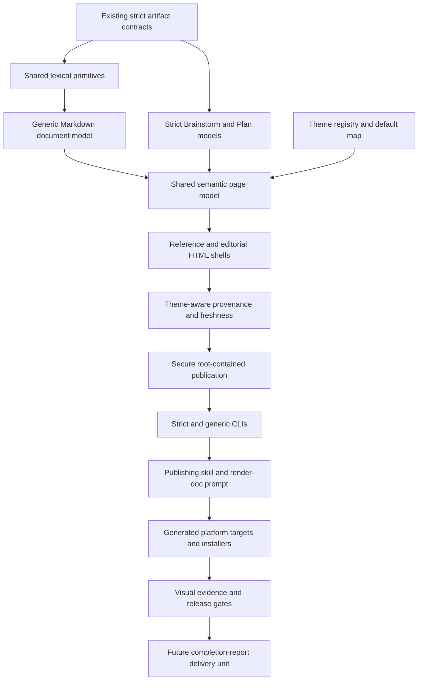

# Plan: Generic Markdown Publishing and Curated Artifact Themes

## Objective

Extend the completed Brainstorm and Plan artifact-view system with an additive,
deterministic Markdown publishing path and two curated visual themes. Preserve
strict Brainstorm and Plan validation, keep Markdown authoritative, make theme
selection explicit and reproducible, and provide a secure generic publisher
that the separately planned completion dossier can reuse.

## Context

The completed artifact-view implementation validates versioned Brainstorms and
Plans, builds typed source ledgers, and renders self-contained HTML under
`.cg-docs/views/`. Its architecture deliberately supports only two artifact
types: `ArtifactKind` is closed, `resolve_artifact_paths()` accepts only the
Brainstorm and Plan source roots, `write_view()` accepts only their view
namespaces, and `render_document()` rejects other document models. The current
HTML shell also contains one hard-coded design contract.

This plan is a follow-up to
`.cg-docs/plans/2026-07-31-dual-audience-workflow-artifact-views-v2.md`, not a
revision of its completed contract. The follow-up keeps that implementation's
validation, source coverage, security, provenance, failure recovery, context
exclusion, and cross-platform behavior as inherited constraints.

The decided brainstorm defines one initiative with two linked delivery units.
This plan covers only the first unit:

- a generic Markdown document model and publisher;
- stable `reference` and `editorial` themes;
- deterministic defaults and explicit theme overrides;
- shared provenance, freshness, security, accessibility, print, and failure
  behavior;
- a user-facing `/cg-render-doc` workflow and local renderer command.

The second unit will define and synthesize the canonical completion report,
integrate it with `/cg-compound`, and register `editorial` as that artifact
type's default. It requires a separate plan after this foundation is accepted.

The `reference` theme is the current restrained artifact-view presentation.
The `editorial` theme is ported from the visual system on
`refactor/modular-compound-gpid`, specifically:

- `.github/skills/cg-skill-standalone-html-brief/references/design-system.md`;
- `.github/skills/cg-skill-standalone-html-brief/assets/editorial-brief-template.html`.

Those branch assets are design inputs only. Runtime publishing remains
deterministic and does not reproduce the branch skill's model-authored,
document-by-document HTML composition.

The generic publisher must not weaken strict validation by pretending arbitrary
Markdown satisfies a Brainstorm or Plan schema. It instead needs a separate
document model that shares safe lexical parsing, exact source ownership,
rendering components, provenance, and publication infrastructure where those
contracts genuinely overlap.

The roadmap feature `broader-artifact-publishing-formats-and-views` is the
matching work item. The separate
`workflow-completion-report-and-html-dossier` feature explicitly depends on
this generic publishing capability.

### Dependency Graph

## Requirements

| ID | Requirement | Source |
|----|-------------|--------|
| R1 | Preserve canonical Markdown as the sole authority and derived HTML as deterministic, regenerable presentation with no execution, approval, or roadmap semantics. | Brainstorm: Context and Requirements |
| R2 | Keep strict Brainstorm and Plan parsing and mandatory schema validation intact; generic Markdown must use a separate model and validation path. | Brainstorm: Decision; completed artifact-view contract |
| R3 | Parse project-contained generic Markdown into an immutable, source-spanned document model with complete lexical coverage and exact-once rendered ownership. | Roadmap: generic Markdown publishing |
| R4 | Support a documented version 1 Markdown grammar for headings, paragraphs, lists, tables, fenced code, blockquotes, links, images, thematic breaks, and recognized callouts; visibly escape bounded unsupported source and fail on ambiguous structures. | Roadmap: generic Markdown publishing |
| R5 | Define stable `reference` and `editorial` theme names, independent theme contract versions, artifact/document-type defaults, compatibility rules, and unknown-theme failure behavior. | Brainstorm: Requirements and Decision |
| R6 | Default Brainstorms, Plans, and unspecified generic documents to `reference`; reserve `editorial` as the completion-report default for the dependent delivery unit; allow only explicit user overrides in version 1. | Brainstorm: Requirements and Decision |
| R7 | Preserve the current artifact-view design as `reference` without weakening strict validation, source fidelity, navigation, accessibility, responsive behavior, or print behavior. | Brainstorm: Next Steps |
| R8 | Port the alternate branch's typography, exact palette, layout grammar, comparison surfaces, responsive rules, and print behavior as a coherent `editorial` theme without importing model-authored content or runtime dependencies. | Brainstorm: Context and Next Steps |
| R9 | Keep theme choice presentation-only: both themes consume the same trusted semantic markup, preserve all substantive source blocks, and expose equivalent landmarks and provenance. | Brainstorm: Requirements |
| R10 | Treat source as untrusted data: escape raw HTML, allow only safe navigation links, securely embed allowlisted project-local bitmap images, reject executable or remote resources, and enforce a restrictive offline CSP. | Roadmap: security and adversarial acceptance |
| R11 | Accept only regular project-contained Markdown sources, reject `.cg-docs/views/**` as source, map generic defaults under `.cg-docs/views/documents/**`, and constrain any explicit output to a registered root-contained view namespace. | Roadmap: paths and explicit output |
| R12 | Publish and recover through shared pinned-handle, non-replacing filesystem operations that preserve concurrent winners and recovery artifacts; never rely on pathname check-then-replace behavior. | Solution: secure publication and rollback |
| R13 | Extend visible and machine-readable provenance with document type, provenance schema version, selected theme, theme contract version, source path/hash, renderer version, and generation time; make exact-byte freshness reproduce the recorded theme. | Brainstorm: Requirements; roadmap: freshness |
| R14 | Provide `cg-render-markdown` plus `/cg-render-doc` with explicit render, validation, freshness, theme override, constrained output, concise success, and exact recovery behavior; retain `cg-render-artifact` for strict workflow artifacts. | Roadmap: command and skill |
| R15 | Keep `.github/` canonical and provide equivalent GitHub Copilot, Claude Code, Codex, and OpenCode prompt/skill behavior, cross-platform launchers, installers, and generated-target closure. | Brainstorm: Requirements; repository packaging contract |
| R16 | Exclude all generated view bodies and diffs from Brain, context, review, commit/PR, release, and duplicate-content model inputs while retaining path, hash, staging, and freshness metadata. | Brainstorm: Requirements; artifact-view contract |
| R17 | Validate technical, decision, and editorial fixtures in both themes for determinism, fidelity, accessibility, offline behavior, responsive layouts, print output, long-document navigation, and no overlap or overflow. | Brainstorm: Next Steps; roadmap acceptance |
| R18 | Keep version 1 one-file, local, dependency-free at runtime, and model/network/Open Design free; exclude completion-report synthesis, bulk backfill, PDF generation, hosted publishing, live editing, arbitrary plugins, and documentation-site restyling. | Brainstorm: Requirements and Decision; roadmap boundaries |

## Phase 1: Contracts, Models, and Reproducible Identity

### 1. Define the publishing and theme contracts

- **Requirements**: R1, R2, R5, R6, R9, R18
- **Files**:
  - `scripts/artifact_views/themes/__init__.py` (new)
  - `scripts/artifact_views/themes/contract.py` (new)
  - `scripts/artifact_views/publishing.py` (new)
  - `scripts/artifact_views/errors.py`
  - `scripts/artifact_views/tests/test_themes.py` (new)
  - `scripts/artifact_views/tests/test_contract.py`
- **Details**:
  - Add an immutable theme contract with stable name, independent contract
    version, design tokens, supported semantic components, stylesheet bytes,
    and compatibility metadata.
  - Register exactly `reference` and `editorial` in version 1. Unknown names
    fail with available values and a corrected command; there is no silent
    fallback or alias.
  - Define deterministic document-type defaults: Brainstorm, Plan, and generic
    use `reference`; the registry reserves completion report for `editorial`
    without adding a completion-report parser, generator, or workflow in this
    plan.
  - Keep theme selection out of the canonical source model. Represent it as an
    explicit rendering input so presentation cannot become source authority.
  - Define explicit override precedence as command input over the documented
    document-type default. Do not add subjective agent selection or a hidden
    project-local theme override in version 1.
  - Version theme contracts independently from artifact schemas and renderer
    code so a visual contract change can make views stale without changing
    canonical Markdown semantics.
- **Test Scenarios**: stable registry and default lookup; explicit override;
  reserved completion-report default; duplicate/empty registration; unknown
  theme; mutation attempts against frozen contracts.
- **Tests**: `pytest -q scripts/artifact_views/tests/test_themes.py scripts/artifact_views/tests/test_contract.py`
- **Acceptance criteria**: theme names, versions, defaults, resolution order,
  compatibility, and failure behavior are executable contracts; strict schema
  definitions remain unchanged.

### 2. Add an additive generic Markdown model and parser

- **Requirements**: R2, R3, R4, R9, R10, R18
- **Files**:
  - `scripts/artifact_views/generic_model.py` (new)
  - `scripts/artifact_views/generic_parser.py` (new)
  - `scripts/artifact_views/parser.py`
  - `scripts/artifact_views/model.py`
  - `scripts/artifact_views/schema.py`
  - `scripts/artifact_views/tests/test_generic_parser.py` (new)
  - `scripts/artifact_views/tests/fixtures/generic/` (new fixtures)
- **Details**:
  - Extract only genuinely shared fence-aware lexical primitives from the
    strict parser. Keep `parse_artifact()` and `validate_source()` as the sole
    Brainstorm/Plan path and preserve their existing public behavior.
  - Add a separate generic document identity and immutable lexical ledger with
    one-based line spans, half-open byte ranges, stable block IDs, and complete
    normalized-source coverage.
  - Derive title deterministically from frontmatter, then the first level-one
    heading, then the source filename. Generic documents do not require
    Compound artifact frontmatter.
  - Define the closed version 1 block and inline grammar needed by the roadmap.
    Recognize callouts only through documented source syntax, such as an
    allowlisted blockquote marker; do not infer callout meaning from prose.
  - Preserve unsupported but structurally bounded Markdown as a visible,
    escaped raw-source block. Reject unclosed fences, malformed tables,
    overlapping ownership, and other ambiguous structures with source spans
    and recovery guidance.
  - Prove every substantive byte range is owned exactly once before rendering.
    Generic parsing must never classify input as a Brainstorm or Plan or claim
    strict validation success.
- **Test Scenarios**: no frontmatter; title fallbacks; Unicode and CRLF; nested
  and long documents; tables with escaped/code-span pipes; recognized and
  unknown callouts; raw HTML; unclosed fences; malformed tables; unsupported
  bounded syntax; complete and duplicate source ownership.
- **Tests**: `pytest -q scripts/artifact_views/tests/test_generic_parser.py scripts/artifact_views/tests/test_parser.py scripts/artifact_views/tests/test_model.py scripts/artifact_views/tests/test_coverage.py`
- **Acceptance criteria**: representative generic Markdown produces an exact,
  immutable source ledger without entering the strict artifact validator, and
  ambiguous input fails before any output mutation.

### 3. Define safe generic paths and theme-aware provenance

- **Requirements**: R5, R6, R11, R13
- **Files**:
  - `scripts/artifact_views/paths.py`
  - `scripts/artifact_views/provenance.py`
  - `scripts/artifact_views/publishing.py` (new)
  - `scripts/artifact_views/tests/test_paths.py`
  - `scripts/artifact_views/tests/test_provenance.py`
  - `scripts/artifact_views/tests/test_publishing_paths.py` (new)
- **Details**:
  - Preserve strict mappings for `.cg-docs/brainstorms/**` and
    `.cg-docs/plans/**`.
  - Accept generic `.md` sources anywhere under the real project root except
    `.cg-docs/views/**`, generated-target exclusions where applicable, links,
    reparse points, non-regular files, and paths that escape through any
    component.
  - Map a generic source deterministically to
    `.cg-docs/views/documents/<project-relative-source>.html`, replacing only
    the final `.md` suffix. Preserve enough path identity to prevent two source
    files from colliding.
  - Support an explicit output only inside the registered generic documents
    namespace in version 1. Reserve Brainstorm, Plan, and future
    completion-report namespaces for their typed owners.
  - Introduce a versioned provenance payload that includes `documentType`,
    `themeName`, and `themeContractVersion` in addition to current source and
    renderer identity. Parse exact keys, reject duplicates and invalid types,
    and classify legacy views deterministically as stale rather than unsafe.
  - Specify freshness behavior: when an existing view has no command-line
    theme override, `--check` reproduces bytes with the theme recorded in valid
    provenance; an explicit override checks that requested theme; missing views
    resolve from the document-type default. Recovery output includes
    `--theme <name>` whenever a prior view used a non-default theme.
- **Test Scenarios**: root Markdown and nested documentation; `.cg-docs` source;
  `.cg-docs/views` recursion; symlink/reparse/hard-link cases; case and suffix
  edge cases; explicit-output collision and reserved namespace; provenance
  round-trip; duplicate/missing/unknown theme fields; legacy view; theme-version
  drift; default and overridden freshness.
- **Tests**: `pytest -q scripts/artifact_views/tests/test_paths.py scripts/artifact_views/tests/test_publishing_paths.py scripts/artifact_views/tests/test_provenance.py`
- **Acceptance criteria**: every source and output is unambiguous and
  root-contained, and provenance contains all inputs needed to reproduce the
  selected presentation without changing source authority.

## Phase 2: Shared Rendering, Curated Themes, and Secure Publication

### 4. Extract the current renderer as the reference theme

- **Requirements**: R1, R2, R5, R7, R9, R13
- **Files**:
  - `scripts/artifact_views/templates.py`
  - `scripts/artifact_views/renderer.py`
  - `scripts/artifact_views/themes/reference.py` (new)
  - `scripts/artifact_views/themes/components.py` (new)
  - `scripts/artifact_views/tests/snapshots/design-contract-reference.json` (new)
  - `scripts/artifact_views/tests/test_design_contract.py`
  - `scripts/artifact_views/tests/test_renderer.py`
  - `scripts/artifact_views/tests/test_accessibility.py`
- **Details**:
  - Move the frozen current tokens and CSS from `templates.py` into the
    `reference` theme without changing their values or visual roles.
  - Separate trusted semantic page markup from presentation. Both themes must
    consume the same headings, landmarks, source ownership wrappers,
    navigation, tables, code, callouts, provenance, and safe link/image nodes.
  - Permit only source-derived grouping, IDs, counts, navigation, and typed
    relationship summaries. Theme code cannot drop, rewrite, or claim source
    blocks.
  - Keep the strict renderer's Brainstorm approach index and Plan phase and
    requirement maps. Generic documents receive heading-derived navigation and
    no invented summary.
  - Update the full HTML shell to include theme identity in metadata and body
    data attributes while maintaining the restrictive CSP and sole
    non-executable provenance script.
  - Freeze reference design tokens and semantic snapshots. Allow intentional
    provenance-schema differences, but require equivalent strict artifact
    content ownership, landmarks, navigation, accessibility, and print rules.
- **Test Scenarios**: strict Brainstorm and phased/non-phased Plan; generic
  document shell; reference default; semantic snapshot; exact source owners;
  duplicate IDs; navigation anchors; print and reduced-motion guards.
- **Tests**: `pytest -q scripts/artifact_views/tests/test_contract.py scripts/artifact_views/tests/test_validator.py scripts/artifact_views/tests/test_coverage.py scripts/artifact_views/tests/test_renderer.py scripts/artifact_views/tests/test_design_contract.py scripts/artifact_views/tests/test_accessibility.py`
- **Acceptance criteria**: existing strict artifacts still validate and render
  through `reference` with their complete semantic structure and source ledger;
  theme extraction does not create a second semantic renderer.

### 5. Port the editorial design as a complete second theme

- **Requirements**: R5, R8, R9, R17, R18
- **Files**:
  - `scripts/artifact_views/themes/editorial.py` (new)
  - `scripts/artifact_views/themes/components.py` (new)
  - `scripts/artifact_views/tests/snapshots/design-contract-editorial.json` (new)
  - `scripts/artifact_views/tests/test_themes.py`
  - `scripts/artifact_views/tests/test_design_contract.py`
  - `scripts/artifact_views/tests/test_renderer.py`
- **Details**:
  - Freeze the alternate branch's exact core palette: ink `#181816`, paper
    `#fbfbf8`, coral `#e94f2d`, teal `#087c70`, blue `#2856c7`, yellow
    `#f2c84b`, plus its documented soft, success, danger, line, geometry, and
    content-width tokens.
  - Use Georgia for display text, Trebuchet MS for body and controls, and
    Consolas for code, with system fallbacks and no downloaded fonts.
  - Port full-width section bands, grid-textured hero treatment, visible
    borders, restrained hard shadows, section-index grammar, comparison
    surfaces, paired tradeoffs, decision bands, timeline styling, and metadata
    treatment only where the shared semantic markup supplies those structures.
  - Use CSS and deterministic source-derived classes only. Do not add
    model-authored layouts, inferred decisions, invented metrics, external
    resources, runtime JavaScript, or copied source content from the template.
  - Implement the documented `980px` and `720px` layout behavior, reduced
    motion, print simplification, stable table overflow, and no nested cards.
  - Record the alternate branch source paths and token contract in developer
    documentation so future changes can distinguish the frozen theme from its
    inspiration.
- **Test Scenarios**: frozen token snapshot; complete standalone stylesheet;
  no external URLs or executable scripts; same semantic DOM summary as
  reference; long title; dense table; comparison and callout classes; mobile
  stacking; print and reduced motion.
- **Tests**: `pytest -q scripts/artifact_views/tests/test_themes.py scripts/artifact_views/tests/test_design_contract.py scripts/artifact_views/tests/test_renderer.py scripts/artifact_views/tests/test_accessibility.py`
- **Acceptance criteria**: `editorial` is recognizably the verified alternate
  branch design system, remains a presentation-only layer, and passes the same
  semantic, security, accessibility, and print contracts as `reference`.

### 6. Render generic Markdown and safe local resources

- **Requirements**: R3, R4, R9, R10, R17, R18
- **Files**:
  - `scripts/artifact_views/generic_renderer.py` (new)
  - `scripts/artifact_views/renderer.py`
  - `scripts/artifact_views/security.py`
  - `scripts/artifact_views/coverage.py`
  - `scripts/artifact_views/tests/test_generic_renderer.py` (new)
  - `scripts/artifact_views/tests/test_publishing_security.py` (new)
  - `scripts/artifact_views/tests/fixtures/generic/` (new fixtures)
- **Details**:
  - Convert the generic source ledger into the shared semantic page model and
    reuse the same safe block/inline rendering helpers as strict artifacts.
  - Generate navigation from real headings and style recognized callouts from
    their documented markers. Do not synthesize summaries, diagrams,
    comparisons, decisions, or metadata absent from source.
  - Escape source raw HTML visibly. Preserve fenced diagram languages as code
    unless a separate safe renderer is introduced in a future plan.
  - Permit user-initiated safe relative, fragment, HTTP(S), and mailto links
    under the existing URL policy; do not fetch any target.
  - For Markdown images, require useful alt text and a project-relative path to
    an allowlisted regular PNG, JPEG, GIF, or WebP file. Read once through the
    shared secure filesystem API with link and hard-link rejection, verify
    extension and magic bytes, enforce a documented size limit, and embed a
    deterministic data URI. Reject absolute, remote, `file:`, `data:`, SVG, or
    missing images with source-spanned recovery guidance.
  - Extend final HTML structural validation for the exact generated `img`
    contract without permitting arbitrary `src`, `srcset`, event, style, or
    executable attributes.
  - Prove every substantive generic source block has exactly one rendered
    owner under both themes.
- **Test Scenarios**: all version 1 Markdown blocks; escaped raw HTML and prompt
  injection text; safe and unsafe links; valid image formats; MIME mismatch;
  oversized/missing/linked/hard-linked image; SVG/script payload; duplicate
  ownership; both themes; offline final HTML.
- **Tests**: `pytest -q scripts/artifact_views/tests/test_generic_parser.py scripts/artifact_views/tests/test_generic_renderer.py scripts/artifact_views/tests/test_security.py scripts/artifact_views/tests/test_publishing_security.py scripts/artifact_views/tests/test_coverage.py`
- **Acceptance criteria**: supported generic Markdown renders completely in
  both themes without network activity or executable source content, and every
  resource and source block has a validated deterministic owner.

### 7. Generalize secure publication, freshness, and recovery

- **Requirements**: R10, R11, R12, R13
- **Files**:
  - `scripts/artifact_views/writer.py`
  - `scripts/artifact_views/publishing.py` (new)
  - `scripts/artifact_views/cli.py`
  - `scripts/artifact_views/tests/test_writer.py`
  - `scripts/artifact_views/tests/test_publishing_integration.py` (new)
  - `scripts/artifact_views/tests/test_integration.py`
- **Details**:
  - Replace hard-coded destination-prefix checks with a typed, registered view
    destination validated before the writer is called. Keep namespace
    ownership explicit so the generic publisher cannot overwrite strict views.
  - Route publication through `secure_fs.secure_write_bytes()` and retain its
    current pinned-parent, non-replacing publish and rollback behavior. Do not
    reintroduce `os.replace()`, string-prefix containment, or path-based cleanup.
  - Add race hooks at the final publication and quarantine/restore boundaries.
    Assert that concurrent winners remain at the destination, previous bytes
    remain in a recovery artifact, unpublished temporary bytes are removed,
    and restrictive umasks remain effective.
  - Extend missing/stale/current checks to generic documents and theme-aware
    provenance. A source hash, renderer version, theme version, document type,
    output identity, or deterministic-byte mismatch is stale.
  - Preserve canonical source and prior valid view on parser, resource,
    renderer, security, provenance, or writer failure. Report source, expected
    view and state, exact error, and a recovery command that reproduces any
    non-default theme.
- **Test Scenarios**: first publication; current rerender; stale source/theme;
  tampered view; corrupt provenance; parser/render/writer failure; destination
  created at race boundary; rollback destination occupied; restrictive umask;
  reserved namespace; recovery command with and without theme override.
- **Tests**: `pytest -q scripts/artifact_views/tests/test_writer.py scripts/artifact_views/tests/test_integration.py scripts/artifact_views/tests/test_publishing_integration.py`
- **Acceptance criteria**: generic and strict views share fail-loud freshness
  and recovery semantics, and no publication or rollback path can clobber a
  concurrent filesystem winner.

## Phase 3: Commands, Workflow Integration, and Platform Parity

### 8. Add strict theme overrides and the generic publishing CLI

- **Requirements**: R2, R5, R6, R11, R13, R14
- **Files**:
  - `scripts/artifact_views/cli.py`
  - `scripts/artifact_views/publishing_cli.py` (new)
  - `scripts/render_markdown.py` (new)
  - `bin/cg-render-markdown` (new)
  - `bin/cg-render-markdown.cmd` (new)
  - `scripts/artifact_views/tests/test_cli.py`
  - `scripts/artifact_views/tests/test_publishing_cli.py` (new)
  - `tests/bash-scripts.Tests.ps1`
  - `tests/install.Tests.ps1`
- **Details**:
  - Add `--theme reference|editorial` to `cg-render-artifact` without changing
    its strict validation, `--automatic`, `--validate-only`, or `--check`
    authority. Existing automatic prompt hooks continue to resolve to
    `reference` unless the user explicitly invoked an override.
  - Add `cg-render-markdown <source>` with `--theme`, `--check`,
    `--validate-only`, and safely constrained `--output` behavior. Keep one
    source per invocation and use the same exit-code classes as the strict CLI.
  - Make `--check` non-mutating and exact. Validation-only must parse, validate
    resources and paths, and prove ownership without writing HTML.
  - Emit one concise path on success, `current|stale|missing <path>` for checks,
    and structured actionable errors without source-body dumps.
  - Implement the bash and CMD wrappers as thin self-relative launchers. The
    CMD wrapper must use the mandatory `where` pre-check, version verification,
    Windows Store stub rejection, argument forwarding, and exit-code parity
    used by all Python launchers.
  - Audit launcher parity when adding the new command; do not silently leave
    one supported platform without the publishing surface.
- **Test Scenarios**: strict default and explicit theme; generic default and
  explicit theme; invalid theme; missing/stale/current; constrained output;
  validation-only; spaces and Unicode in paths; Python candidate selection;
  missing Python; forwarded exit code.
- **Tests**: `pytest -q scripts/artifact_views/tests/test_cli.py scripts/artifact_views/tests/test_publishing_cli.py scripts/artifact_views/tests/test_integration.py scripts/artifact_views/tests/test_publishing_integration.py`; safe single-file Pester runs for `install.Tests.ps1` and `bash-scripts.Tests.ps1` through `tests/Run-Tests.ps1` using `execution_subagent`.
- **Acceptance criteria**: users can render, validate, and freshness-check one
  generic Markdown file or explicitly theme a strict artifact on every
  supported shell without bypassing strict validation or output containment.

### 9. Add the publishing skill and `/cg-render-doc` orchestration

- **Requirements**: R1, R2, R5, R6, R14, R15, R18
- **Files**:
  - `.github/skills/cg-skill-markdown-publishing/SKILL.md` (new)
  - `.github/skills/cg-skill-markdown-publishing/references/theme-contract.md` (new)
  - `.github/prompts/cg-render-doc.prompt.md` (new)
  - `scripts/cg_generate_targets.py`
  - `scripts/schemas/target-mapping.schema.json`
  - generated `.claude/`, `.agents/`, and `.opencode/` targets
  - `scripts/tests/test_target_mapping.py`
  - `scripts/tests/test_target_closure.py`
  - `scripts/tests/test_target_determinism.py`
  - `scripts/tests/test_target_drift.py`
  - `tests/prompt-tools.Tests.ps1`
- **Details**:
  - Define the skill as knowledge and orchestration for deterministic local
    publishing, not a request for a model to author bespoke HTML.
  - Route strict Brainstorm and Plan sources through `cg-render-artifact` and
    other Markdown through `cg-render-markdown`; never use the generic command
    to claim strict validation.
  - Let the user select `--theme` explicitly. An agent may explain why one
    theme suits a reading job and show the exact command, but it cannot silently
    choose or persist a subjective theme.
  - Document defaults, theme stability, source authority, output mapping,
    image restrictions, freshness, recovery, and the future completion-report
    integration boundary.
  - Add `/cg-render-doc <path> [--theme <name>] [--check] [--no-html]` parsing
    with validation on all paths and no HTML-body reads during checks.
  - Update canonical target mapping and generate all platform targets only
    after canonical prompt and skill content stabilizes. Never hand-edit
    generated copies.
- **Test Scenarios**: strict/generic routing; explicit recommendation requiring
  user action; unknown theme; validation-only; stale recovery; prompt tool
  declarations; skill closure; generated target ownership, determinism, and
  drift.
- **Tests**: `pytest -q scripts/tests/test_target_mapping.py scripts/tests/test_target_closure.py scripts/tests/test_target_determinism.py scripts/tests/test_target_drift.py`; safe `execution_subagent` run of `. tests\Run-Tests.ps1 -File prompt-tools.Tests.ps1` and inspection of `tests/last-run.json`.
- **Acceptance criteria**: every supported agent platform exposes equivalent,
  deterministic publishing guidance and invokes repository tooling instead of
  generating document-specific HTML with a model.

### 10. Integrate installation and preserve context exclusions

- **Requirements**: R12, R14, R15, R16, R18
- **Files**:
  - `install.ps1`
  - `scripts/install.sh`
  - `scripts/link.ps1`
  - `scripts/link.sh`
  - `scripts/update.ps1`
  - `scripts/update.sh`
  - `scripts/brain/scanner.py`
  - `scripts/cg_audit_context.py`
  - `.github/shared/context-loading.contract.md`
  - `.github/shared/artifact-view.contract.md`
  - `.github/prompts/cg-review.prompt.md`
  - `.github/prompts/cg-commit-push-pr.prompt.md`
  - tests under `scripts/artifact_views/tests/`, `scripts/tests/`, and `tests/`
- **Details**:
  - Install and update the new launcher and runtime modules with the same
    canonical source-of-truth and no-op behavior as existing commands.
  - Preserve shared secure filesystem dependencies and Python version support
    across installed and linked layouts.
  - Generalize the artifact-view contract to cover strict artifact views and
    generic document views while clearly distinguishing schema validation from
    generic publishing validation.
  - Confirm that the existing `.cg-docs/views/**` body exclusion covers the new
    documents namespace in Brain, context audits, reviews, release scans,
    commit/PR flows, and duplicate detection. Add explicit sentinels where a
    broad scanner could regress.
  - Permit only path, staging state, source/view hash, provenance identity, and
    freshness result metadata in model context. Do not read or diff generated
    HTML bodies.
  - Keep runtime imports free of model SDKs, network clients, browser tools,
    subprocess agents, and Open Design dependencies.
- **Test Scenarios**: fresh and repeated install; self-install; update/link
  layouts; missing launcher source; generic view sentinel in every context
  scanner; hard-link/symlink alias; runtime dependency scan; generated-target
  packaging closure.
- **Tests**: focused Python installer, target, scanner, and integration tests;
  safe single-file Pester runs through `tests/Run-Tests.ps1` for installer,
  launcher, and prompt contracts.
- **Acceptance criteria**: installed and repository-local commands behave
  equivalently, generic views remain derived and excluded from model context,
  and runtime publication remains local and dependency-free.

## Phase 4: Cross-Theme Evidence and Adversarial Validation

### 11. Generalize the design-evidence schema and fixtures

- **Requirements**: R7, R8, R9, R10, R13, R17
- **Files**:
  - `scripts/artifact_views/evidence.py`
  - `scripts/validate_artifact_view_evidence.py`
  - `scripts/artifact_views/tests/test_evidence.py`
  - `scripts/artifact_views/tests/fixtures/publishing/` (new)
  - `scripts/artifact_views/tests/snapshots/` (new theme snapshots)
- **Details**:
  - Preserve validation of the completed schema version 1 evidence artifact,
    then add a versioned matrix that keys evidence by document class and theme
    rather than requiring exactly one Brainstorm and one Plan.
  - Include technical, decision, and editorial Markdown fixtures. Render each
    with `reference` and `editorial` so the matrix covers six source/theme
    combinations without requiring a completion-report schema.
  - Require source, view, screenshot, and print artifact hashes; renderer and
    theme identity; explicit browser/design-tool producer and version; and
    booleans for every required check. Never embed canonical source bodies or
    HTML bodies in evidence JSON.
  - Use the union of existing and editorial design viewports:
    `390x844`, `768x1024`, `1024x768`, `1440x900`, and `1920x1080`.
  - Require nonblank output, no page-level horizontal overflow, no incoherent
    overlap, reachable navigation and tables, first-viewport identity, keyboard
    order, visible focus, 200 percent zoom, contrast, reduced motion, offline
    load, print readability, complete provenance, and long-document
    orientation.
  - Keep evidence tooling implementation-only. No browser or design tool may
    become a publisher runtime dependency.
- **Test Scenarios**: complete matrix; missing theme/document pair; duplicate
  pair; stale hash; missing viewport/check/file; false required check; unknown
  producer; source/HTML body injection; legacy schema 1 evidence.
- **Tests**: `pytest -q scripts/artifact_views/tests/test_evidence.py scripts/artifact_views/tests/test_design_contract.py`
- **Acceptance criteria**: the validator objectively rejects incomplete,
  stale, or failing cross-theme evidence while retaining compatibility with the
  prior completed evidence record.

### 12. Produce and validate responsive, accessible, and print evidence

- **Requirements**: R7, R8, R9, R10, R13, R17, R18
- **Files**:
  - `.cg-docs/work-reports/2026-08-02-curated-artifact-themes.design-evidence.json` (new)
  - associated implementation evidence files referenced by hash
  - renderer, theme, accessibility, and evidence tests as defects are found
- **Details**:
  - Render all six fixture/theme combinations with fixed generation inputs and
    verify repeated deterministic output before browser inspection.
  - Open each standalone file offline and capture the required viewport and
    print evidence with a recorded implementation-time tool and version.
  - Check real DOM geometry for overlap and overflow, not screenshot presence
    alone. Verify long words, code, tables, images, callouts, navigation, focus,
    zoom, print page breaks, and first-viewport subject identity.
  - Compare semantic summaries across themes to prove that visual differences
    do not alter source ownership, heading order, landmarks, links, or
    provenance.
  - Keep screenshots, PDFs, and HTML bodies out of model and Brain inputs. The
    evidence JSON stores only paths, hashes, statuses, and bounded observations.
  - Repair the smallest owning theme or shared semantic component when evidence
    fails, rerender the affected matrix cells, and rerun the validator before
    broadening changes.
- **Test Scenarios**: technical code/table stress; decision alternatives and
  tradeoffs; editorial long-form hierarchy; desktop, tablet portrait/landscape,
  phone, and wide desktop; offline and print; both themes.
- **Tests**: `python scripts/validate_artifact_view_evidence.py --evidence .cg-docs/work-reports/2026-08-02-curated-artifact-themes.design-evidence.json --require-all-pass`
- **Acceptance criteria**: all required evidence cells pass with current hashes
  and theme provenance, and neither theme loses content or fails the shared
  responsive, accessibility, offline, or print contract.

## Phase 5: Documentation and Release Gates

### 13. Document authority, commands, themes, security, and recovery

- **Requirements**: R1, R2, R5, R6, R10, R11, R13, R14, R15, R16, R18
- **Files**:
  - `README.md`
  - `docs/configuration/index.md`
  - `docs/development/index.md`
  - `docs/installation.md`
  - `docs/reference.md`
  - `docs/reference/commands.md`
  - `docs/workflow.md`
  - `docs/context-files.md`
  - `docs/troubleshooting.md`
  - `docs/navigation.json`
- **Details**:
  - Document strict versus generic validation, canonical authority, default
    output mapping, constrained explicit output, stable theme names and
    versions, explicit override syntax, and default resolution.
  - Show `cg-render-artifact` for Brainstorms/Plans and
    `cg-render-markdown`/`/cg-render-doc` for other Markdown, including
    validation-only, freshness, non-default-theme recovery, and unknown-theme
    errors.
  - Explain safe link and local image behavior, raw HTML escaping, offline CSP,
    runtime independence, and why generated HTML must not be edited as
    authority or loaded into model context.
  - State that `editorial` is frozen from the alternate branch's standalone
    brief design inputs, but runtime composition is deterministic and
    model-free.
  - Mark completion-report generation, its schema, and `/cg-compound`
    integration as the next dependent delivery unit, not functionality shipped
    by this plan.
  - Add troubleshooting for missing/stale/tampered views, unsafe resources,
    occupied recovery names, unknown themes, and generated-target drift.
- **Test Scenarios**: command examples match parser help; navigation paths
  resolve; install summaries include the launcher; no claim that generic
  documents receive strict schema validation or that the completion dossier is
  already available.
- **Tests**: `node scripts/check-docs-site.js`; `pytest -q scripts/tests/test_target_documentation.py`
- **Acceptance criteria**: a user can select, render, validate, check, recover,
  and safely share either theme without reading implementation code, and the
  docs preserve the delivery-unit boundary.

### 14. Run final regressions and prove releasable platform parity

- **Requirements**: R2, R7, R9, R10, R12, R13, R15, R16, R17, R18
- **Files**:
  - all files touched by this plan
  - `tests/last-run.json` (generated test result)
  - generated target trees and evidence artifacts
- **Details**:
  - Run focused theme, parser, renderer, provenance, path, security, writer,
    CLI, integration, evidence, installer, documentation, and target tests
    before the broad gates.
  - Run all Python tests with the repository configuration and require no
    failures.
  - Run the complete Pester suite only through the canonical safe runner using
    `execution_subagent`; require `passed: true` and `filteredFiles: null` in
    `tests/last-run.json`.
  - Validate the final evidence matrix and documentation site after all theme
    and renderer bytes stabilize.
  - Run generated-target ownership, closure, determinism, and drift checks.
    Regenerate from `.github/` rather than repairing generated files.
  - Check VS Code diagnostics for every touched code file and run the saved
    Plan's artifact freshness check.
  - Review the final diff for generated HTML body leakage, undocumented
    dependencies, unrelated restyling, completion-report implementation, and
    any weakening of strict artifact validation.
- **Test Scenarios**: clean full pass; filtered Pester result; stale generated
  target; stale design evidence; stale Plan view; diagnostics error; unexpected
  runtime dependency; out-of-scope completion-report code.
- **Tests**: `pytest -q`; `node scripts/check-docs-site.js`; final evidence
  validation; `execution_subagent` run of `. tests\Run-Tests.ps1`; VS Code
  diagnostics; `cg-render-artifact --check .cg-docs/plans/2026-08-02-generic-markdown-publishing-curated-themes.md`.
- **Acceptance criteria**: all required unfiltered gates pass, generated targets
  and evidence are current, diagnostics are clear, and the implementation is
  ready for plan review and the separately planned completion-report unit.

## Testing Strategy

- **Contract and model tests**: prove strict/generic separation, closed grammar,
  immutable source ledgers, theme registry stability, and exact requirement
  defaults.
- **Parser and coverage tests**: exercise supported Markdown, bounded raw
  source, malformed/ambiguous input, source spans, Unicode/newlines, and
  exact-once ownership.
- **Theme and semantic snapshot tests**: freeze both design contracts and
  compare theme-independent landmarks, IDs, navigation, source ownership, and
  provenance.
- **Security and filesystem tests**: cover URL/resource policy, raw HTML and
  prompt injection, local bitmap validation, containment, links/reparse points,
  hard links, non-replacing publication, rollback collisions, umask, CSP, and
  output structural validation.
- **CLI and integration tests**: cover defaults, explicit themes, exact checks,
  validation-only, constrained output, tampering, failure preservation,
  recovery commands, and installed layouts.
- **Visual evidence**: render technical, decision, and editorial fixtures in
  both themes across five viewports plus print, offline, keyboard, focus,
  contrast, zoom, reduced-motion, overflow, overlap, and provenance checks.
- **Platform tests**: verify bash/CMD launchers, PowerShell and shell installers,
  canonical prompt/skill targets, generated closure, ownership, determinism,
  and drift.
- **Regression gates**: run all Python tests, documentation validation, current
  evidence validation, VS Code diagnostics, and the full unfiltered Pester suite
  through the canonical safe runner.

Pester commands must follow `cg-skill-pester-safety`: agent workflows use
`execution_subagent` with `tests/Run-Tests.ps1`, never a directory-form
`Invoke-Pester` call or a direct result pipeline.

## Documentation Checklist

- [ ] Explain Markdown authority and derived HTML status.
- [ ] Distinguish strict artifact validation from generic publishing validation.
- [ ] Document supported version 1 Markdown and bounded unsupported behavior.
- [ ] Document stable theme names, contract versions, defaults, and overrides.
- [ ] Document generic source/output mapping and constrained explicit output.
- [ ] Document source hash, document type, theme, renderer, and time provenance.
- [ ] Document safe links, local bitmap embedding, raw HTML escaping, and CSP.
- [ ] Document render, validate-only, check, stale, tamper, and recovery flows.
- [ ] Document launcher installation and all supported platform targets.
- [ ] Document generated-view model-context and duplicate-content exclusions.
- [ ] Credit the frozen editorial design inputs without creating a runtime link.
- [ ] State that completion-report synthesis and `/cg-compound` integration are
  delivered by a separate dependent plan.

## Risks & Mitigations

| Risk | Impact | Mitigation |
|------|--------|------------|
| Generic parsing is implemented by weakening the strict parser or validator. | Brainstorms and Plans could pass without required execution contracts, causing silent workflow regressions. | Keep separate entry points and models; share only lexical primitives; retain strict regression tests and validation-only preflights. |
| Theme code starts controlling semantics or omitting source content. | Two views of the same source could communicate different facts. | Build one trusted semantic page model, enforce exact-once source ownership, and compare cross-theme semantic snapshots. |
| Adding theme fields invalidates or misclassifies older provenance. | Existing views may appear current when they are not, or fail with opaque errors. | Version provenance, classify legacy payloads as stale, document regeneration, and test exact key/type migration behavior. |
| Generic source or explicit output paths escape the project or collide with typed views. | User files or authoritative artifacts could be exposed or overwritten. | Reject links/reparse points and view sources, mirror under `views/documents`, reserve typed namespaces, and use component-aware containment. |
| Publication or rollback replaces a concurrent writer. | User or process-created bytes could be destroyed. | Use shared pinned-handle, non-replacing operations; preserve recovery artifacts; inject races at final mutation boundaries and assert every byte owner. |
| Local image support admits scripts, remote fetches, aliases, or oversized payloads. | Standalone views could execute content, leak data, or consume excessive memory. | Allowlist bitmap formats, verify magic bytes and size, securely read one regular low-link-count file, embed data, reject SVG/remote/absolute/data sources. |
| The editorial port becomes a hand-tailored AI-authored page generator. | Output becomes non-deterministic and the source may be summarized or distorted. | Freeze only tokens, CSS, layout grammar, and shared components; prohibit runtime model calls and source-specific invented composition. |
| Visual evidence becomes subjective or stale. | Accessibility and responsive regressions could pass based on screenshots alone. | Require hashed matrix cells, DOM geometry checks, explicit booleans, tool/version identity, print artifacts, and current-theme provenance. |
| New prompt, skill, launcher, and installer surfaces drift across platforms. | Users receive different commands or incomplete installations. | Keep `.github/` canonical, regenerate targets once canonical work stabilizes, and run mapping, closure, determinism, drift, bash, CMD, and installer tests. |
| Completion-report requirements leak into the publishing foundation. | The first unit grows into an unreviewable synthesis and presentation change. | Reserve only the document type/default seam; exclude report schemas, generation, source relationships, and `/cg-compound` integration from this plan. |

## Out of Scope

- Completion-report schema, source relationship model, or factual synthesis.
- `/cg-completion-report` and end-of-`/cg-compound` report generation.
- Report correction, resumability, stage-state, findings, or evidence ledgers.
- Historical bulk conversion or directory-wide publishing.
- Arbitrary output outside registered `.cg-docs/views/**` namespaces.
- PDF generation, hosted pages, deployment, or runtime web servers.
- Live editing, bidirectional Markdown/HTML synchronization, or HTML authority.
- AI summaries, invented diagrams, transcript ingestion, or arbitrary plugins.
- Executable source HTML, JavaScript, SVG, Mermaid rendering, or remote assets.
- Restyling the documentation site or artifact types beyond Brainstorms, Plans,
  generic Markdown, and the reserved completion-report default seam.

## Completion Contract

### Outcome

Compound GPID can deterministically publish any project-contained Markdown file
as a secure, self-contained HTML view through a generic document path, while
preserving strict Brainstorm and Plan validation. The `reference` and
`editorial` themes are stable presentation-only choices; defaults, overrides,
theme versions, provenance, freshness, context exclusion, and failure behavior
are reproducible.

### Verification Surface

| ID | Phase | Evidence Required | Command/Artifact | Required |
|----|-------|-------------------|------------------|----------|
| V1 | 1 | Generic document model/parser, theme registry/default map, theme-aware provenance, and safe path contracts pass focused tests. | `pytest -q scripts/artifact_views/tests/test_generic_parser.py scripts/artifact_views/tests/test_themes.py scripts/artifact_views/tests/test_paths.py scripts/artifact_views/tests/test_provenance.py` | yes |
| V2 | 2 | Both themes preserve identical semantic/source ownership; strict Brainstorm/Plan validation and the `reference` baseline do not regress. | `pytest -q scripts/artifact_views/tests/test_contract.py scripts/artifact_views/tests/test_validator.py scripts/artifact_views/tests/test_coverage.py scripts/artifact_views/tests/test_renderer.py scripts/artifact_views/tests/test_design_contract.py` | yes |
| V3 | 2 | Local image embedding, links, raw HTML, CSP, unsafe resources, root containment, and non-clobbering publication pass adversarial tests. | `pytest -q scripts/artifact_views/tests/test_security.py scripts/artifact_views/tests/test_writer.py scripts/artifact_views/tests/test_publishing_security.py` | yes |
| V4 | 3 | Generic and strict CLIs support deterministic defaults, explicit `--theme`, exact-byte `--check`, unknown-theme failure, and recovery while persisting theme identity. | `pytest -q scripts/artifact_views/tests/test_cli.py scripts/artifact_views/tests/test_integration.py scripts/artifact_views/tests/test_publishing_integration.py` | yes |
| V5 | 3 | `/cg-render-doc`, the publishing skill, launchers, installers, and generated Copilot/Claude/Codex/OpenCode targets remain equivalent. | Focused Python target tests plus `execution_subagent` runs of `. tests\Run-Tests.ps1 -File install.Tests.ps1`, `bash-scripts.Tests.ps1`, and `prompt-tools.Tests.ps1`; each `tests/last-run.json` must report `passed: true`. | yes |
| V6 | 4 | Technical, decision, and editorial fixtures pass both-theme accessibility, offline, responsive, print, long-document, and provenance checks at the required viewport matrix. | `python scripts/validate_artifact_view_evidence.py --evidence .cg-docs/work-reports/2026-08-02-curated-artifact-themes.design-evidence.json --require-all-pass` | yes |
| V7 | 5 | Documentation and generated-target references are internally consistent. | `node scripts/check-docs-site.js` and `pytest -q scripts/tests/test_target_documentation.py scripts/tests/test_target_drift.py` | yes |
| V8 | final | All Python regressions pass. | `pytest -q` | yes |
| V9 | final | The complete unfiltered Pester suite passes through the canonical safe runner. | `execution_subagent`: run `. tests\Run-Tests.ps1`; require `tests/last-run.json` to contain `passed: true` and `filteredFiles: null`. | yes |
| V10 | final | Touched files have no VS Code errors and the saved Plan view is current. | VS Code diagnostics plus `cg-render-artifact --check .cg-docs/plans/2026-08-02-generic-markdown-publishing-curated-themes.md` | yes |

### Constraints

| ID | Phase | Constraint | Check |
|----|-------|------------|-------|
| C1 | 1 | Generic Markdown never masquerades as a Brainstorm or Plan or weakens mandatory schema validation. | Existing contract/validator tests plus separate generic parser tests. |
| C2 | 2 | Themes alter presentation only; no source block, qualifier, semantic landmark, or provenance field is omitted. | Exact-once coverage and cross-theme semantic snapshots. |
| C3 | 2 | Runtime remains model-free, network-free, and independent of Open Design or external assets. | Dependency/static-import, CSP, resource, and offline-load tests. |
| C4 | 1 | Derived output stays under `.cg-docs/views/**`; publication and rollback never replace concurrent winners and preserve recovery artifacts. | Path containment and filesystem race-injection tests. |
| C5 | 3 | Brainstorm, Plan, and unspecified generic documents default to `reference`; overrides are explicit and persisted; unknown themes fail without fallback. | Theme resolution, provenance, stale-check, and CLI error tests. |
| C6 | 3 | `.github/` remains canonical; generated targets are regenerated only after canonical prompt/skill work stabilizes. | Target ownership, closure, determinism, and drift tests. |
| C7 | 4 | Both themes meet shared accessibility, responsive, print, and no-overlap requirements; editorial identity uses the verified alternate-branch design source. | Machine-validated evidence matrix and source-linked theme contract. |
| C8 | final | Completion-report synthesis and documentation-site restyling do not enter this delivery unit. | Final diff and requirement mapping review. |

### Boundaries

- Allowed: generic Markdown model/parser; safe local bitmap embedding; theme
  registry; `reference` and `editorial` theme assets; provenance/freshness;
  root-contained output mapping; strict and generic CLIs; `/cg-render-doc`;
  `cg-skill-markdown-publishing`; launchers/installers; canonical and generated
  platform assets; tests, evidence, and documentation.
- Out of scope: completion-report schema or synthesis,
  `/cg-completion-report`, `/cg-compound` integration, historical bulk
  backfill, arbitrary output outside `.cg-docs/views/**`, PDF generation,
  hosted publishing, live editing, arbitrary plugins, AI summaries, transcript
  ingestion, and documentation-site restyling.

### Iteration Policy

1. Preserve strict validation and the current `reference` output contract
   before adding generic behavior.
2. Keep generic parsing/modeling additive; do not relax the Brainstorm or Plan
   schema to gain compatibility.
3. Use `reference` defaults unless the user explicitly selects `editorial`;
   agents may recommend but never silently choose.
4. Fail on unknown themes, unsafe paths/resources, ambiguous source ownership,
   and unprovable freshness.
5. Run focused executable checks at each phase before expanding scope.
6. Accept visual changes only when shared evidence passes for both themes and
   representative document classes.
7. Regenerate platform targets after canonical prompt/skill changes stabilize,
   then run final Python and canonical Pester gates.

### Blocked-Stop Conditions

- Strict Brainstorm/Plan behavior or the current reference semantic contract
  cannot be preserved.
- Exact source ownership, safe resource embedding, root containment, or
  non-clobbering publication cannot be proven.
- Required browser/print/accessibility evidence cannot be produced or remains
  failing.
- Progress would require executable source HTML/scripts, runtime network/model/
  Open Design calls, or an unsafe arbitrary output path.
- Canonical/generated platform parity cannot be restored.
- Completion-report synthesis becomes necessary to finish this foundation,
  requiring the second linked plan instead.
- A required deviation arises under `ask` and approval is unavailable.
- Any required evidence remains failed after the permitted focused repair
  cycle.