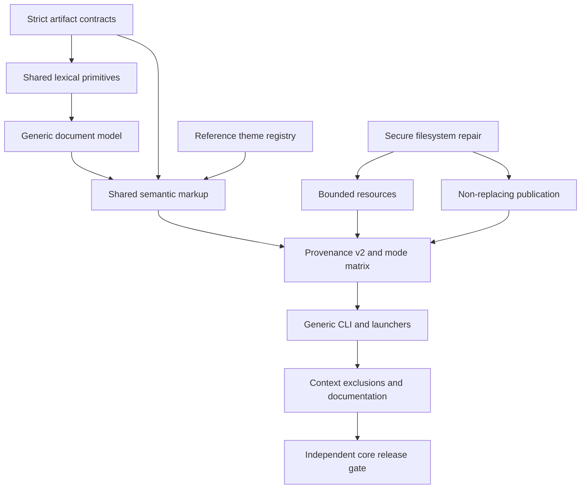

# Plan: Generic Markdown and Reference Publishing Core

## Objective

Build an independently releasable generic Markdown publisher around the
existing `reference` presentation while preserving strict Brainstorm and Plan
validation. Define and prove source routing, destination ownership, bounded
resource handling, reproducible provenance and mode behavior, and
non-clobbering filesystem publication before adding a second theme or agent
workflow surface.

## Context

This Plan replaces the core portion of the reviewed, oversized
`.cg-docs/plans/2026-08-02-generic-markdown-publishing-curated-themes.md`.
The review identified four blocking and eight important contract gaps. This
replacement addresses the findings that belong to the generic publishing
kernel; the dependent editorial, platform, and browser-evidence work moves to
`.cg-docs/plans/2026-08-02-editorial-theme-publishing-workflow-evidence.md`.

The completed artifact-view implementation is intentionally strict:

- `ArtifactKind` supports only Brainstorm and Plan;
- `parse_artifact()` and `validate_source()` enforce their typed contracts;
- `resolve_artifact_paths()` and `write_view()` own the corresponding source
  and output namespaces;
- `render_document()` proves exact-once source ownership before producing
  self-contained HTML;
- the current shell and CSS form the presentation that this Plan names
  `reference`.

Generic publishing must be additive. It must never accept canonical
Brainstorms or Plans through a weaker path, claim schema validation for an
arbitrary document, or publish a second generic view for a typed artifact.

Two shared filesystem defects are controlling prerequisites. On POSIX,
`secure_write_bytes()` verifies the destination and then calls `os.replace()`,
so a target created at the final boundary can still be overwritten. The shared
reader also performs an unbounded `read()`, so an image size check after the
read does not protect memory. This Plan repairs those shared primitives and
runs regressions for all existing callers before the generic publisher relies
on them.

### Deterministic Mode Matrix

The core registers only `reference` at theme contract version 1. The matrix is
part of the executable contract and is extended, not reinterpreted, by the
follow-up Plan:

| Mode | Explicit theme | Existing owned view | Resolution |
|------|----------------|---------------------|------------|
| render | present | any | Validate the named theme; it wins. |
| render | absent | valid provenance v2 | Reuse the recorded theme name and current registered contract version. |
| render | absent | missing or legacy provenance v1 | Use the document-type default, `reference`. |
| render | absent | corrupt or differently owned output | Fail without replacing; report ownership recovery. |
| `--automatic` | present | any | Validate the explicit theme; if HTML is enabled, it wins. |
| `--automatic` | absent | valid provenance v2 | Reuse the recorded theme when HTML is enabled. |
| `--automatic` | absent | missing or legacy provenance v1 | Use `reference` when HTML is enabled. |
| `--automatic` with HTML disabled | any | any | Validate source, paths, resources, and explicit theme if supplied; do not inspect or mutate output bytes. |
| `--validate-only` | present | any | Validate source, paths, resources, and the named theme; do not consult output. |
| `--validate-only` | absent | any | Validate against the document-type default; do not consult output. |
| `--check` | present | existing | Reproduce expected bytes with the named theme; report current only on exact match. |
| `--check` | absent | valid provenance v2 | Reproduce expected bytes with the recorded theme name and current contract version. |
| `--check` | absent | missing or legacy provenance v1 | Resolve the default path and `reference`; legacy output is stale. |
| any mutating mode | any | recorded unknown theme | Fail unless an explicit registered theme is supplied. |

Known theme names with an older recorded contract version are stale and are
rerendered with the current version of the same name. Unknown names never fall
back silently. Provenance schema 1 remains parseable only for ownership and
migration; newly written views use provenance schema 2.

### Generic Path And Ownership Contract

- A generic source is a regular `.md` file below the real project root.
- `.cg-docs/brainstorms/**`, `.cg-docs/plans/**`, `.cg-docs/views/**`, and the
  registered evidence-assets namespace are rejected, including case, link,
  reparse-point, and alias variants. Typed roots recover through
  `cg-render-artifact`.
- The default output for `docs/a.md` is
  `.cg-docs/views/documents/docs/a.html`; the full project-relative source path
  prevents basename collisions.
- Explicit output is optional and must be a portable relative `.html` path
  under `.cg-docs/views/documents/**`. Reject absolute paths, traversal,
  alternate data streams, trailing spaces/dots, reserved Windows device names,
  and typed namespaces.
- Provenance schema 2 records normalized `outputPath`. An existing destination
  may be replaced only when valid provenance proves the same normalized source,
  document type, and output path, or when a legacy typed view is upgraded by
  its typed owner. Missing/corrupt provenance or a different source owner fails
  without replacement.
- On case-insensitive filesystems, case-folded output identity controls
  ownership. On case-sensitive hosts, an existing case-distinct owner that
  would collide on Windows is rejected when detected. Sequential attempts to
  map two sources to one output always fail on the second source.

### Generic Image Contract

- Markdown image URIs are resolved relative to the source document directory,
  not the process working directory or project root.
- Version 1 accepts a relative URL path only: no scheme, authority, query,
  fragment, backslash, control character, NUL, or encoded path separator.
  Percent-decode UTF-8 once, normalize `.` and `..` lexically, and require the
  result to remain under the real project root and outside excluded generated
  namespaces.
- Alt text must be non-empty after Markdown whitespace normalization.
- Allow only PNG, JPEG, GIF, and WebP. Verify suffix and magic bytes from the
  same pinned regular-file handle, reject links/reparse points and hard links,
  and enforce a documented byte limit before allocation.
- Extend `secure_read_bytes()` with an optional bound or add an equivalent
  shared bounded API. Inspect handle metadata first, then read at most
  `max_bytes + 1`; reject oversize content before returning bytes.
- Embed accepted bytes as deterministic data URIs. Reject SVG, remote, absolute,
  `file:`, user-supplied `data:`, malformed, missing, and MIME-mismatched images.

### Dependency Graph

## Requirements

| ID | Requirement | Source |
|----|-------------|--------|
| R1 | Preserve canonical Markdown as authority and derived HTML as deterministic, regenerable presentation only. | Brainstorm: Requirements |
| R2 | Keep strict Brainstorm and Plan schemas, parsing, validation, path ownership, and recovery intact; reject their roots from generic resolution. | Review P2.1; completed artifact-view contract |
| R3 | Parse generic Markdown through a separate immutable, source-spanned model with complete lexical coverage and exact-once rendered ownership. | Brainstorm: Decision; roadmap feature |
| R4 | Define a closed version 1 generic grammar for headings, paragraphs, lists, tables, fenced code, blockquotes, links, images, thematic breaks, and allowlisted callout markers; escape bounded unsupported input and fail on ambiguity. | Roadmap feature; review P2.7 |
| R5 | Extract the current visual system as stable `reference` theme contract version 1 without changing strict semantic output. | Brainstorm: Next Steps |
| R6 | Implement provenance schema 2 with source, normalized output identity, document type, source hash, renderer version, theme name/version, and UTC generation time; parse legacy schema 1 only for deterministic migration. | Review P2.2 and P2.4 |
| R7 | Implement the documented render, automatic, validation-only, and check mode matrix with explicit override, recorded identity, default, legacy, corrupt, old-version, and unknown-theme behavior. | Review P2.4 |
| R8 | Accept only project-contained generic sources and portable registered document outputs; enforce one-source destination ownership and fail on collisions. | Review P2.1 and P2.2 |
| R9 | Resolve images source-relatively, normalize URIs explicitly, require non-empty alt text, securely bound reads before allocation, verify bitmap signatures, and embed accepted bytes offline. | Review P2.3 |
| R10 | Repair shared POSIX publication to use non-replacing final-syscall semantics and preserve concurrent winners and recovery artifacts on every supported platform. | Review P1.1; secure publication solution |
| R11 | Treat source as untrusted data, escape raw HTML, allow only safe navigation links, enforce restrictive CSP, and prohibit executable or remote runtime resources. | Roadmap feature |
| R12 | Provide `cg-render-markdown` with render, `--automatic`, `--validate-only`, `--check`, optional constrained `--output`, and `--theme reference`, while retaining `cg-render-artifact` for typed sources. | Roadmap feature |
| R13 | Install thin bash and CMD launchers with Python-version, Windows Store stub, argument, and exit-code parity. | Repository launcher contract |
| R14 | Keep generated view bodies out of Brain, context, review, commit/PR, release, summaries, and duplicate-content inputs; edit existing infrastructure only when a focused test proves a gap. | Brainstorm: Requirements; review P3.1 |
| R15 | Document strict versus generic validation, paths, ownership, resources, provenance, mode behavior, failures, and the boundary before the dependent editorial Plan. | Brainstorm: Requirements |
| R16 | Keep runtime dependency-free, model-free, network-free, browser-free, and Open Design free. | Brainstorm: Requirements |

## Phase 1: Secure Contracts And Generic Identity

### 1. Separate generic parsing from strict artifact validation

- **Requirements**: R1, R2, R3, R4
- **Files**:
  - `scripts/artifact_views/generic_model.py` (new)
  - `scripts/artifact_views/generic_parser.py` (new)
  - `scripts/artifact_views/parser.py`
  - `scripts/artifact_views/model.py`
  - `scripts/artifact_views/schema.py`
  - `scripts/artifact_views/tests/test_generic_parser.py` (new)
  - `scripts/artifact_views/tests/fixtures/generic/` (new)
- **Details**:
  - Extract only fence-aware lexical primitives that can retain existing strict
    behavior. Keep `parse_artifact()` and `validate_source()` as the sole typed
    Brainstorm/Plan path.
  - Add a generic identity, frontmatter-tolerant document model, stable block
    IDs, line and byte spans, and a complete lexical ledger.
  - Resolve title from frontmatter, first level-one heading, then filename.
  - Define exact source markers for callouts, including `NOTE`, `TIP`,
    `IMPORTANT`, `WARNING`, `CAUTION`, `DECISION`, `PROS`, and `CONS`. Markers
    create source-backed semantic callout nodes; no prose inference is allowed.
    Timeline and diagram semantics are not part of version 1.
  - Escape structurally bounded unsupported syntax as visible raw source. Reject
    unclosed fences, malformed tables, overlapping ranges, and ambiguous
    ownership with source-spanned recovery guidance.
- **Test Scenarios**: strict regression; generic source with/without
  frontmatter; title fallbacks; UTF-8 and CRLF; nested and long documents;
  escaped table pipes; every callout marker; raw HTML; unclosed fence; malformed
  table; duplicate and missing ownership; typed-root recovery.
- **Tests**: `pytest -q scripts/artifact_views/tests/test_contract.py scripts/artifact_views/tests/test_parser.py scripts/artifact_views/tests/test_validator.py scripts/artifact_views/tests/test_model.py scripts/artifact_views/tests/test_coverage.py scripts/artifact_views/tests/test_generic_parser.py`
- **Acceptance criteria**: generic input has a complete independent source
  ledger, and no generic code path can claim or weaken typed validation.

### 2. Repair shared non-clobbering publication and bounded reads

- **Requirements**: R9, R10, R16
- **Files**:
  - `scripts/secure_fs.py`
  - `scripts/tests/test_secure_fs.py` (new or existing shared tests extended)
  - `scripts/artifact_views/tests/test_writer.py`
  - existing generated-target secure-write tests
- **Details**:
  - Replace POSIX final `os.replace()` publication with a portable no-replace
    protocol through the pinned parent descriptor. Quarantine a verified
    existing destination to a unique sibling, then publish the private
    temporary file with a non-replacing same-directory hard link followed by
    unlink of the temporary name. An `EEXIST` preserves the concurrent file and
    prior quarantine and fails loudly.
  - Keep Windows handle-relative `replace=False` publication and align recovery
    reporting across backends.
  - Restore quarantine only with non-replacing semantics. If the original name
    is occupied, preserve both the concurrent winner and quarantine and report
    the recovery name.
  - Preserve process umask for new files and established mode for replacements.
    Do not add path-based cleanup after handle-relative mutation.
  - Extend secure reads with an optional byte bound. Inspect the pinned handle's
    regular-file type, link count, and size before allocation; read no more than
    the bound plus one byte and reject growth beyond the limit.
  - Re-run all shared callers because this is a kernel-level behavior change,
    not an artifact-view-only helper.
- **Test Scenarios**: no existing target; normal replacement; concurrent target
  before final publish on POSIX and Windows; occupied rollback; prior bytes in
  quarantine; temp cleanup; restrictive umask; mode preservation; oversized
  initial file; file growth during bounded read; symlink/reparse/hard-link
  source; generated-target caller regression.
- **Tests**: `pytest -q scripts/tests/test_secure_fs.py scripts/artifact_views/tests/test_writer.py scripts/tests/test_target_path_safety.py scripts/tests/test_target_determinism.py`
- **Acceptance criteria**: every final publication and rollback is
  non-replacing, every competing byte owner is preserved, and bounded reads
  reject oversized content before returning it.

### 3. Define portable paths, destination ownership, provenance v2, and modes

- **Requirements**: R2, R5, R6, R7, R8
- **Files**:
  - `scripts/artifact_views/themes/__init__.py` (new)
  - `scripts/artifact_views/themes/contract.py` (new)
  - `scripts/artifact_views/themes/reference.py` (new)
  - `scripts/artifact_views/paths.py`
  - `scripts/artifact_views/provenance.py`
  - `scripts/artifact_views/publishing.py` (new)
  - `scripts/artifact_views/tests/test_themes.py` (new)
  - `scripts/artifact_views/tests/test_paths.py`
  - `scripts/artifact_views/tests/test_publishing_paths.py` (new)
  - `scripts/artifact_views/tests/test_provenance.py`
- **Details**:
  - Register only `reference` version 1 and defaults for Brainstorm, Plan, and
    generic document. Theme is a rendering input, not canonical source data.
  - Implement generic source rejection and default/explicit output mapping from
    the Path and Ownership Contract above. Normalize a portable output identity
    and protect typed namespaces.
  - Add provenance schema 2 with exact keys and types, including `outputPath`,
    `documentType`, `themeName`, and `themeContractVersion`. Reject duplicates,
    malformed hashes/timestamps, unknown schema versions, and output mismatch.
  - Preserve a separate strict parser for schema 1 provenance. It may prove a
    typed source owner and default `reference` migration but is always stale
    relative to schema 2.
  - Implement the full mode matrix as table-driven resolution with no hidden
    project theme config or subjective agent choice.
- **Test Scenarios**: root and nested Markdown; typed roots; views/evidence
  recursion; links/reparse points; portable explicit names; Windows reserved
  names and trailing dots/spaces; same/different owner; case behavior;
  provenance v1/v2/unknown; duplicate keys; output mismatch; every matrix row;
  unknown/old theme version.
- **Tests**: `pytest -q scripts/artifact_views/tests/test_themes.py scripts/artifact_views/tests/test_paths.py scripts/artifact_views/tests/test_publishing_paths.py scripts/artifact_views/tests/test_provenance.py`
- **Acceptance criteria**: source, output owner, theme identity, and behavior for
  every CLI mode are deterministic before rendering code can mutate a file.

## Phase 2: Reference Rendering And Generic Publication

### 4. Extract one shared semantic renderer and the reference theme

- **Requirements**: R1, R2, R3, R4, R5, R11
- **Files**:
  - `scripts/artifact_views/templates.py`
  - `scripts/artifact_views/renderer.py`
  - `scripts/artifact_views/generic_renderer.py` (new)
  - `scripts/artifact_views/themes/reference.py` (new)
  - `scripts/artifact_views/themes/components.py` (new)
  - `scripts/artifact_views/tests/test_renderer.py`
  - `scripts/artifact_views/tests/test_generic_renderer.py` (new)
  - `scripts/artifact_views/tests/test_design_contract.py`
  - `scripts/artifact_views/tests/test_accessibility.py`
- **Details**:
  - Move the current design tokens and stylesheet unchanged into `reference`
    version 1 and freeze its contract snapshot.
  - Build one trusted semantic page shell for headings, landmarks, source
    ownership wrappers, navigation, lists, tables, code, callouts, images, and
    provenance. Strict derived maps remain source-derived and type-specific;
    generic documents receive heading navigation only.
  - Render supported generic blocks through shared escaping and source owners.
    Unsupported raw source remains visible and escaped.
  - Add theme and provenance schema identities to metadata and body attributes
    without adding executable scripts beyond the JSON provenance element.
  - Prove strict Brainstorm/Plan semantic snapshots and exact-once coverage do
    not regress.
- **Test Scenarios**: strict Brainstorm and phased/non-phased Plan; generic long
  document; every callout; tables and code; raw HTML; duplicate IDs; navigation;
  reference token snapshot; print and reduced-motion guards.
- **Tests**: `pytest -q scripts/artifact_views/tests/test_contract.py scripts/artifact_views/tests/test_validator.py scripts/artifact_views/tests/test_coverage.py scripts/artifact_views/tests/test_renderer.py scripts/artifact_views/tests/test_generic_renderer.py scripts/artifact_views/tests/test_design_contract.py scripts/artifact_views/tests/test_accessibility.py`
- **Acceptance criteria**: strict and generic documents share trusted semantic
  rendering while retaining their distinct validation authorities.

### 5. Implement safe links, bounded images, CSP, and final HTML validation

- **Requirements**: R4, R9, R11, R16
- **Files**:
  - `scripts/artifact_views/security.py`
  - `scripts/artifact_views/generic_renderer.py` (new)
  - `scripts/artifact_views/publishing.py` (new)
  - `scripts/artifact_views/tests/test_security.py`
  - `scripts/artifact_views/tests/test_publishing_security.py` (new)
  - `scripts/artifact_views/tests/fixtures/generic/` (new)
- **Details**:
  - Preserve safe user-initiated relative, fragment, HTTP(S), and mailto links;
    never fetch them.
  - Implement the Generic Image Contract exactly. Use the bounded shared read
    on the normalized source-relative identity and validate bytes from that
    handle before data-URI encoding.
  - Extend final structural validation to permit only renderer-generated `img`
    nodes with allowlisted data MIME types, alt text, and no event, style,
    source-set, or remote resource attributes.
  - Escape raw HTML and prompt-like text as source data. Keep the restrictive
    offline CSP and forbid executable scripts, forms, frames, objects, base
    elements, refresh, and runtime network attributes.
- **Test Scenarios**: safe/unsafe links; every allowed bitmap; percent-encoded
  spaces; encoded separators; `..` inside/outside root; query/fragment; empty
  alt; suffix/signature mismatch; oversize/growing file; symlink/reparse/hard
  link; SVG/polyglot/script payload; raw HTML; duplicate generated IDs; offline
  final HTML.
- **Tests**: `pytest -q scripts/artifact_views/tests/test_security.py scripts/artifact_views/tests/test_publishing_security.py scripts/artifact_views/tests/test_generic_renderer.py`
- **Acceptance criteria**: accepted documents are complete offline artifacts,
  and no source-controlled content can become an executable or unbounded
  runtime resource.

### 6. Publish and freshness-check strict and generic views

- **Requirements**: R6, R7, R8, R10, R12
- **Files**:
  - `scripts/artifact_views/writer.py`
  - `scripts/artifact_views/cli.py`
  - `scripts/artifact_views/publishing_cli.py` (new)
  - `scripts/render_markdown.py` (new)
  - `scripts/artifact_views/tests/test_cli.py`
  - `scripts/artifact_views/tests/test_publishing_cli.py` (new)
  - `scripts/artifact_views/tests/test_integration.py`
  - `scripts/artifact_views/tests/test_publishing_integration.py` (new)
- **Details**:
  - Replace hard-coded writer prefix strings with typed registered
    destinations; retain strict namespace ownership.
  - Add `--theme reference` to the strict CLI and implement recorded/default
    resolution for its existing automatic and check modes.
  - Add the one-file generic CLI with render, automatic, validation-only,
    check, theme, and constrained output modes.
  - Before mutation, securely inspect any existing output provenance and prove
    ownership. Never replace corrupt, unowned, or differently owned output.
  - Compute freshness from exact expected bytes using source, normalized output,
    document type, provenance schema, renderer, theme name/version, and
    generation identity rules. Preserve a prior valid view on every failure.
  - Emit concise success/check output and exact source, expected view/state,
    ownership error, and reproducible recovery command on failure.
- **Test Scenarios**: every mode-matrix row; strict and generic default;
  explicit output; same/different owner; legacy migration; tampered/corrupt
  view; source/theme/output drift; HTML-disabled automatic mode; parser,
  resource, renderer, security, and writer failure; concurrent publish and
  rollback collision.
- **Tests**: `pytest -q scripts/artifact_views/tests/test_cli.py scripts/artifact_views/tests/test_publishing_cli.py scripts/artifact_views/tests/test_integration.py scripts/artifact_views/tests/test_publishing_integration.py scripts/artifact_views/tests/test_writer.py`
- **Acceptance criteria**: rendering and checking are reproducible, ownership
  is enforced before mutation, and failures preserve every authoritative or
  concurrently created byte owner.

## Phase 3: Launchers, Installation, And Context Boundaries

### 7. Add cross-platform launchers and installation

- **Requirements**: R12, R13, R16
- **Files**:
  - `bin/cg-render-markdown` (new)
  - `bin/cg-render-markdown.cmd` (new)
  - `install.ps1`
  - `scripts/install.sh`
  - link/update scripts only if focused installed-layout tests prove a gap
  - `tests/bash-scripts.Tests.ps1`
  - `tests/install.Tests.ps1`
  - `scripts/artifact_views/tests/test_publishing_integration.py`
- **Details**:
  - Add thin self-relative bash and CMD wrappers that forward all arguments and
    process status to `scripts/render_markdown.py`.
  - Apply the mandatory CMD `where` pre-check, candidate version verification,
    and Windows Store stub rejection to `python3`, `python`, and `py`.
  - Install the new wrapper and required runtime package files idempotently.
    Preserve same-source/destination no-op behavior.
  - Treat link/update files as conditional. Run installed-layout tests first
    and edit only where auto-discovery or existing directory linking does not
    carry the new module.
- **Test Scenarios**: each Python candidate; no Python; Store stub; spaces in
  paths; forwarded arguments/status; fresh/repeated/self install; missing
  wrapper; installed explicit render and check.
- **Tests**: focused Python integration tests; `execution_subagent` runs
  `. tests\Run-Tests.ps1 -File @('install','bash-scripts')`, then requires
  `passed: true`, `failedCount: 0`, `filteredFiles` exactly
  `['install','bash-scripts']`, and passing per-file records in
  `tests/last-run.json`.
- **Acceptance criteria**: repository-local and installed generic commands have
  equivalent behavior on supported shells, with a durable exact filtered-test
  record.

### 8. Verify context exclusions and document the core

- **Requirements**: R1, R2, R6, R7, R8, R9, R14, R15, R16
- **Files**:
  - `.github/shared/artifact-view.contract.md`
  - `scripts/brain/scanner.py`, `scripts/cg_audit_context.py`,
    `scripts/cg_summary.py`, review/commit/release surfaces only if sentinel
    tests prove the existing `.cg-docs/views/**` exclusion is incomplete
  - `README.md`
  - `docs/configuration/index.md`
  - `docs/development/index.md`
  - `docs/installation.md`
  - `docs/reference.md`
  - `docs/reference/commands.md`
  - `docs/workflow.md`
  - `docs/context-files.md`
  - `docs/troubleshooting.md`
  - documentation and context-exclusion tests
- **Details**:
  - Generalize the shared contract while preserving the distinction between
    typed schema validation and generic publishing validation.
  - Add generic-view sentinels under `.cg-docs/views/documents/**` to Brain,
    context-audit, summary, review, commit/PR, release, and duplicate-content
    tests. Reuse existing prefix exclusions when they pass; do not churn
    prompts or scanners without a failing focused test.
  - Document authority, grammar, callout markers, source/output rules,
    ownership, image normalization and limits, provenance schemas, the full
    mode matrix, commands, failures, recovery, installation, and runtime
    independence.
  - State that this core ships only `reference`; the blocked follow-up Plan adds
    `editorial`, `/cg-render-doc`, platform target generation, and browser
    evidence.
- **Test Scenarios**: no generic-view body or diff enters any model surface;
  path/hash/freshness metadata remains usable; command examples match parser
  help; docs links resolve; no premature editorial or completion-report claim.
- **Tests**: `node scripts/check-docs-site.js`; `pytest -q scripts/tests/test_target_documentation.py scripts/tests/test_audit_context.py scripts/tests/test_cg_summary.py scripts/artifact_views/tests/test_integration.py`
- **Acceptance criteria**: the core is understandable and safely reviewable
  without expanding generated HTML into model context or claiming follow-up
  functionality.

## Phase 4: Independent Core Release Gate

### 9. Run focused and full core verification

- **Requirements**: R1, R2, R3, R4, R5, R6, R7, R8, R9, R10, R11, R12, R13, R14, R15, R16
- **Files**:
  - all files touched by this Plan
  - `tests/last-run.json` (generated result)
- **Details**:
  - Run the focused parser, secure filesystem, path, provenance, renderer,
    resource, CLI, integration, launcher, installer, context, and documentation
    checks from prior steps.
  - Run all Python tests with repository configuration and require no failures.
  - Run the complete Pester suite only through `execution_subagent` and the
    canonical runner. Require `passed: true`, `failedCount: 0`, and
    `filteredFiles: null`.
  - Check VS Code diagnostics for touched code and validate the saved Plan view
    is current.
  - Review the diff for editorial assets, agent prompts/skills, browser packages,
    completion-report code, broad infrastructure churn without a failing test,
    and generated HTML body leakage.
- **Test Scenarios**: focused failure; shared-caller regression; filtered final
  Pester result; diagnostics error; stale Plan view; out-of-scope dependency or
  file.
- **Tests**: `pytest -q`; `node scripts/check-docs-site.js`;
  `execution_subagent` run of `. tests\Run-Tests.ps1`; VS Code diagnostics;
  `cg-render-artifact --check .cg-docs/plans/2026-08-02-generic-markdown-reference-publishing-core.md`.
- **Acceptance criteria**: all unfiltered required gates pass, the generic
  `reference` core is independently releasable, and the follow-up Plan can rely
  on frozen path, provenance, mode, semantic, and filesystem contracts.

## Testing Strategy

- Preserve strict artifact behavior through existing contract, parser,
  validator, coverage, renderer, and integration regressions.
- Test generic parsing and source ownership independently from typed schemas.
- Treat shared secure filesystem changes as kernel work: exercise POSIX and
  Windows final boundaries, rollback, umask, bounded reads, and all existing
  generated-target callers.
- Drive path, provenance, ownership, and mode behavior from explicit tables,
  including legacy, unknown, corrupt, and collision states.
- Test image normalization and bytes from the same pinned handle with no
  unbounded pre-read.
- Test CLI behavior at source, installed, and shell-wrapper boundaries.
- Use sentinel content to prove generated view bodies remain excluded while
  path-level metadata remains available.
- Run the full Python and canonical Pester gates only after focused checks pass.

## Documentation Checklist

- [ ] Explain typed versus generic validation authority.
- [ ] Document version 1 generic grammar and exact callout markers.
- [ ] Document source rejection and default/explicit output mapping.
- [ ] Document one-source output ownership and portable filename rules.
- [ ] Document provenance schema 2 and legacy schema 1 migration.
- [ ] Publish the complete CLI mode matrix.
- [ ] Document source-relative image normalization, formats, alt text, and size limit.
- [ ] Document non-clobbering publication and recovery artifacts.
- [ ] Document `cg-render-markdown` and installed launchers.
- [ ] Document context exclusions and runtime independence.
- [ ] State that `editorial`, `/cg-render-doc`, browser evidence, and completion dossiers remain follow-up work.

## Risks & Mitigations

| Risk | Impact | Mitigation |
|------|--------|------------|
| Shared POSIX publication changes regress generated targets. | Repository generators could preserve stale recovery files or fail publication. | Specify one no-replace protocol, run all shared path-safety/determinism tests, and block on any caller regression. |
| Hard-link publication behaves differently across filesystems. | A supported host could lack required semantics. | Keep temp and target in one pinned directory; probe required operations; fail closed on unsupported hosts rather than falling back to replacement. |
| Generic parsing weakens typed validation. | Malformed Plans could appear valid. | Separate models and entry points; reject typed roots in resolver and CLI; retain strict preflight tests. |
| Output identity is ambiguous across platforms. | One source could overwrite another or fail after migration. | Record normalized output path, enforce portable names, compare valid owner provenance, and fail on case/reserved-name collisions. |
| Bare rerenders unexpectedly switch themes. | Presentation would not be reproducible. | Implement the explicit mode matrix and reuse recorded known theme identity for owned outputs. |
| Image limits are checked after allocation. | Oversized files could exhaust memory. | Bound reads through the pinned handle before returning bytes and test growth races. |
| Raw HTML or image payloads become executable. | Standalone views could run attacker-controlled content. | Escape HTML, reject SVG and remote/user data URIs, verify bitmap signatures, and structurally validate final HTML and CSP. |
| Infrastructure files are edited speculatively. | Scope and generated drift increase without value. | Use focused sentinel/install tests first and edit auto-discovery or exclusion code only on demonstrated failure. |

## Out of Scope

- `editorial` theme implementation or theme-specific browser evidence.
- `/cg-render-doc` prompt and `cg-skill-markdown-publishing`.
- Generated Claude Code, Codex, or OpenCode publishing targets.
- Node, Playwright, axe-core, screenshots, or print evidence.
- Completion-report schema, synthesis, correction, or `/cg-compound` integration.
- Historical bulk conversion, directory publishing, or output outside
  `.cg-docs/views/**`.
- Hosted publishing, product PDF generation, live editing, arbitrary plugins,
  executable source HTML/SVG/JavaScript, or documentation-site restyling.

## Completion Contract

### Outcome

Compound GPID can publish project-contained generic Markdown through a secure,
deterministic `reference` renderer without weakening strict Brainstorm/Plan
validation. Source routing, output ownership, bounded resource reads,
theme/provenance identity, mode behavior, freshness, and non-clobbering
publication are executable contracts.

### Verification Surface

| ID | Phase | Evidence Required | Command/Artifact | Required |
|----|-------|-------------------|------------------|----------|
| V1 | 1 | Strict schemas remain unchanged; generic parsing and exact source ownership pass. | `pytest -q scripts/artifact_views/tests/test_contract.py scripts/artifact_views/tests/test_parser.py scripts/artifact_views/tests/test_validator.py scripts/artifact_views/tests/test_model.py scripts/artifact_views/tests/test_coverage.py scripts/artifact_views/tests/test_generic_parser.py` | yes |
| V2 | 1 | POSIX and Windows publication never replace concurrent bytes; bounded secure reads reject oversized or aliased resources. | `pytest -q scripts/tests/test_secure_fs.py scripts/artifact_views/tests/test_writer.py scripts/artifact_views/tests/test_publishing_security.py scripts/tests/test_target_path_safety.py scripts/tests/test_target_determinism.py` | yes |
| V3 | 2 | Typed roots are rejected by the generic CLI; output ownership, provenance v2, and every render/check/automatic/validate mode follow the documented matrix. | `pytest -q scripts/artifact_views/tests/test_paths.py scripts/artifact_views/tests/test_publishing_paths.py scripts/artifact_views/tests/test_provenance.py scripts/artifact_views/tests/test_cli.py scripts/artifact_views/tests/test_publishing_cli.py scripts/artifact_views/tests/test_integration.py scripts/artifact_views/tests/test_publishing_integration.py` | yes |
| V4 | 2 | `reference` preserves strict semantic output and safely renders generic links, images, callouts, tables, code, and raw source. | `pytest -q scripts/artifact_views/tests/test_renderer.py scripts/artifact_views/tests/test_generic_renderer.py scripts/artifact_views/tests/test_security.py scripts/artifact_views/tests/test_publishing_security.py scripts/artifact_views/tests/test_accessibility.py scripts/artifact_views/tests/test_design_contract.py` | yes |
| V5 | 3 | `cg-render-markdown` launchers and installers work on supported shells. | `execution_subagent`: run `. tests\Run-Tests.ps1 -File @('install','bash-scripts')`; require `passed: true`, `failedCount: 0`, exact `filteredFiles`, and passing file records in `tests/last-run.json`. | yes |
| V6 | 3 | Documentation and context exclusions are consistent. | `node scripts/check-docs-site.js` and `pytest -q scripts/tests/test_target_documentation.py scripts/tests/test_audit_context.py scripts/tests/test_cg_summary.py` | yes |
| V7 | final | All Python regressions pass. | `pytest -q` | yes |
| V8 | final | Full unfiltered Pester passes safely. | `execution_subagent`: run `. tests\Run-Tests.ps1`; require `passed: true`, `failedCount: 0`, and `filteredFiles: null`. | yes |
| V9 | final | Diagnostics are clear and the replacement Plan view is current. | VS Code diagnostics and `cg-render-artifact --check .cg-docs/plans/2026-08-02-generic-markdown-reference-publishing-core.md` | yes |

### Constraints

| ID | Phase | Constraint | Check |
|----|-------|------------|-------|
| C1 | 1 | Generic publishing cannot accept typed Brainstorm/Plan roots or claim strict validation. | Direct resolver and CLI rejection tests with strict recovery commands. |
| C2 | 2 | The current `reference` semantic contract and exact source ownership cannot regress. | Existing strict contract, validator, coverage, and semantic snapshots. |
| C3 | 1 | Every destination has one recorded source owner and stays under a registered `.cg-docs/views/**` namespace. | Output-path provenance, collision, case, reserved-name, and containment tests. |
| C4 | 1 | Publication uses no-replace primitives; collisions preserve current or quarantined bytes and fail loudly. | Final-boundary race tests on POSIX and Windows; unsupported hosts fail closed. |
| C5 | final | Runtime remains dependency-free, model-free, network-free, browser-free, and Open Design free. | Static dependency and offline tests. |

### Boundaries

- Allowed: generic model/parser, `reference` registry extraction, provenance
  schema 2, exact mode matrix, typed-root rejection, destination ownership,
  bounded local bitmap reads, shared secure publication repair, generic CLI,
  launchers/installers, context exclusions, tests, and core documentation.
- Out of scope: `editorial`, `/cg-render-doc`, agent-platform targets, browser
  evidence tooling, completion-report synthesis, PDF output, hosted publishing,
  arbitrary output roots, and documentation-site restyling.

### Iteration Policy

1. Repair and validate shared secure filesystem primitives before using them in
   the publisher.
2. Preserve strict artifact behavior before adding generic paths.
3. Define path ownership, provenance, and the mode matrix before CLI rendering.
4. Keep all generic output under registered view namespaces and reject
   ambiguous ownership.
5. Run focused executable tests after each phase and stop on strict or security
   regressions.
6. Ship this core independently before the dependent editorial Plan begins.

### Blocked-Stop Conditions

- POSIX or Windows non-clobbering publication cannot be proven.
- Generic routing can bypass strict artifact validation.
- Output ownership or mode/theme reproduction remains ambiguous.
- Resource size is checked only after an unbounded allocation.
- A required deviation arises under `ask` and approval is unavailable.
- Any required focused or final evidence remains failed.
