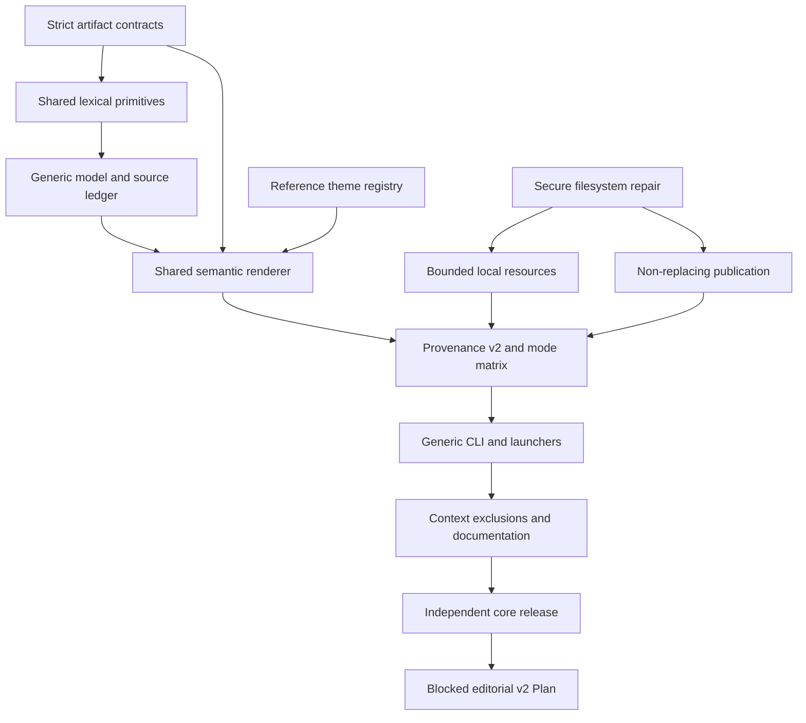

# Plan: Generic Markdown and Reference Publishing Core (Revised)

## Objective

Build an independently releasable generic Markdown publisher around the
existing `reference` presentation while preserving strict Brainstorm and Plan
validation. Define and prove source routing, destination ownership, bounded
resource handling, reproducible provenance and mode behavior, and
non-clobbering filesystem publication before adding a second theme or agent
workflow surface.

## Context

This revision incorporates every finding accepted during the prior
`/cg-plan-review`. The reviewed combined Plan was split into this Deep core and
the dependent Standard Plan at
`.cg-docs/plans/2026-08-03-editorial-theme-publishing-workflow-evidence-v2.md`.
The split is part of the approved correction for P2.8, not optional sequencing.

The completed artifact-view implementation remains the strict authority for
Brainstorms and Plans. Generic publishing is additive: it receives a separate
document model and cannot accept typed artifact roots or claim typed schema
validation. The current renderer becomes stable theme `reference` version 1.

Two shared filesystem defects are prerequisites. POSIX publication currently
ends with replacing `os.replace()` semantics after validation, and the shared
reader can allocate the full file before a caller checks size. This Plan repairs
both shared primitives and validates all existing callers before using them for
generic publication and local bitmap embedding.

### Review Finding Traceability

| Finding | Accepted revision | Owning step or dependent Plan |
|---------|-------------------|-------------------------------|
| P1.1 POSIX publication still replaces concurrent bytes | Implement pinned-parent, non-replacing publish and rollback on POSIX; preserve concurrent and quarantined bytes; regress all shared callers. | Core Step 2; V2; C4 |
| P1.2 Evidence JSON self-attests browser behavior | Add a locked Playwright/Chromium/axe producer that measures behavior before manifest validation. | Editorial v2 Steps 5-6 |
| P1.3 Editorial source is movable and unpinned | Pin commit `52fc749ed484af2246dd7152b032f4dd01e86621` and both source blob IDs; stop on absence or mismatch. | Editorial v2 Step 1 |
| P1.4 Filtered Pester commands are invalid or vague | Use registered basenames, exact `filteredFiles`, per-file records, and enumerated Python target modules. | Core Step 7; Editorial v2 Step 4 |
| P2.1 Generic CLI can bypass typed validation | Reject Brainstorm and Plan roots in the resolver and direct CLI, including aliases; recover through `cg-render-artifact`. | Core Steps 1, 3, 6; V3; C1 |
| P2.2 Destination ownership is undefined | Record normalized output identity in provenance and replace only a destination owned by the same source/document type/output identity. | Core Steps 3 and 6; V3; C3 |
| P2.3 Image resolution and bounded reads are underspecified | Resolve source-relative URIs with exact normalization; validate alt text; inspect and bound pinned-handle reads before allocation. | Core Steps 2 and 5; V2 and V4 |
| P2.4 Theme behavior differs by CLI mode | Implement an explicit render/automatic/validate/check matrix for missing, owned, legacy, old-version, unknown, corrupt, and explicit-theme states. | Core Steps 3 and 6; Editorial v2 Step 2 |
| P2.5 Evidence schema migration is undefined | Preserve schema 1 dispatch unchanged and add isolated exact schema 2 validation. | Editorial v2 Step 5 |
| P2.6 Evidence binaries can enter context | Store screenshots/PDFs under `.cg-docs/views/evidence/**` and add sentinels across every model/review/release input. | Editorial v2 Step 6 |
| P2.7 Editorial components lack deterministic triggers | Use exact source-backed callout markers and tables only; defer inferred timelines, diagrams, metrics, and prose-derived grouping. | Core Steps 1 and 4; Editorial v2 Step 2 |
| P2.8 Unit is oversized and target generation is premature | Ship the core independently; block editorial work on it; finish canonical edits before one target-generation pass. | Plan split; Editorial v2 Steps 3-4 |
| P3.1 Infrastructure edits are assumed | Treat generator, mapping, scanner, prompt, link, and update edits as test-first and conditional. | Core Steps 7-8; Editorial v2 Steps 3-4 |

### Deterministic Mode Matrix

| Mode | Explicit theme | Existing output | Resolution |
|------|----------------|-----------------|------------|
| render or enabled `--automatic` | present | any | Validate and use the named registered theme. |
| render or enabled `--automatic` | absent | owned provenance v2 | Reuse the recorded theme name with its current registered contract version. |
| render or enabled `--automatic` | absent | missing or provenance v1 | Use document-type default `reference`. |
| render or enabled `--automatic` | absent | corrupt, unowned, or differently owned | Fail without replacement and report ownership recovery. |
| disabled `--automatic` | any | any | Validate source, paths, resources, and explicit theme; do not inspect or mutate output. |
| `--validate-only` | present | any | Validate source, paths, resources, and named theme; do not consult output. |
| `--validate-only` | absent | any | Validate with document-type default; do not consult output. |
| `--check` | present | existing | Reproduce expected bytes with the named theme. |
| `--check` | absent | owned provenance v2 | Reproduce expected bytes with the recorded theme name and current contract version. |
| `--check` | absent | missing or provenance v1 | Resolve default path/theme; legacy output is stale. |
| any mutating mode | absent | recorded unknown theme | Fail until the user supplies a registered explicit theme. |

A known theme with an older contract version is stale and rerenders with the
current version of the same name. Unknown themes never silently fall back.

### Generic Path, Ownership, And Image Contracts

- Generic input is a regular project-contained `.md` file. Reject typed
  Brainstorm/Plan roots, `.cg-docs/views/**`, evidence assets, links, reparse
  points, hard-link aliases where required, and path/case aliases.
- Default output mirrors the complete project-relative source under
  `.cg-docs/views/documents/**`. Explicit output must be a portable relative
  `.html` path in that namespace and reject traversal, alternate streams,
  trailing spaces/dots, Windows device names, and typed namespaces.
- Provenance schema 2 records normalized `outputPath`. Existing output is
  replaceable only when valid provenance proves the same source, document type,
  and output identity. Corrupt, missing-owner, or differently owned output
  fails without mutation.
- Images resolve relative to the source directory. Accept no scheme, authority,
  query, fragment, backslash, control character, encoded separator, or escape
  from the project. Require non-empty normalized alt text.
- Allow only PNG, JPEG, GIF, and WebP. From one pinned regular-file handle,
  reject links/hard links, inspect size before allocation, perform a bounded
  read, verify suffix and magic bytes, and embed deterministic data URIs.

### Dependency Graph

## Requirements

| ID | Requirement | Source |
|----|-------------|--------|
| R1 | Preserve canonical Markdown authority and derived, regenerable HTML presentation. | Brainstorm |
| R2 | Preserve strict Brainstorm/Plan schemas, validation, paths, and recovery; reject typed roots from generic publishing. | P2.1 |
| R3 | Parse generic Markdown through a separate immutable source-spanned model with complete lexical coverage and exact-once ownership. | Brainstorm; roadmap |
| R4 | Define a closed generic grammar with exact callout markers; escape bounded unsupported input and fail on ambiguity. | P2.7 |
| R5 | Freeze the current visual system as `reference` theme contract version 1 without strict semantic regression. | Brainstorm |
| R6 | Add provenance schema 2 with normalized output identity, document type, source hash, renderer, theme name/version, and generation time. | P2.2; P2.4 |
| R7 | Implement the complete deterministic mode matrix. | P2.4 |
| R8 | Enforce project-contained source, portable output, and one-source destination ownership. | P2.1; P2.2 |
| R9 | Resolve and embed local bitmaps through exact URI normalization and bounded pinned-handle reads. | P2.3 |
| R10 | Repair shared POSIX publication and rollback to preserve concurrent winners without replacement. | P1.1 |
| R11 | Escape raw HTML, enforce safe links and offline CSP, and prohibit executable or remote runtime resources. | Roadmap |
| R12 | Provide strict and generic one-file render, automatic, validate, and check CLIs with constrained output. | Roadmap |
| R13 | Install bash/CMD launchers with Python detection, argument, and exit-code parity. | Repository contract |
| R14 | Keep generated view bodies out of every model/review/release input; edit infrastructure only after a focused failure. | P3.1 |
| R15 | Document authority, grammar, paths, ownership, images, provenance, modes, failures, and the follow-up boundary. | Brainstorm |
| R16 | Keep publisher runtime dependency-free, model-free, network-free, browser-free, and Open Design free. | Brainstorm |

## Phase 1: Secure Contracts And Generic Identity

### 1. Separate generic parsing from strict artifact validation

- **Requirements**: R1, R2, R3, R4
- **Files**: `scripts/artifact_views/generic_model.py`, `generic_parser.py`, shared lexical helpers only where needed, fixtures, and focused parser/model/coverage tests.
- **Details**: Preserve `parse_artifact()` and `validate_source()` as the sole typed path. Add stable spans and block IDs for generic input. Resolve title from frontmatter, first H1, then filename. Recognize exact `NOTE`, `TIP`, `IMPORTANT`, `WARNING`, `CAUTION`, `DECISION`, `PROS`, and `CONS` callout markers; infer nothing from prose. Reject typed roots and ambiguous ownership.
- **Test Scenarios**: strict regression, title fallbacks, Unicode/CRLF, long documents, escaped table pipes, all markers, raw HTML, malformed table, unclosed fence, duplicate ownership, typed-root recovery.
- **Tests**: focused contract, parser, validator, model, coverage, and new generic-parser pytest files.
- **Acceptance criteria**: generic input has an independent complete ledger and cannot claim typed validation.

### 2. Repair non-clobbering publication and bounded reads

- **Requirements**: R9, R10, R16
- **Files**: `scripts/secure_fs.py`, shared secure filesystem tests, artifact writer tests, and generated-target path/determinism regressions.
- **Details**: Replace POSIX final replacement with pinned-parent quarantine plus no-replace same-directory publication; restore only without replacement and preserve recovery names on collision. Keep Windows handle publication `replace=False`. Preserve umask and established modes. Add optional bounded secure reads that inspect type, links, and size before allocation and read at most the limit plus one byte.
- **Test Scenarios**: no target, replacement, concurrent target on POSIX/Windows, occupied rollback, recovery bytes, temp cleanup, umask/mode, oversize and growth races, alias rejection, all shared callers.
- **Tests**: `pytest -q scripts/tests/test_secure_fs.py scripts/artifact_views/tests/test_writer.py scripts/tests/test_target_path_safety.py scripts/tests/test_target_determinism.py`.
- **Acceptance criteria**: publication and rollback never clobber a concurrent owner, and oversized reads fail before bytes are returned.

### 3. Implement paths, ownership, provenance v2, and mode resolution

- **Requirements**: R2, R5, R6, R7, R8
- **Files**: theme registry/reference modules, `paths.py`, `provenance.py`, new publishing coordinator, and focused theme/path/provenance tests.
- **Details**: Register only `reference` version 1. Implement the path/ownership and mode contracts above. Parse provenance v1 only for deterministic typed migration and always classify it stale; write exact-key schema 2. Fail unknown schemas, malformed identity, output mismatch, and unowned destinations.
- **Test Scenarios**: root/nested source, typed and generated roots, portable explicit names, Windows device/trailing names, same/different owners, case behavior, v1/v2/unknown provenance, duplicate keys, every mode row, old/unknown theme.
- **Tests**: focused theme, path, publishing-path, and provenance pytest files.
- **Acceptance criteria**: source, destination owner, theme identity, and every mode resolve deterministically before mutation.

## Phase 2: Reference Rendering And Generic Publication

### 4. Extract the reference theme and shared semantic renderer

- **Requirements**: R1, R2, R3, R4, R5, R11
- **Files**: `templates.py`, `renderer.py`, new generic renderer and theme components, snapshots, renderer/design/accessibility tests.
- **Details**: Move current tokens/CSS unchanged into frozen `reference` version 1. Use one trusted semantic shell for landmarks, source owners, navigation, lists, tables, code, callouts, images, and provenance. Retain typed derived maps; generic documents receive heading navigation only. Escape unsupported source visibly.
- **Test Scenarios**: Brainstorm, phased/non-phased Plan, generic long document, all callouts, tables/code/raw HTML, duplicate IDs, navigation, snapshots, print and reduced motion.
- **Tests**: focused strict/generic renderer, contract, validator, coverage, design, and accessibility pytest files.
- **Acceptance criteria**: strict semantic snapshots and exact source ownership remain intact while generic documents use the shared shell.

### 5. Implement safe links, bounded images, CSP, and HTML validation

- **Requirements**: R4, R9, R11, R16
- **Files**: `security.py`, generic renderer/publishing coordinator, fixtures, security and publishing-security tests.
- **Details**: Preserve user-initiated safe links without fetching. Implement the image contract with bounded shared reads. Permit only renderer-generated bitmap data images with alt text. Escape raw HTML and reject executable elements, attributes, remote resources, SVG, and user data URIs.
- **Test Scenarios**: safe/unsafe links, every bitmap, encoded paths, traversal, empty alt, suffix/signature mismatch, oversize/growth, aliases, SVG/polyglot/script payload, offline output.
- **Tests**: focused security, publishing-security, and generic-renderer pytest files.
- **Acceptance criteria**: accepted output is complete offline HTML with no executable or unbounded source-controlled resource.

### 6. Publish and freshness-check strict and generic views

- **Requirements**: R6, R7, R8, R10, R12
- **Files**: writer, strict CLI, new generic CLI/entrypoint, and CLI/integration tests.
- **Details**: Replace writer prefix strings with typed registered destinations. Add `--theme reference` to strict rendering and a one-file generic CLI with constrained output. Prove existing output ownership before mutation. Compute exact freshness from source, output, document type, provenance schema, renderer, and theme identities. Preserve prior valid views and report reproducible recovery.
- **Test Scenarios**: every mode row, strict/generic defaults, explicit output, same/different owner, legacy/tamper/corruption, disabled automatic, all failure stages, publication and rollback races.
- **Tests**: focused strict/generic CLI, integration, provenance, and writer pytest files.
- **Acceptance criteria**: render/check behavior is reproducible and no unowned or concurrent bytes are replaced.

## Phase 3: Launchers, Installation, And Context Boundaries

### 7. Add cross-platform launchers and installation

- **Requirements**: R12, R13, R16
- **Files**: new bash/CMD wrappers, installers, and link/update files only if focused installed-layout tests fail.
- **Details**: Forward arguments/status through self-relative entrypoints. Apply mandatory CMD `where` prechecks, version verification, and Store-stub rejection. Install idempotently. Use registered Pester basenames and inspect exact durable file records.
- **Test Scenarios**: all Python candidates, no Python, Store stub, spaces, forwarded status, fresh/repeated/self install, installed render/check.
- **Tests**: focused Python integration plus `execution_subagent` running `. tests\Run-Tests.ps1 -File @('install','bash-scripts')`; require exact `filteredFiles` and passing per-file records.
- **Acceptance criteria**: local and installed commands behave equivalently on supported shells.

### 8. Verify exclusions and document the core

- **Requirements**: R1, R2, R6, R7, R8, R9, R14, R15, R16
- **Files**: shared artifact-view contract; scanners/prompts/summaries only on focused failure; README and relevant docs; exclusion/documentation tests.
- **Details**: Preserve typed/generic authority distinction. Add generic-view sentinels to Brain, audits, summaries, review, PR, release, and duplicate checks. Reuse existing `.cg-docs/views/**` exclusions when they pass. Document all core contracts and state that editorial/workflow/evidence is blocked follow-up work.
- **Test Scenarios**: view body/diff excluded, metadata allowed, commands match help, links resolve, no premature editorial/dossier claim.
- **Tests**: `node scripts/check-docs-site.js` and focused target-documentation, audit-context, summary, and integration pytest files.
- **Acceptance criteria**: users can operate and recover the core without loading generated HTML into model context.

## Phase 4: Independent Core Release Gate

### 9. Run focused and full core verification

- **Requirements**: R1, R2, R3, R4, R5, R6, R7, R8, R9, R10, R11, R12, R13, R14, R15, R16
- **Files**: all touched files and generated `tests/last-run.json`.
- **Details**: Run every focused gate above, all Python tests, documentation checks, full canonical Pester through `execution_subagent`, diagnostics, and Plan freshness. Review the diff for editorial assets, browser packages, prompt/skill targets, dossier code, speculative infrastructure edits, and generated-body leakage.
- **Test Scenarios**: focused failure, shared-caller regression, filtered final Pester, diagnostics error, stale Plan view, out-of-scope file/dependency.
- **Tests**: `pytest -q`; `node scripts/check-docs-site.js`; full `. tests\Run-Tests.ps1` via `execution_subagent`; diagnostics; `cg-render-artifact --check .cg-docs/plans/2026-08-03-generic-markdown-reference-publishing-core-v2.md`.
- **Acceptance criteria**: all unfiltered gates pass and the core is independently releasable before the dependent Plan starts.

## Testing Strategy

- Preserve strict artifact behavior with existing contract, parser, validator,
  coverage, renderer, and integration tests.
- Test generic parsing, path ownership, provenance, and modes as independent
  table-driven contracts.
- Treat secure filesystem changes as shared kernel work across POSIX, Windows,
  rollback, umask, bounded reads, and every existing writer.
- Validate image identity and bytes from one pinned bounded handle.
- Exercise repository-local, wrapper, and installed command boundaries.
- Prove generated views remain metadata-only to all model/review/release paths.
- Run focused checks before broad Python, documentation, and Pester gates.

## Documentation Checklist

- [ ] Explain typed versus generic validation authority.
- [ ] Document generic grammar and exact callout markers.
- [ ] Document source rejection, portable output, and one-source ownership.
- [ ] Document provenance schemas and the complete mode matrix.
- [ ] Document source-relative images, formats, alt text, and byte limit.
- [ ] Document non-clobbering publication and recovery artifacts.
- [ ] Document generic CLI, launchers, exclusions, and runtime independence.
- [ ] Link the blocked editorial v2 Plan and preserve the dossier boundary.

## Risks & Mitigations

| Risk | Impact | Mitigation |
|------|--------|------------|
| POSIX no-replace changes regress shared writers. | Generated targets or views could fail or preserve stale recovery files. | Specify one pinned protocol and run all shared path/determinism callers. |
| Generic publishing weakens typed validation. | Malformed workflow artifacts could appear valid. | Separate models and reject typed roots in resolver and direct CLI. |
| Cross-platform output identity is ambiguous. | One source could overwrite another. | Record normalized output, enforce portable names, and require same-owner provenance. |
| Bare rerender changes presentation. | Regeneration becomes unstable. | Apply the explicit mode matrix and recorded known-theme identity. |
| Image limits occur after allocation. | Oversized files can exhaust memory. | Inspect and bound the pinned handle before returning bytes. |
| Raw source becomes executable. | Generated HTML can run attacker-controlled content. | Escape HTML, reject SVG/remote data, verify bitmaps, validate CSP and structure. |
| Infrastructure is edited speculatively. | Scope and generated drift expand. | Test first; edit generators, prompts, scanners, link/update only on demonstrated gaps. |
| Follow-up work leaks into the core. | The core becomes oversized again. | Block editorial/browser/agent work until this Plan completes independently. |

## Out of Scope

- Editorial theme, `/cg-render-doc`, publishing skill, generated agent targets,
  Node/Playwright/axe, screenshots, print evidence, and evidence schema 2.
- Completion-report schema, synthesis, correction, and `/cg-compound` integration.
- Bulk or hosted publishing, arbitrary output roots, product PDF generation,
  live editing, arbitrary plugins, executable source HTML/SVG/JavaScript, and
  documentation-site restyling.

## Completion Contract

### Outcome

Compound GPID can publish project-contained generic Markdown through a secure,
deterministic `reference` renderer without weakening strict Brainstorm/Plan
validation. Source routing, output ownership, bounded resource reads,
theme/provenance identity, mode behavior, freshness, and non-clobbering
publication are executable contracts.

### Verification Surface

| ID | Phase | Evidence Required | Command/Artifact | Required |
|----|-------|-------------------|------------------|----------|
| V1 | 1 | Strict schemas remain unchanged; generic parsing and exact source ownership pass. | Focused strict and generic parser/model/coverage pytest files named in Step 1. | yes |
| V2 | 1 | POSIX and Windows publication never replace concurrent bytes; bounded reads reject oversized or aliased resources. | `pytest -q scripts/tests/test_secure_fs.py scripts/artifact_views/tests/test_writer.py scripts/artifact_views/tests/test_publishing_security.py scripts/tests/test_target_path_safety.py scripts/tests/test_target_determinism.py` | yes |
| V3 | 2 | Typed roots are rejected; ownership, provenance v2, and every mode-matrix row pass. | Focused path, provenance, strict/generic CLI, and integration pytest files named in Steps 3 and 6. | yes |
| V4 | 2 | `reference` preserves strict semantics and safely renders generic links, images, callouts, tables, code, and raw source. | Focused renderer, security, accessibility, design, and coverage pytest files named in Steps 4-5. | yes |
| V5 | 3 | Generic launchers and installers pass with durable exact filtered evidence. | `execution_subagent`: `. tests\Run-Tests.ps1 -File @('install','bash-scripts')`; require `passed: true`, `failedCount: 0`, exact `filteredFiles`, and passing file records. | yes |
| V6 | 3 | Documentation and model-context exclusions pass. | `node scripts/check-docs-site.js` plus focused documentation, audit, summary, and integration pytest files. | yes |
| V7 | final | All Python regressions pass. | `pytest -q` | yes |
| V8 | final | Full unfiltered Pester passes safely. | `execution_subagent`: `. tests\Run-Tests.ps1`; require `passed: true`, `failedCount: 0`, `filteredFiles: null`. | yes |
| V9 | final | Diagnostics are clear and the Plan view is current. | VS Code diagnostics and `cg-render-artifact --check .cg-docs/plans/2026-08-03-generic-markdown-reference-publishing-core-v2.md` | yes |

### Constraints

| ID | Phase | Constraint | Check |
|----|-------|------------|-------|
| C1 | 1 | Generic publishing cannot accept typed artifact roots or claim strict validation. | Direct resolver/CLI rejection and strict recovery tests. |
| C2 | 2 | `reference` semantics and exact source ownership cannot regress. | Strict validator, coverage, and semantic snapshots. |
| C3 | 1 | Every destination has one source owner in a registered views namespace. | Output provenance, case, collision, reserved-name, and containment tests. |
| C4 | 1 | Publish and rollback use no-replace semantics and preserve competing bytes. | Final-boundary POSIX/Windows race tests; unsupported hosts fail closed. |
| C5 | final | Runtime remains dependency-free, model-free, network-free, browser-free, and Open Design free. | Static dependency and offline tests. |

### Boundaries

- Allowed: generic parser/model, reference theme, provenance v2, mode matrix,
  typed-root rejection, destination ownership, bounded bitmaps, secure writer
  repair, generic CLI, launchers/installers, exclusions, tests, and core docs.
- Out of scope: editorial, agent publishing workflow, browser evidence,
  completion reports, arbitrary output roots, hosted/PDF publishing, and docs
  site restyling.

### Iteration Policy

1. Repair and validate shared secure filesystem primitives first.
2. Preserve strict artifact behavior before adding generic paths.
3. Define ownership, provenance, and modes before mutating CLI output.
4. Reject ambiguous source, resource, destination, and theme identity.
5. Run focused executable tests after each phase and stop on strict/security regressions.
6. Ship the core independently before starting the blocked follow-up.

### Blocked-Stop Conditions

- Non-clobbering publication cannot be proven on a supported backend.
- Generic routing can bypass strict artifact validation.
- Output ownership or mode/theme reproduction remains ambiguous.
- Resource limits require an unbounded pre-read.
- A required deviation arises under `ask` without approval.
- Any required focused or final evidence remains failed.
