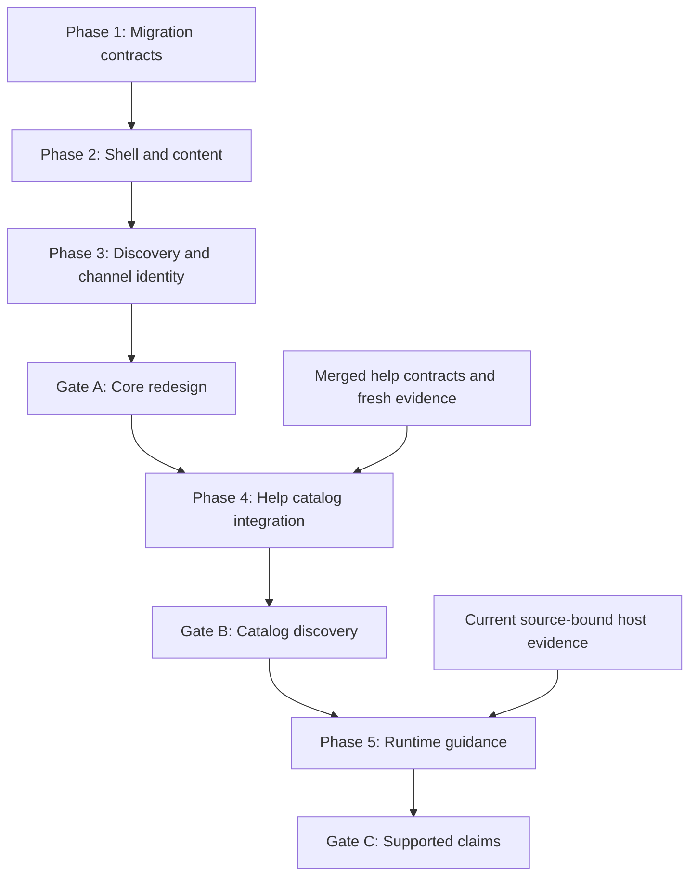

# Plan: Documentation Information Architecture and UX Redesign

## Objective

Make it easy to choose the correct suite, find a command by task, follow a complete procedure, and identify the documentation build being read. Preserve the current static site, Markdown sources, editorial visual style, public links, and protected publishing controls.

Deliver the core redesign independently of `/cg-help`. Catalog-backed discovery and runtime-support claims have separate integration gates.

## Context

### Source and Approval

This is the CG implementation-plan conversion of [the source proposal](../archive/2026-09-16-documentation-ia-ux-redesign-proposal.md), inspected on 2026-09-16. The supplied `.mdb` extension referred to this existing `.md` file. The source remains unchanged. Its product decisions are retained; the completion contract below was approved before this plan was saved.

The 2026-09-16 `/cg-plan-review` revision was explicitly requested with all findings to be addressed. The corrections below retain the five phases and product scope. They clarify source verification, mixed-version operation, and mandatory test gates; they do not authorize implementation or publication during plan review.

Confirmed decisions:

- Keep exactly two documentation channels: the published root and `/dev/`. Do not add archived documentation versions.
- Combine Skill Management guidance into one page. Retain detailed operation references outside the primary sidebar.
- Release the core redesign independently of `/cg-help`. Gate catalog integration and runtime-support claims separately.
- Retain HTML/CSS/JavaScript, current typography, and the publishing pipeline. Do not migrate to a documentation framework.
- Change documentation and its presentation/build tooling, not command behavior, suite dependencies, installation eligibility, release branch policy, or protected-tag rules.

The work aligns with the charter's technical and research suites and reusable knowledge objectives. Frontmatter `language: both` follows project configuration; implementation is primarily JavaScript, HTML, CSS, Markdown, and workflow YAML. Python help checks apply only at the integration gates.

### Verified Starting Point

| Current evidence | Implementation consequence |
| --- | --- |
| `docs/navigation.json` registers 76 pages, including 29 Skill Management entries. | Separate registration from sidebar visibility; retain complete Markdown coverage. |
| `docs/assets/site.js` renders Markdown and routes with `#page=<id>&section=<slug>`. | Preserve URL semantics, the stale-navigation guard, and escaping. |
| Search, Ctrl/Cmd+K, code-copy buttons, themes, and mobile navigation already exist. | Improve existing behavior rather than implement competing controls. |
| Runtime and validator slugs differ, repeated headings collide, and validator extraction includes fenced-code headings. | Establish a shared heading contract before TOC, redirects, or section search. |
| Section changes currently fetch and render again; `#content` can enter the homepage route. | Separate shell actions and same-page scrolling from document navigation. |
| The composer checks artifact digests and source fingerprints, but `legacy-pages.js` replaces checked-out docs with producer output before composition. | Preserve pristine canonical checkouts and independently verify generated output before import. A comparison against an imported tree is not canonical-source evidence. |
| Current metadata has no fingerprint-algorithm version; tagged producers run their own historical builder. | Version producer/fingerprint contracts and preserve the exact supported legacy algorithm during controller rollout and historical recovery. |
| HTML, CSS, and JavaScript use fixed paths; existing root content can have the old runtime. | Bind upgraded shells and their assets to a build identity, and declare per-channel runtime/heading capabilities rather than assuming both channels are upgraded. |
| Existing `.docs-build-metadata.json` is outside the served site. | New public `channels.json` needs an exact reserved-path contract. |
| Tagged publication can put a prerelease at root; dev publication currently takes root content from `main`. | Label root Published, not automatically Stable or Latest release. |
| Operation descriptors bind `docs/skills/management/commands/*.md`. | Preserve reference paths, flags, result contracts, and evidence anchors. |
| `scripts/rebuild-docs.js` and `docs/_wiki.yml` control generated sections. | Transfer ownership atomically when help generation becomes authoritative. |
| Playwright 1.52.0 and axe-core 4.10.3 are already development dependencies. | Reuse them; add a docs-specific suite, not new test dependencies. |
| `scripts/tests/docs-preview-runtime.test.js` checks HTTP responses but is absent from `test:docs-automation`. | Wire it into the docs script and add real browser interactions separately. |
| CI installs Chromium after the current docs test command; `link-check.yml` omits CSS triggers. | Run browser checks after browser installation and cover CSS/new helper inputs. |

The source proposal's `wealthy-salmonberry` phase status, command count, and regression result are historical observations, not current integration evidence. Recheck merged canonical help sources and fresh results at Gates B/C. Do not inspect or copy unmerged sibling artifacts as production authority.

### Relevant Prior Work

- [Research handbook and isolated dev-preview brainstorm](../brainstorms/2026-09-03-cr-research-handbook-and-dev-preview.md): Pages deployment replaces the whole site; retain a complete paired artifact and source/freshness/digest checks. Its historic Stable terminology does not override this plan's verified Published labels.
- [Wiki ownership failure](../solutions/bugs/2026-05-19-cg-compound-wiki-update-silently-skipped-all-manual-pages.md): explicitly assign generated sections and protect prose outside markers. Do not silently drop manual-update obligations.
- [Cross-file contract drift](../solutions/testing-patterns/2026-07-24-cross-file-contract-state-must-align-docs-validator-tests.md): align runtime, generator, validator, fixtures, and behavioral tests in one contract change.

The existing documentation-deployment and research-handbook plans are adjacent work, not prior versions of this redesign. No existing CG redesign plan is replaced. The current feature branch is retained. Future integration PRs target `dev`; this does not change the existing site's root-source selection policy or authorize a PR to `main`.

### Plan Review Corrections

The initial critic reported one P1 and four P2 findings. The execution-workflow check added P2.6. All six are addressed by the requirements below; none is accepted as a risk or deferred. Verification of the revised plan is separate from implementation evidence.

| Finding | Correction in this plan | Required evidence |
| --- | --- | --- |
| P1.1: Imported docs replace the source before comparison. | Step 5 preserves immutable canonical inputs, independently computes expected generated bytes, and imports only into separate staging. | Importer-through-composer tests reject self-consistent forged output. |
| P2.2: Browser integrity excludes the loaded shell. | Step 5 binds HTML, local runtime/helper/CSS assets, and fetched content to one shell identity. | Stale HTML/assets with fresh metadata cannot receive a verified label. |
| P2.3: Fingerprint changes break old producers and recovery. | Steps 1, 5, and 6 use explicit producer/fingerprint versions and protected, bounded compatibility implementations. | Real legacy-algorithm and new-algorithm fixtures pass or fail the stated compatibility matrix. |
| P2.4: Legacy destination behavior is undefined. | Step 5 defines channel capabilities, legacy heading rules, departure-side notices, and upgraded-shell-only UI guarantees. | An actual legacy-runtime fixture verifies switch limitations and fallbacks. |
| P2.5: New Node tests can be omitted from CI. | Steps 1 and 4 register every new docs Node test in the continuing docs command. | CI-selection checks prove execution of each new test file. |
| P2.6: Targeted tests can be mistaken for phase-completion evidence. | Testing Strategy and the Completion Contract preserve `/cg-work` full-suite phase gates and safe execution. | Fresh unfiltered safe-runner evidence is recorded at each phase boundary. |

Verification outcome (2026-09-16): the plan critic's follow-up pass confirmed all six findings resolved, with no remaining material issues, accepted risks, or deferred findings. CG artifact validation passed. The plan is ready for `/cg-work phase1`; this is not evidence that implementation, help integration, or publication checks have run.

## Requirements

| ID | Requirement | Source |
|----|-------------|--------|
| R1 | Keep the static-site foundation and editorial style; use seven task-oriented groups with at most two sidebar levels. | Source sections 1, 3 |
| R2 | Provide exactly Published and Development channels with verified shell/content identity, declared runtime/heading capabilities, explicit switch fallbacks, and cache integrity. | Source section 2; review P2.2, P2.4 |
| R3 | Explain CG versus CR accurately in one guide and use accessible Technical, Research, and Shared treatments. | Source section 3 |
| R4 | Separate left navigation from a responsive right/inline H2/H3 TOC; preserve focus, history, and section-only navigation. | Source section 4 |
| R5 | Share heading/link rules across consumers; preserve public page IDs, anchors, raw Markdown, and meaningful compatibility paths. | Source sections 1, 4, 5 |
| R6 | Consolidate Skill Management into one complete guide while preserving unique safety content and detailed operation contracts. | Source section 5 |
| R7 | Document every public command by use case with accurate syntax, prerequisites, example, output, approval boundary, failure, and next step. | Source section 6 |
| R8 | Build deterministic, channel-local section search with clear ranking, failures, keyboard behavior, and safe display. | Source section 8 |
| R9 | Meet accessibility and resilience requirements for responsive layout, copying, storage failure, focus, zoom, and reduced motion. | Source sections 4, 8 |
| R10 | Keep deterministic builds and one owner per generated section; version fingerprint/producer contracts, include canonical inputs in fingerprints and outputs in artifact digests, and preserve supported legacy recovery. | Source sections 2, 7, 8; review P2.3 |
| R11 | Preserve paired deployment and trust boundaries; verify output against unchanged canonical inputs and independently computed generated bytes before import, then deploy only the verified artifact. | Source sections 2, 9; review P1.1 |
| R12 | Gate catalog-backed discovery on merged help contracts, inventory reconciliation, freshness, native parity, and one documentation writer. | Source section 7, Gate B |
| R13 | Publish only current source-bound host-support claims and supported help invocations; mark failed or unverified hosts accurately. | Source section 7, Gate C |
| R14 | Produce executed behavioral, migration, security, publishing, and generation evidence, include all new docs tests in CI, and retain mandatory full-suite phase gates before completion. | Source section 9; CG goal-execution contract; review P2.5, P2.6 |
| R15 | Provide version-correct source/issue links and a printable task-to-command cheat sheet without collecting project/search data. | Source sections 6, 8 |

## Implementation Steps

### Phase and Gate Map

| Phase | Steps | Result |
| --- | --- | --- |
| 1 | 1 | Migration and shared contract baseline |
| 2 | 2-3 | Navigation shell and restructured content |
| 3 | 4-5 | Discovery, channel identity, and independently releasable Gate A |
| 4 | 6 | Catalog-backed discovery, Gate B |
| 5 | 7 | Evidence-bound runtime guidance, Gate C |



Gate A has no dependency on unmerged help work. A completed Gate A is a releasable subset, not whole-plan completion. Hold Gates B/C when their prerequisites are absent without withdrawing the validated core site.

Gate A supports staged channel upgrades. Its new UI guarantees apply to upgraded shells, while paired-artifact integrity and explicit legacy-destination handling apply to both channels. Unchanged legacy root content is not described as redesigned or as having a verified in-page label. Publication still requires a compatible protected controller; passing local implementation checks is not proof that this external rollout prerequisite is complete.

## Phase 1: Migration and Contract Baseline

### 1. Freeze the Migration Contract

- **Requirements**: R1, R5, R6, R10, R11, R14
- **Files**: `docs/navigation.json`, `docs/assets/site.js`, `scripts/check-docs-site.js`, `scripts/assemble-docs-site.js`; proposed shared `docs/assets/docs-contract.js`; `package.json`, `.github/workflows/tests.yml`; `scripts/tests/check-docs-site.test.js`, `scripts/tests/assemble-docs-site.test.js`; proposed `scripts/tests/docs-navigation.test.js` and fixtures under `scripts/tests/fixtures/docs-redesign/`.
- **Details**: Inventory all current page IDs, source paths, headings, inbound links, and old runtime/validator slugs. Inventory unique warnings/examples across all 29 Skill Management entries plus `docs/skills/importing.md`. Record expected old-to-new destinations and preservation checks as reviewable fixtures. Recheck current release/help boundaries without making Gate A depend on help readiness. Define additive manifest, heading, redirect, channel-capability, shell-identity, and versioned producer/fingerprint contracts before presentation work. Register `docs-navigation.test.js` and every other new docs Node test in `test:docs-automation` in the same change; a one-time direct command is not CI registration.
- **Test Scenarios**: Normal route/heading migration; repeated, punctuated, inline-code, and Unicode headings; fenced-code headings excluded; legacy slug conflicts; hidden but registered references; duplicate IDs; missing targets; unsafe paths; redirect cycles; old root/new dev fixtures.
- **Tests**: `node --test scripts/tests/docs-navigation.test.js scripts/tests/check-docs-site.test.js scripts/tests/assemble-docs-site.test.js` after the new test file exists; `node scripts/check-docs-site.js`.
- **Acceptance criteria**: Every existing public route and meaningful heading has an explicit retained or migrated destination; no ambiguous alias is silently chosen. Invalid manifests fail. Shared heading rules and content-preservation fixtures are executable, not only prose. An automated CI-selection assertion confirms that the existing workflow command selects every new docs Node test file, and that command executes them successfully.

Contract rules:

- Keep existing IDs and source paths unless a documented migration needs a change. Existing manifest records remain visible by default.
- Add validated sidebar visibility and optional redirects with target page ID, default section, and explicit old-section-to-new-section mapping. Hidden references remain registered, linked, searchable, and fully validated. Compatibility stubs are excluded from search.
- Preserve complete Markdown coverage and the validator's separate candidate-page allowance. Do not hide files from validation to simplify the sidebar.
- Use one tested heading extractor/slug contract for rendering, link checks, TOC, and search. Produce deterministic duplicate suffixes; reject ambiguous legacy aliases. Share helpers only where runtime/build consumers need the same behavior.
- Define the exact public `channels.json` output, per-channel source/producer/fingerprint/runtime/heading identities, per-file digest maps, and permitted transforms. Inventory the dev-banner transform plus the upgraded shell's build-ID slots and content-addressed local assets. Reserve their exact expected output paths; no broad JSON/generated-path exemption is permitted.
- Capture fixtures using the actual current legacy runtime and fingerprint algorithm before changing them. Record source revision and generator/runtime digests for those fixtures. A legacy fixture must not be produced by passing old source through the new builder.

## Phase 2: Navigation Shell and Content

### 2. Build the Navigation and Reading Shell

- **Requirements**: R1, R3, R4, R5, R9, R14
- **Files**: `docs/index.html`, `docs/assets/site.js`, `docs/assets/site.css`, `docs/navigation.json`, the shared heading helper from Step 1; `package.json`, `.github/workflows/tests.yml`; proposed `playwright.docs.config.js` and `scripts/tests/docs-browser.spec.js`, with isolated server fixtures; navigation/validator tests.
- **Details**: Implement the navigation groups, manifest visibility/redirects, collapsible sidebar, suite badges, breadcrumbs, contextual next steps, responsive TOC, heading permalinks, and same-page routing below. Add a dedicated browser test command, proposed as `npm run test:docs-browser`, using existing Playwright and axe-core. Keep the browser server isolated and ensure Chromium installation precedes this command in CI.
- **Test Scenarios**: Desktop/right TOC, tablet/inline TOC, mobile/drawer; direct section load, Back/Forward, same-page movement without fetch, rapid route changes, unknown page/section, loading/error states, skip-to-content from a deep link, storage access that throws, and keyboard focus return.
- **Tests**: `node --check docs/assets/site.js`; `node scripts/check-docs-site.js`; `node --test scripts/tests/docs-navigation.test.js`; `npm run test:docs-browser` for this phase's fixtures.
- **Acceptance criteria**: Left navigation and TOC remain separate at every breakpoint. Route/history and focus tests pass; no stale response changes the active page. Existing escaping and race guards remain effective. Shell controls remain usable without storage.

Primary information architecture:

| Group | Primary destinations | Secondary destinations |
| --- | --- | --- |
| Start Here | Getting Started; CG or CR: Choose a Workflow; Working with AI Responsibly; What's New | Why Compound GPID; installation details |
| Technical Workflows | Choose a Task; Design the Work; Deliver and Resume; Review and Assure; Knowledge and Coordination | Detailed workflow contracts |
| Research Workflows | Start Here; First CR Workflow; Worked Example; Lifecycle and Task Types; Evidence and Boundaries | Research philosophy and method references |
| Skills | Skills Catalog; Skill Management | Analysis, research, development, and institutional catalogs; operation references |
| Operate | Configuration; Updates and Versions; Help and Troubleshooting; Governance and Security | Strict config schema; installation and recovery reference |
| Reference | Find a Command; Agents; Files and Artifacts; Complete Reference | Context/model/Brain schemas; evaluation-only capabilities; compatibility manual |
| Contribute | Contribute and Develop | Maintainer tools, release controller docs, issue dispatch, documentation maintenance |

Shell and presentation contract:

- Keep no more than two sidebar levels. Use real group buttons with `aria-expanded`; automatically open the active group. Remove numeric prefixes and literal backticks from labels. Use contextual next steps, not arbitrary previous/next links across unrelated references.
- Keep the paper/navy palette and Fraunces/Manrope/DM Mono typography. Add light/dark tokens for deep-teal Technical (CG), plum Research (CR), and neutral Shared. Labels carry meaning without color. Keep suite identity distinct from Slash prompt, Shell command, Maintainer only, Development, and danger/success status.
- Get suite identity from canonical ownership/support metadata, not prefixes. `/cg-skill` and later `/cg-help` can be Shared. Before help integration, do not create a second command-facts catalog.
- Allow only a small safe Markdown callout convention. Keep raw blockquotes meaningful; do not enable arbitrary embedded HTML.
- At about 1200 CSS px and above, use a 240-256 px left rail, a flexible article near 65-80 characters per line, and a 200-220 px right rail. Avoid narrowing the article excessively.
- Generate the H2/H3 TOC from the current article only. Hide it for fewer than two relevant headings. Use a sticky, independently scrollable right rail below the actual header/banner height. At intermediate/mobile widths, put a separate collapsible TOC above the article; never merge it into the mobile left drawer.
- Use `nav aria-label="On this page"`, visible focus, permalinks, and `aria-current="location"`. Passive tracking does not change focus or fill history. TOC clicks update the section URL and scroll without fetching/rendering again.
- Keep `#content` as a shell action that focuses the current main content without replacing the page/section route. Scope heading lookup to the article and disconnect observers on route changes.
- Compute offsets from actual header/banner geometry. Support reduced motion and 200% zoom. Clear the TOC on the homepage, loading/error states, and unknown routes. Guard storage reads/writes and keep an in-memory theme choice if persistence fails.

### 3. Restructure Content Without Losing Contracts

- **Requirements**: R3, R5, R6, R7, R10, R14
- **Files**: `docs/modular-guide.md`, `docs/index.html`, `docs/skills/management/index.md`, superseded management narratives, `docs/skills/importing.md`, retained `docs/skills/management/commands/*.md`, `docs/reference/commands.md`, relevant `docs/workflows/*.md`, `docs/research/*.md`, `docs/navigation.json`, `docs/_wiki.yml`; migration/content fixtures and validator tests.
- **Details**: Rework `modular-guide` as the dedicated suite-choice guide. Replace the homepage's CG-only core-workflow panel with equally visible Technical and Research paths. Consolidate Skill Management into the full guide below. Build a goal-first command hub and complete recipes; preserve generated syntax/summary ownership until Gate B. Review technical and research examples against current canonical sources with appropriate subject reviewers.
- **Test Scenarios**: Each old narrative route/section reaches its replacement; raw Markdown stubs have useful links and anchors; every unique warning/example is accounted for; operation descriptors and help-evidence anchors remain valid; public slash/shell commands have complete entries and accurate invocation context.
- **Tests**: `node scripts/check-docs-site.js`; `node scripts/rebuild-docs.js --check --all`; migration/content tests in `scripts/tests/docs-navigation.test.js`; route scenarios in `npm run test:docs-browser`. Record the canonical-source/content review and checklist in the execution report.
- **Acceptance criteria**: A reader can choose CG/CR from one comparison page and complete consumer or maintainer Skill Management guidance on one page. All public commands meet the entry checklist. No unique safety content, descriptor-bound path, generated-section ownership, or valid evidence anchor is silently lost.

Suite-choice content:

- CG asks whether an implementation meets engineering requirements; CR asks whether a research claim is supported by evidence, assumptions, and valid methods. Contrast typical tasks, review focus, practical examples, and mixed work.
- Both suites require human judgment and verified lessons. They are not coding/no-coding, programming-language, or novice/expert choices. CR composes shared capabilities without depending on the CG suite.
- Include `suites: [cg]`, `[cr]`, and `[cg, cr]` examples. A launcher repair belongs to CG; statistical specification or published-indicator validation belongs to CR. Explain bounded handoffs without implying `/cg-review` replaces `/cr-review`.
- Preserve `modular-guide` and its architecture/configuration anchors or provide explicit mappings. Apply labelled suite badges consistently to entry paths, summaries, workflows, search, and callouts.

Unified Skill Management structure:

| H2 | Required H3 topics and content |
| --- | --- |
| Start Here | Consumer versus maintainer; `/cg-skill` versus shell `cg-skill`; skills are not slash commands |
| Lifecycle and Safety | State transitions; discover before change; plan, review, digest-bound apply, verify; authority boundaries |
| Use Skills in a Project | Find and inspect; import at an exact SHA; activate/deactivate; availability |
| Maintain Plugin Skills | Create/vendor; registry and capabilities; update; deprecate/remove; release gates |
| Security and Provenance | Quarantine; approval; provenance; path protection; destructive-action safeguards |
| Diagnose and Recover | Finding/exit codes; stale plans; manifest/projection failures; safe remediation |
| Migrate Existing Workflows | Retired-command replacements; old-to-new examples; changes requiring a new plan |
| Operation Reference | Compact operation/role/effect table; links to the 12 detailed operation contracts |

Move and edit the narratives, rather than only hiding old pages. Preserve all unique safety conditions and meaningful examples from the guide/lifecycle/consumer/maintainer/security/migration pages and importing page. Keep `commands/*.md` as reference authority, searchable and linked back to guide sections. Convert superseded narratives into short hidden compatibility pages with explicit links and retained old anchors; do not maintain duplicate full guides. Update internal links and check module, descriptor, help-evidence, and schema consumers before removing any heading. The preservation checklist covers all 29 entries and importing content.

Command-entry checklist: use when; do not use when; prerequisites and suite/role requirements; exact invocation; concrete example; expected output/artifact; verification or approval boundary; common failure; next useful step. Use Technical, Research, Shared, and Shell groupings. Keep the complete reference for exact syntax and reuse workflow/research guides instead of one thin page per command.

First-pass recipes:

| Task | Required treatment |
| --- | --- |
| Start a project | Installation/linking, suite selection, then `/cg-setup` where eligible |
| Fix a software error | `/cg-fixbug The launcher fails when the project path contains spaces` |
| Complete a small technical task | `/cg-light-work <task>` qualification, saved-plan approval, review, opt-in compounding |
| Deliver a larger change | Clarify, save/review a plan, `/cg-work phase1`, verify before publication |
| Resolve review findings | `/cg-review`, `/cg-fix-triage`, re-review with evidence |
| Run research | `/cr-brainstorm Compare poverty estimates across survey rounds`; comparability assumptions before `/cr-plan` and `/cr-work` |
| Resume or recover | `/cg-resume`, state/artifact prerequisites, troubleshooting |
| Manage skills | Discovery, plan, explicit apply, verification |

These are editorial scenario seeds, not new specifications. Verify grammar and claimed artifacts against current prompts, wrappers, and descriptors. Label chat versus terminal and PowerShell versus POSIX where needed. Use synthetic examples, explicit placeholders, and illustrative output labels. Keep safety visible when long flags use progressive disclosure. Do not imply review certifies a research claim.

## Phase 3: Discovery, Identity, and Gate A

### 4. Improve Local Discovery and Reading Tools

- **Requirements**: R8, R9, R10, R14, R15
- **Files**: `docs/assets/site.js`, `docs/assets/site.css`, `docs/reference/commands.md`, `scripts/rebuild-docs.js`, `docs/_wiki.yml`, `package.json`; proposed generated `docs/assets/search-index.json`; shared heading helper; `scripts/tests/rebuild-docs.test.js`, `scripts/tests/docs-preview-runtime.test.js`, browser/navigation tests, and focused search-generation tests as needed.
- **Details**: Generate a deterministic section-level index through the existing docs build, then replace page-by-page first-search fetching with one lazy local index. Add ranked section results, error/retry/no-results states, exact copy feedback, source/issue links, and printable cheat sheet. Wire the existing HTTP preview test and every new search-generation or contract test into `test:docs-automation`; extend the CI-selection assertion from Step 1. Add inputs to the declared fingerprint version and independently verify exact generated outputs without indexing an index into itself.
- **Test Scenarios**: Exact command/title versus body ranking; slash/shell disambiguation; CG/CR/Shared labels; hidden references included but stubs excluded; index fetch failure/retry; stale responses; unsafe catalog/Markdown text and URLs; denied clipboard; exact code bytes; storage failure; print output.
- **Tests**: `node scripts/rebuild-docs.js --check --all`; `node --test scripts/tests/rebuild-docs.test.js scripts/tests/docs-preview-runtime.test.js`; `npm run test:docs-automation`; `npm run test:docs-browser`. Verify byte-identical repeat builds and manual-prose preservation in isolated fixtures.
- **Acceptance criteria**: Search is local, deterministic, section-aware, and usable by keyboard. A failed index never becomes an apparently complete cache. Reading works if search fails. Copy operations report failure accurately and preserve code. Print retains suite and build identity while removing navigation/copy controls. The continuing Node CI command executes all new unit/contract tests; browser tests remain a separate command after Chromium installation.

Discovery contract:

- Exact command/title matches rank above body text. Results show heading, snippet, suite/type, and current channel. Prevent duplicated guide/reference hits from dominating.
- Preserve Ctrl/Cmd+K, arrows, Enter, Escape, focus return, visible selection, and platform-correct shortcut hints. Do not intercept ordinary typing or add unmodified single-letter shortcuts.
- Keep code-copy buttons with accessible success/error feedback and a manual-selection fallback. Exclude prompts, line numbers, and output from copyable invocation blocks.
- Meet WCAG 2.2 AA contrast, semantic landmarks, descriptive links, responsive tables, reduced motion, visible focus, and no full-page horizontal scrolling. Do not announce the article on every TOC movement.
- Add version-correct source links and issue links containing page/channel/SHA, not search queries or project data. Resolve allowed repository paths outside the manifest to validated GitHub source URLs rather than inert text. Step 5 supplies verified identity; local previews must not invent it.
- Add a compact printable task-to-command cheat sheet. Before Gate B, keep current syntax/summary generation and verify manual recipes against canonical sources; do not build a competing metadata catalog.
- Preserve useful raw Markdown and the existing no-JavaScript fallback. Search/catalog display is escaped; URL schemes, traversal, and source paths are validated.

### 5. Add Channel Identity and Validate Gate A

- **Requirements**: R2, R9, R10, R11, R14, R15
- **Files**: `scripts/assemble-docs-site.js`, `scripts/legacy-pages.js`, `scripts/rebuild-docs.js`, protected generator/fingerprint compatibility helpers only if needed, `docs/index.html`, `docs/assets/site.js`, `docs/assets/site.css`, `docs/assets/docs-contract.js`, `docs/versioning.md`; `.github/workflows/release-pages.yml`, `.github/workflows/release-docs.yml`, `.github/workflows/pages.yml`, `.github/workflows/docs-site-build.yml`, `.github/workflows/doc-rebuild.yml`, `.github/workflows/link-check.yml`, `.github/workflows/tests.yml`; composer, legacy-pages, validator, release-pages evidence, fingerprint, and browser tests. Public `channels.json`, shell stamps, and content-addressed assets are assembled outputs, not source Markdown/bot outputs.
- **Details**: Implement the provenance, producer-version, shell-integrity, and channel-compatibility contracts below. Keep canonical checkouts unchanged; verify producer outputs before copying to separate staging. Add accessible channel selection and compact footer identity/source links to upgraded shells. Extend trusted verification without widening permissions. Include CSS, new helpers, manifests, and relevant tests in CI triggers. Validate repository-prefixed root and dev previews using both actual legacy and upgraded runtimes. Establish protected-controller compatibility through the existing reviewed path before publication; this plan does not itself authorize deployment or a PR to `main`.
- **Test Scenarios**: Main-sourced and tagged/prerelease root; two-channel preservation; missing page/section at destination; missing/malformed/colliding/tampered metadata; stale source/artifact; unsafe paths/symlinks; exact allowed transforms; forged HTML/Markdown/indexes with recomputed artifact digests and a valid canonical fingerprint; stale loaded HTML/JS/CSS/helper with fresh metadata/data; failed integrity loads; explicit reload; actual old producer/new controller and supported recovery; unknown/downgraded producer versions; actual legacy root with new dev; no cross-channel asset/search leakage.
- **Tests**: `node --check docs/assets/site.js`; `node scripts/check-docs-site.js`; `node scripts/rebuild-docs.js --check --all`; `npm run test:docs-automation`; `npm run test:docs-browser`. Use `node scripts/rebuild-docs.js --verify-fingerprint <metadata-file>` and `node scripts/assemble-docs-site.js --verify <artifact-dir> --main-root <root-source> --dev-root <dev-source>` with the existing expected SHA/branch/ref arguments and actual fixture/build paths. These placeholders must be resolved in the execution report, not reported as executed verbatim.
- **Acceptance criteria**: Gate A has passing core checks, source-reviewed content, URL migration, browser/accessibility evidence, independently verified paired-channel output, and the producer/controller compatibility matrix below. Upgraded shells label Published from verified shell/content provenance, never guessed Stable. Legacy channels retain their bytes and have explicit limitations rather than false new-UI claims. Canonical checkouts remain unchanged through importer/composer tests. All generation precedes final verification and upload. Gate A makes no claim that `/cg-help` is released. Record controller-rollout readiness separately; an unsupported live controller blocks publication, not the truthful recording of passed local checks.

Channel contract:

| Channel | URL | Label |
| --- | --- | --- |
| Published | `https://gpid-wb.github.io/compound-gpid/` | `Published: <verified tag>` or `Published: <ref>@<short SHA>`; mark verified prerelease tags |
| Development | `https://gpid-wb.github.io/compound-gpid/dev/` | `Development: dev@<short SHA>` with a persistent change-before-release notice |

Do not infer root identity from `latest.json`, the current default branch, the URL, or a release payload without source proof. Explain that these are two moving channels, not documentation for every historical installation. Link older release notes and tagged source without promising archived sites. The labels above are in-page guarantees for upgraded shells. The paired manifest may describe a legacy channel's verified source, but this does not mean its unchanged runtime displays the label or provides a switch.

Each channel declares `runtimeContract`, `headingContract`, and supported capabilities such as redirect mappings, section links, switch notices, and reverse switching. The trusted verifier derives these values from a recognized producer/runtime contract; the browser does not trust an unverified producer claim. Validate destination pages and headings with that channel's declared rules, not the active channel's new slug algorithm. Retain only the actual legacy rule set needed for the unchanged root and supported recovery. Unknown capabilities fail closed for switching; do not guess a route.

For upgraded destinations, preserve page and section where supported; a missing section opens the page top with a notice, and a missing page uses an explicit destination fallback with a return link. For a legacy destination, show a departure-side notice before navigation explaining any lost section/page, absence of verified in-page identity, or missing reverse switch. Present the exact destination and a copyable return URL and require confirmation. Retain the source page in browser history for Back. Do not add new fragments or redirect semantics to legacy URLs, promise a destination-side notice, or modify old root bytes. Fixtures must use the actual legacy HTML/JS/heading rules, not a new runtime with capabilities disabled. Test missing sections, missing pages, default legacy homepage behavior, Back, and lack of return controls. These explicit limitations are part of Gate A, not exceptions to silently discard.

Build-identity contract:

1. The trusted composer emits one root `channels.json` only after independent source/output verification. Include schema version, two fixed channel paths, full source SHA, branch/ref, optional validated release tag, `producerContract`, `fingerprintVersion`, `runtimeContract`, `headingContract`, capabilities, and per-file digest maps for HTML, local JS/CSS/helper assets, navigation, Markdown, and generated indexes. Upgraded channels also declare `shellBuildId` and the exact asset inventory. Derive labels from these fields. Compute output digests before writing metadata; exclude metadata from its own inputs.
2. Reserve this exact output path and reject source collisions. Do not add deployment identity files to source Markdown or documentation bot commits.
3. Include `channels.json` in final artifact digests. Recompute expected metadata and compare final bytes with independently verified channel builds. Allow only the exact declared dev-banner, upgraded-shell stamp/asset-link transforms, and metadata addition. Validate each transform against its expected result; do not merely skip transformed files. Cover root and dev without exempting JSON, HTML, or generated directories.
4. Include generation/validation code in the versioned fingerprint contract. Generate every asset before final verification; upload the verified artifact without later modification. Mutable source/producer code must not run with publication credentials. Keep pristine source, expected build, imported staging, and final composition as distinct paths.
5. Fetch channel metadata and destination manifests with base-path-aware URLs. Keep ordinary assets, Markdown, search, and command data inside the active channel. Only explicit channel switching crosses channels.
6. Before showing a verified label, require matching embedded HTML and executing-runtime `shellBuildId` values, a supported runtime contract, successful integrity loading of the declared local assets, and verified navigation/document/index bytes. Namespace caches by channel, shell identity, and manifest identity. On mismatch, retain any already verified view with its original identity, show a build-change/full-reload notice, and reject new mismatched content/search/command data. Explicit full reload refreshes the shell, metadata, and caches; no loop or silent relabelling is allowed. Fetching fresh `index.html` while retaining an old DOM is not proof of loaded-shell identity.
7. Missing or malformed metadata blocks production artifact validation. An explicitly local preview may show `Local preview: version unavailable`, permit reading, and disable unverified switching. A production metadata failure must show an unavailable/unverified state, not falsely claim Local preview or a stable version.

Pre-import source verification:

- Keep each exact-SHA canonical checkout immutable. Replace the current `importDev` mutation of `<source>/docs` with verified copying into a separate staging directory; make composer inputs distinguish canonical roots from built trees. Failed validation must not alter canonical or previously valid staged output.
- Compare every non-generated producer file with its canonical source bytes. For managed Markdown sections, search/command indexes, and other declared generated output, independently compute the expected result from pristine inputs using the matching protected generator contract. Preserve bytes outside managed markers. Verify full file inventory, exact bytes, and safe paths before import; artifact self-digests plus a declared canonical fingerprint are not derivation proof.
- Use protected controller validation/generation code with source trees treated only as data. Never `require`, import, install, or execute generator code from mutable producer/source trees in a credentialed publication job. A separate validation job is permitted only if it uses protected code, has no publication credentials, and binds its result to exact source SHAs, producer contract, run, artifact ID, and archive digest; a producer-supplied receipt is not sufficient.
- After import, compare staging and composition against those independently established expected bytes, including exact permitted transforms. Add end-to-end importer-through-composer tests that change unmanaged Markdown, homepage HTML, managed sections, search/command indexes, or shell assets, update all producer-declared digests, and retain a valid canonical fingerprint. Each forged artifact must fail before promotion. Assert that both canonical checkouts are byte-identical before and after successful and failed operations.

Producer and fingerprint compatibility:

- New metadata records explicit `producerContract` and `fingerprintVersion`. The protected controller selects exactly one recognized contract from its reviewed compatibility table and verifies that the canonical producer's contract/code identity matches it. A producer cannot choose an older algorithm to omit new required inputs. Reject unknown, mismatched, or downgraded versions without trying alternatives until one passes.
- Treat existing schema-v1 metadata with absent version fields as the single recognized legacy contract only when it matches the documented legacy shape and recognized canonical producer code. Preserve that algorithm's exact input selection, normalization, and ordering, plus the generated-output rules needed by current tagged-release and recovery policy. Do not apply the current input set to legacy artifacts. This is bounded support for shipped artifacts, not an open-ended compatibility framework.
- The new fingerprint contract includes the source registry, shell/help metadata paths, sidecars, route maps, shared helpers, and generation/validation code needed by this plan, with explicit absence semantics for not-yet-present help inputs. Derived outputs stay out of their own inputs but must pass independent expected-byte validation. If Gate B changes the algorithm or output contract, introduce a new explicit version and update protected support before enabling that producer; do not silently change an existing version's meaning.
- Retain only legacy implementations required by current release/recovery policy. Each supported producer version has an independently trusted expected-output implementation; an unknown historical generator stops with a compatibility blocker, not a fallback to self-digest-only verification. Do not disable recovery or change release policy to make this plan pass.
- Use a controller-first rollout that supports both required legacy and new contracts, then enable new producers. Prove old producer/new controller, new producer/new controller, the currently authorized historical-recovery path, and rejection of new producer/old-only controller, unknown versions, and downgrade attempts. Build fixtures with the respective historical/current algorithms and record their provenance; processing two source revisions with the same new builder does not satisfy this matrix.

Loaded-shell identity:

- Derive a deterministic `shellBuildId` from verified source SHA, canonical fingerprint, and producer/runtime contract identifiers, before output stamping. Do not derive it from already stamped HTML or from `channels.json`; this avoids a hash cycle.
- In isolated build output, fill explicitly owned HTML and runtime identity slots, then emit content-addressed local JS/CSS/helper assets with Subresource Integrity references in the HTML. Use exact generated filenames such as hashed siblings within `assets/` so existing asset-relative links remain valid, or deterministically rewrite and validate those links. Compute asset hashes after stamping and compute the final HTML digest after asset-link substitution. The protected expected-output build repeats these exact transforms; no whole-file exemption is allowed.
- Keep the original shell templates and helper source canonical. Generated stamp slots, hashed filenames, asset dependencies, integrity attributes, and missing/failed-load behavior have one build owner and are covered by output inventory checks. Do not let generic documentation bot commits write deployment-specific identities back to source.
- The default shell state is unverified. Successful startup must match embedded HTML identity, executing runtime identity, declared assets, and channel metadata before labels become verified. Failed CSS/JS/helper integrity loading or unavailable required integrity capability must leave an explicit unverified/error state. A missing content-addressed asset after a deployment requires full reload, never a silent unversioned-asset fallback.
- Test stale HTML with fresh metadata/data; fresh HTML with stale JS, CSS, or helper responses; incompatible runtime contracts; missing/integrity-failed assets; and deployments changed in an open tab. A legacy shell has no retroactive build stamp and follows the channel-capability rules above.

Preserve existing root-source selection, protected publication authority, and serialized paired deployment. Do not enable the disabled release controller or `/releases/<tag>/` snapshots. If trusted publishing support cannot be updated within approved boundaries, record the rollout blocker instead of changing release policy or opening a PR to `main`.

## Phase 4: Catalog-Backed Discovery and Gate B

### 6. Integrate Help Only After Its Source Contracts Are Ready

- **Requirements**: R7, R8, R10, R12, R14
- **Files**: Integrated canonical `.github/prompts/*.help.json`, `.github/shared/help-catalog.json`, `.github/shared/shell-commands.json`, `.github/shared/module-registry.json`, `docs/workflow.md`, and `scripts/help/` contracts; `scripts/rebuild-docs.js`, `docs/_wiki.yml`; proposed `docs/reference/command-routes.json` and generated `docs/assets/command-index.json`; fingerprint, help, target-parity, docs generation, and browser tests. Reconcile exact help filenames from merged sources before implementation.
- **Details**: Confirm integrated source inventory, including `/cg-light-work`, and current help validation/freshness/parity results. Adopt the merged help documentation writer/checker; transfer each generated section and wiki ownership in one reviewed change. Produce the browser projection and presentation-only route map below. Do not copy unmerged sibling catalogs or infer readiness from prior phase reports.
- **Test Scenarios**: Slash/shell same-name IDs; repeated workflow steps; missing/extra/stale metadata; empty `documentationTargets`; invalid routes/anchors; malicious display/link text; changed manual prose; deterministic repeated generation; named-record repin leaves every other pin unchanged; catalog-enabled build cannot fall back to stale manual facts; new help input/output contracts remain compatible with supported producers and cannot bypass independent output validation.
- **Tests**: Run the merged catalog/query/transport/support checks, native target-drift checks, and relevant skill-documentation tests; record exact commands and source revision after readiness inspection. Also run docs fingerprint/managed-output tests, `node scripts/rebuild-docs.js --check --all`, `node scripts/check-docs-site.js`, `npm run test:docs-automation`, and `npm run test:docs-browser`. If Pester is required, first load its safety skill and use the canonical safe runner/subagent process.
- **Acceptance criteria**: Gate B has merged help contracts, reconciled inventory, fresh catalog, one generator per section, passing parity/regressions, source-bound routes/indexes, and preserved prose. The execution report records concrete integrated commands; unknown commands or absent evidence block Gate B rather than being guessed.

Data and ownership contract:

```text
Canonical prompts / shell definitions / module registry
  + reviewed help sidecars and explicit workflow records
  -> source validation and digest checks
  -> canonical help-catalog.json
  -> native copies + generated documentation facts
  -> website command index + section search
  -> verified channel-specific artifact

Reviewed Markdown recipes + command/workflow route map
  -> narrative, page/section links, and parity checks
```

- Keep kind-qualified IDs: `slash:cg-help` differs from `shell:cg-help`. Preserve stable workflow IDs and repeated steps. Do not derive identity from titles/URLs.
- `command-routes.json` contains presentation links only, keyed by command/workflow ID to a registered page/section. It does not duplicate usage, constraints, or availability, and does not assume `documentationTargets` is populated.
- Generate the safe browser projection from the complete validated catalog, not the bounded help overview. Include schema/generator versions and `sourceDigest`, and bind the output to the channel's source revision.
- Use `supportedSuites` and `ownerModule` for eligibility. Reader-selected website filters are not proof of activation in a visitor's project.
- Catalog facts cover usage, examples, prerequisites, outputs, constraints, related commands, and explicit workflows. Editors own explanation and worked scenarios. Review linked recipes when either changes; automated checks cannot prove semantic accuracy.
- Reuse the help documentation writer/checker when available. Align `_wiki.yml` and wiki regeneration; preserve manual text outside managed markers. Website and help maintainers jointly review ownership transfer.
- Fingerprint sidecars, registry/shell metadata, workflow records, route maps, and generators through Step 5's versioned contract. Derived indexes are outputs, not inputs to themselves; independently regenerate their expected bytes and keep every output in artifact-digest verification. Rerun the producer/controller compatibility matrix when help changes the input set or generated-output contract.
- Stale pins fail loudly. Named-record repins need explicit review and may not update unrelated pins. No silent fallback to stale manual facts in a catalog-enabled build.
- Help workflow records are linear unless the merged contract explicitly changes that. Editorial alternatives must not imply supported branches, optional steps, or a `workflow:<id>` invocation. The help response limit of three candidates does not constrain the separate website inventory.

## Phase 5: Evidence-Bound Runtime Guidance and Gate C

### 7. Enable Only Supported Help Guidance

- **Requirements**: R7, R12, R13, R14
- **Files**: Help/troubleshooting and linked workflow/command guides, presentation route map, integrated help support/evidence checks, generated command/search outputs, and related browser/documentation tests. Use the merged support verifier's actual evidence locations.
- **Details**: Check current source-bound certification for each claimed host. Publish verified copyable help lookups only where supported; mark failed/unverified hosts accurately. Keep host evidence separate from catalog freshness. Recheck documentation-anchor consumers even when the catalog `sourceDigest` is unchanged.
- **Test Scenarios**: Verified host; absent, failed, stale, or source-mismatched evidence; renamed evidence anchor with unchanged catalog digest; unsupported lookup grammar; mixed host support.
- **Tests**: Current integrated support verifier and evidence/link tests, catalog freshness/parity checks, `node scripts/check-docs-site.js`, `node scripts/rebuild-docs.js --check --all`, `npm run test:docs-automation`, and `npm run test:docs-browser`. Record exact verifier invocation, source identity, host results, and claim mapping in the execution report.
- **Acceptance criteria**: Gate C has current source-bound evidence and accurate claims. There is no blanket five-host certification or invented compatibility guarantee. Unsupported claims are removed or marked without withdrawing valid claims or the completed Gate A site. Required final evidence is complete before whole-plan completion.

## Testing Strategy

Use targeted tests for per-step feedback. This does not replace `/cg-work` Step 2.5's full-suite phase-completion gate, even when a phase touches only docs or CSS. Before implementation, include existing `tests/docs-automation.Tests.ps1`, `tests/docs-preview.Tests.ps1`, and `tests/wiki.Tests.ps1` in the test-index assessment for affected content. Add behavioral assertions, not just static-token checks. New test filenames/commands above are proposed implementation outputs, not claims that they already exist.

At every phase boundary, first load `cg-skill-pester-safety`, then run `. tests\Run-Tests.ps1` with no flags or pipeline through the canonical execution subagent. Inspect `tests/last-run.json` for `passed: true`, zero failures, and `filteredFiles: null`; record the command, time, source revision, and tested working-tree state in the execution report. A targeted `-File` run is partial evidence and cannot satisfy this gate. Retain phase-specific Node/browser checks as additional evidence. If safe execution or required evidence is unavailable, block completion or obtain an explicit allowed evidence exception; do not silently omit the gate. This plan-review pass itself changes no implementation and does not require that full suite.

| Area | Required checks |
| --- | --- |
| Existing docs gates | `node --check docs/assets/site.js`; `node --check scripts/check-docs-site.js`; `node scripts/check-docs-site.js`; `node scripts/rebuild-docs.js --check --all`; `npm run test:docs-automation` |
| Browser matrix | Root and `/dev/` under `/compound-gpid/`; light/dark; 320/390/768/1024/1440 px widths; 200% zoom; reduced motion; keyboard-only use; mobile focus return; storage that throws; existing no-JavaScript fallback |
| TOC/router | Duplicate/punctuated/Unicode/inline-code headings; fenced-code exclusions; old fragments; direct links; skip link; Back/Forward; no-fetch same-page movement; rapid navigation; unknown routes/sections; observer teardown; real header/banner offsets |
| Content migration | All old Skill Management routes/headings; useful raw Markdown stubs; preserved descriptor paths, safety content, examples, and valid evidence anchors; hidden references remain searchable |
| Search/copy/security | Slash/shell disambiguation; suite/type labels; ranking and section links; no-results and failed fetch; stale response races; denied clipboard; exact bytes; script-like text; unsafe/traversal URLs; no silent-success errors |
| Publishing | Pristine canonical inputs before/after import; independently expected generated bytes; forged-output rejection despite self-consistent digests/fingerprint; exact declared transforms; verified branch/tag/prerelease labels; actual legacy root/new dev and departure-side fallback; capability/heading-version checks; metadata collision/tamper/missing fields; stale source/artifact; no channel leakage |
| Shell integrity | Stale HTML or local runtime/CSS/helper with fresh metadata/data; matched HTML/runtime build IDs; content-addressed asset/SRI success and failure; missing assets; no fresh-label assignment to an old DOM; full reload without silent fallback; mixed caches and open-session deployments |
| Producer compatibility | Actual legacy producer/new controller; new producer/new controller; supported historical recovery; reject unknown, mismatched, or downgraded contracts and new producer/old-only controller; immutable fingerprint-version semantics |
| Generation/help | Byte-identical repeat builds; managed/manual ownership; versioned fingerprints change with canonical inputs; independent generated-index verification; stale/missing/extra metadata rejection; kind-qualified IDs; repeated steps; no stale fallback; support evidence and anchor invalidation |
| Continuing CI | Every new docs Node test selected by `test:docs-automation`; workflow runs that command; browser command runs after Chromium installation; no new test file is covered only by a one-time phase command |
| Phase completion | Fresh unfiltered canonical safe-runner result for each phase plus required docs Node/browser evidence; targeted checks cannot replace the full-suite gate |
| Human review | Technical/research example accuracy, unique-content preservation, screen-reader and visual usability checks complement automated tests; they never substitute for executed required checks |

Current `test:docs-automation` includes `scripts/tests/rebuild-docs.test.js`, `generate-whats-new.test.js`, `release-version.test.js`, `docs-snapshots.test.js`, `legacy-pages.test.js`, `assemble-docs-site.test.js`, `check-docs-site.test.js`, and `scripts/evidence/tests/release-pages.test.js`. Keep existing snapshot regression tests without enabling snapshot publication. Extend its explicit file list with the HTTP preview test, `docs-navigation.test.js`, and every new docs Node unit/contract test introduced by this plan. Add an automated assertion that the bounded docs test inventory and command agree. Keep the dedicated Playwright suite out of that Node test list and run its separate command after browser installation. Do not use an unrestricted repository-wide test glob.

## Documentation Checklist

- [ ] One CG/CR comparison guide, accurate mixed-work boundaries, and balanced homepage paths.
- [ ] Seven navigation groups, complete registration, breadcrumbs, suite/type labels, and documented redirect behavior.
- [ ] One complete Skill Management guide; all 29 entries plus importing content inventoried; useful stubs and preserved reference/evidence contracts.
- [ ] Every public command meets the entry checklist; eight first-pass recipes and chat/terminal distinctions are reviewed.
- [ ] Published/Development moving-channel policy, verified shell/content labels, explicit legacy-channel limitations, fallback behavior, and old-release source links are explained.
- [ ] Search failures, copy failures, source/issue links, keyboard controls, and printable cheat sheet are clear.
- [ ] Generated-section ownership, pristine-source verification, producer/fingerprint versions, supported recovery, generator inputs/outputs, and maintainer validation commands are documented where appropriate.
- [ ] Help catalog availability and host-support claims match the specific completed gate and current evidence.

## Risks & Mitigations

| Risk | Mitigation and evidence |
| --- | --- |
| Consolidation loses safety guidance or an evidence anchor. | Inventory first; require content/anchor preservation fixtures, descriptor checks, and reviewed checklists. |
| Slug migration breaks old links or silently selects the wrong duplicate. | Shared slug contract, deterministic suffixes, explicit aliases, ambiguity rejection, and deep-link/history tests. |
| Imported output is mistaken for canonical source. | Immutable checkouts, independent expected-output generation, separate staging, and forged-output importer-through-composer tests. |
| New identity metadata or shell transforms weaken trusted composition. | Exact owned slots/output paths, protected recomputation of all transforms, byte comparison in both channels, complete digests, and negative tamper tests. |
| An open tab combines an old shell with new data under one label. | Matching HTML/runtime identity, content-addressed assets with integrity checks, verified fetched bytes, identity-keyed caches, and explicit full-reload tests. |
| New fingerprint inputs break immutable tagged producers or recovery. | Versioned protected producer/algorithm support, preserved required legacy semantics, no heuristic fallback, and independently produced compatibility fixtures. |
| A new channel promises controls or heading rules absent on old root. | Verified per-channel capabilities, actual legacy-runtime fixtures, destination-specific slugs, departure-side limitations/fallbacks, and unchanged legacy bytes. |
| Help integration is delayed or historical evidence is mistaken for readiness. | Independently releasable Gate A; merged-source readiness checks for B/C; no production copies from sibling worktrees. |
| Two generators overwrite the same section or manual prose. | Atomic ownership transfer, one writer per section, marker-bound generation, repeat-build/prose-preservation tests. |
| A three-column layout harms narrow screens, zoom, or keyboard use. | Responsive independent controls; width/zoom/keyboard matrix; axe checks plus focused human review. |
| CI omits new Node tests or CSS, or launches browser tests before installation. | Bounded test-inventory/command assertions, trigger coverage tests, and explicit Chromium-before-browser-test ordering. |
| Targeted checks are reported as full phase-completion evidence. | Mandatory safe-runner phase gates, fresh unfiltered result checks, and execution-report records for every phase. |
| Protected-controller rollout needs authority outside the work branch. | Preserve release policy, target integration PRs to `dev`, require release-maintainer coordination, and stop at unauthorized boundaries. |

### Ownership and Rollback

The website maintainer owns navigation, presentation, aliases, and editorial guides. The help maintainer owns catalog schema, source validation, reviewed repins, and runtime certification. The release maintainer owns protected composition and deployment changes. Shared generated-section changes need website and help review.

Keep gate changes separately reviewable and reversible. Roll back with a reviewed corrective commit and a new validated paired artifact, not a deployed-site edit or a moved tag. Preserve aliases needed by published links. A failed catalog integration holds Gate B; it does not justify stale data or removal of the valid Gate A site.

## Out of Scope

- Documentation framework migration, static pre-rendering, separate SEO routes, or an independent CR site.
- Archived version sites, release-controller enablement, `/releases/<tag>/` publication, or release/branch/tag policy changes.
- Changes to command behavior, research methods, suite dependencies, installation eligibility, or runtime-certification rules.
- Browser CLI execution, project scans, natural-language assistant services, remote query logging, hosted search, analytics, and translation.
- The source proposal's optional system-theme default and syntax-highlighting polish. Any later work needs a separate approved scope; no runtime CDN dependency is introduced here.
- Unrequested commits, PRs, deployments, or edits to the original proposal during plan creation.

## Completion Contract

### Outcome

On upgraded documentation channels, readers can choose CG or CR, find commands by task, use a separate in-page TOC, follow one complete Skill Management guide, and identify the verified shell/content build; unchanged legacy channels have explicit switching limitations and retain independently verified source/output integrity. The core redesign can ship independently of help once its protected-controller prerequisite is met; catalog-backed discovery and `/cg-help` runtime claims require their own evidence gates.

### Verification Surface

| ID | Phase | Evidence Required | Command/Artifact | Required |
|----|-------|-------------------|------------------|----------|
| V1 | 1 | Route, heading, and content-preservation inventory; tested migration/version rules and continuing CI registration | Migration/legacy fixtures, shared-heading/navigation tests, docs-validator and CI-selection tests from Step 1 | yes |
| V2 | 2 | Sidebar, TOC, redirects, deep links, history, and skip-link behavior pass | `npm run test:docs-browser` and router tests from Step 2 | yes |
| V3 | 2 | CG/CR guide, unified Skill Management, and command recipes preserve source contracts | Content checklist, recorded canonical-source review, executed link/migration checks from Step 3 | yes |
| V4 | 3 | Search, copy, keyboard, responsive layout, storage failure, and accessibility checks pass | Playwright with existing axe-core; generation tests and matrix from Step 4 | yes |
| V5 | 3 | Pristine-source derivation, root/dev shell/content identities, legacy switching, and producer/recovery compatibility pass | Importer-through-composer forgery tests, canonical-input preservation, independent generated-byte checks, actual-version fixtures, shell-integrity and browser cases from Step 5 | yes |
| V6 | 3 | Gate A passes with truthful upgraded/legacy scope and no unfinished help claims; publication prerequisites are recorded | `node scripts/check-docs-site.js`; `node scripts/rebuild-docs.js --check --all`; `npm run test:docs-automation`; `npm run test:docs-browser`; Gate A content review and protected-controller readiness record | yes |
| V7 | 4 | Gate B has a fresh integrated catalog, reconciled inventory, one generator per section, and adapter parity | Recorded merged help checks, managed-output tests, source-bound route/index checks from Step 6 | yes |
| V8 | 5 | Gate C publishes only source-bound, evidenced host claims | Current help support-verifier evidence, freshness/anchor checks, and claim mapping from Step 7 | yes |
| V9 | final | All required evidence and constraint results are recorded, including every mandatory full-suite phase gate and final regression checks after help changes | CG execution report with Gate A/B/C status, current source/working-tree identities, exact commands/results, fresh unfiltered safe-runner evidence for each phase, and approved exceptions | yes |

Each phase's required evidence is additional to `/cg-work`'s full-suite completion gate. Re-run affected earlier evidence on the final source after later phases change shared generators, shell code, or publication contracts; historical passing results alone do not prove the final state.

### Constraints

| ID | Constraint | Check |
|----|------------|-------|
| C1 | Keep exactly two channels, the static-site foundation, and existing visual style; do not claim new UI capabilities for an unchanged legacy shell. | Build/route/capability tests and scoped site review; no third channel or framework dependency. |
| C2 | Preserve public routes, meaningful anchors, operation-reference paths, and safety guidance. | Executed migration/descriptor checks and reviewed content checklist. |
| C3 | Keep paired deployments, trusted controls, pristine-source derivation, loaded-shell identity, and supported historical producer/recovery contracts. | Pre-import forgery tests, source preservation, independent expected bytes, shell integrity, and versioned compatibility tests. |
| C4 | Do not change command behavior, suite dependencies, or release policy. | Scoped diff and canonical-source review; integration PR target remains `dev`. |
| C5 | Keep generated sections under one owner; preserve manual prose. | Repeat-build, ownership, and prose-preservation tests. |
| C6 | Do not present stale catalog data or unverified runtime support as current. | Negative catalog, fingerprint, support-evidence, and claim checks. |
| C7 | New docs tests remain in CI, and targeted tests never replace the required full-suite phase gate. | CI-selection tests and fresh unfiltered `tests/last-run.json` evidence recorded for each phase. |

### Boundaries

- Allowed: documentation content, navigation, browser presentation, local search, channel identity, related build tooling, scoped workflow validation, tests, and gated help integration.
- Out of scope: framework migration, archived version sites, command behavior changes, release-controller enablement, hosted search, analytics, translation, and optional theme/highlighting follow-ups.
- Planning/review boundary: create or revise this plan only as authorized; leave the source proposal and implementation files unchanged. Roadmap writes require separate approval and the roadmap agent. Automatic HTML is disabled by the current project configuration; validation remains mandatory.
- Execution boundary: canonical Markdown is authoritative. Follow `/cg-work` permissions, protected-artifact rules, review routing, safe test execution, and durable execution-report requirements. Plan approval is not authority to commit, publish, or cross protected boundaries.

### Iteration Policy

1. Establish migration rules before changing routes or content.
2. Complete and verify each phase, including the mandatory safe-runner full-suite gate and its phase-specific Node/browser checks. Record failed or missing evidence and repair in-scope failures before recording that phase complete. Stop if required evidence cannot be obtained through the workflow's permitted recovery process.
3. Permit Gate A to ship through the existing separately authorized release process while Gates B/C remain pending. Do not mark the whole plan complete or imply missing gates passed.
4. Recheck integrated help sources and test evidence before Gates B/C. Record actual verifier commands and source revisions; do not invent compatibility shims for unavailable contracts.
5. With `deviation-policy: ask`, pause before any scope or contract deviation. Require explicit user approval for evidence exceptions and record the affected ID, reason, and approval in the execution report.
6. Before final completion, check all V1-V9 evidence and C1-C7 constraints against the final source, rerunning affected earlier checks after shared-code changes. Static inspection alone is not executed verification. Failed or absent requirements block completion unless an allowed, explicit user-approved exception is recorded.

### Blocked-Stop Conditions

- Required checks fail or cannot run safely, or remain failed after permitted recovery attempts.
- Migration loses a required route, safety condition, descriptor path, or evidence anchor.
- Pristine-source derivation, loaded-shell identity, producer/fingerprint compatibility, catalog freshness, generator ownership, or publication trust checks fail.
- The declared producer/runtime contract is unknown, a required historical recovery version cannot be independently verified, or publication would need an unsupported protected controller. Do not guess compatibility, use self-digests as source proof, or change release policy to continue.
- New tests are absent from continuing CI or required phase-completion evidence is missing, stale, failed, or filtered.
- A protected boundary must be crossed without approval, or a needed deviation under `ask` has no approval.
- The execution report cannot be durably saved or updated.
- Missing help integration evidence blocks its gate, not completed Gate A work. Do not mark later phases or the whole plan complete while that evidence is absent.
- Completion would require treating static inspection, historical test reports, guessed host support, or an unexecuted placeholder command as passed evidence.
